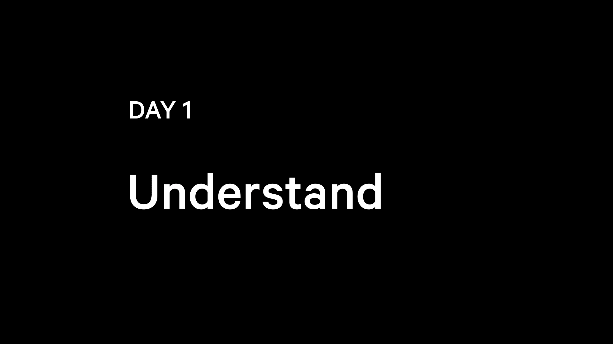
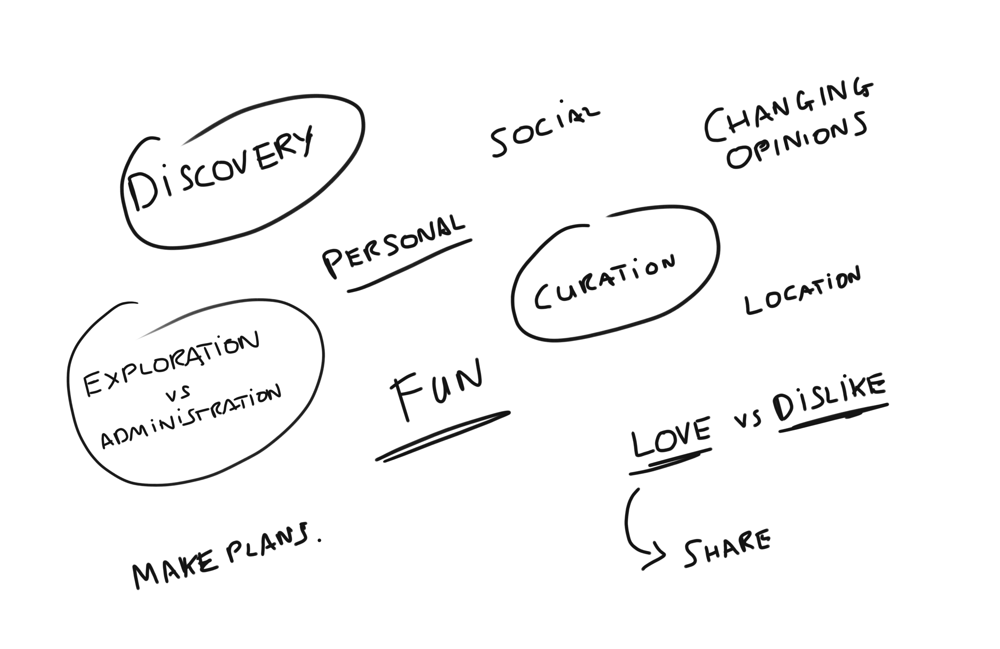
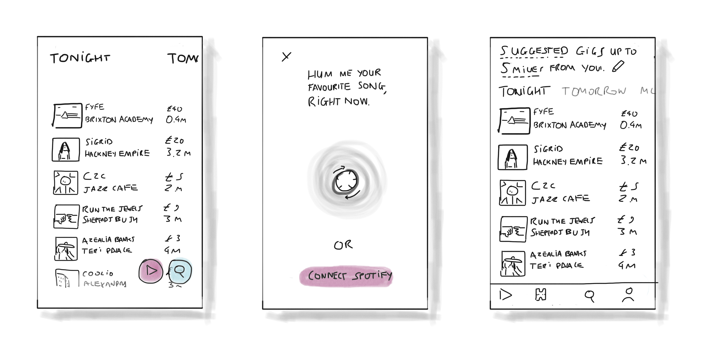
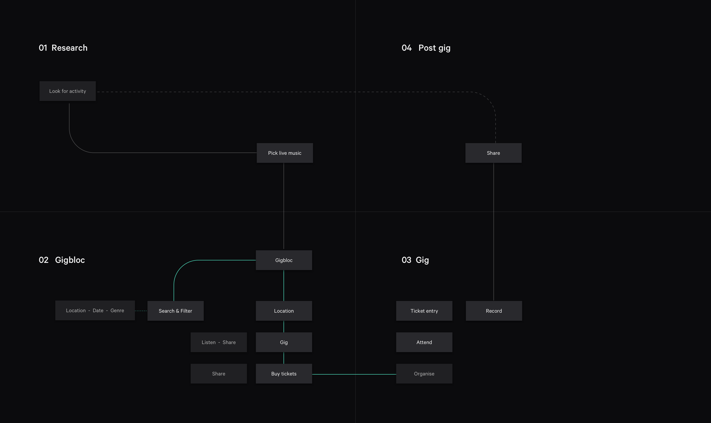
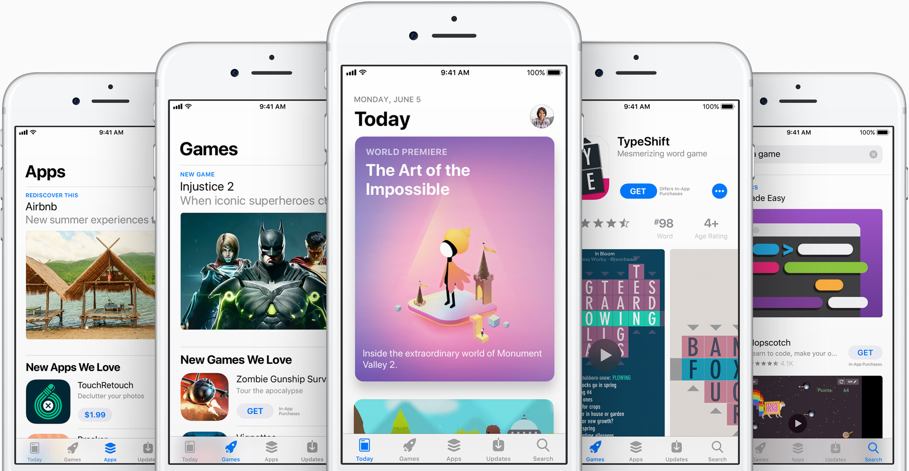

---
layout: work
top-color: dark
bottom-color: white
type: case-study
title: Live music discovery
img: http://static1.squarespace.com/static/514e40ffe4b0e29595fe765d/t/5647bbb0e4b072d19f90d5f1/1447541681826/?format=750w
categories: work case
meta: Responsive website campaign
longTitle: Designing how to discover your city's music scene
year: 2017
role: Designer
jobRole: UX, UI 
jobOutput: Responsive design, Video
tags: [featured-work, work, featured]
order: 1
thumbNail: ../assets/work/gigbloc/project-thumbnail-1.gif
feature-video: ../assets/work/gigbloc/prototypes-collage-1
client: Gigbloc

--- 

		

				

					
The challenge

					<h2>Sprint from the start</h2>
					

						Some old colleagues are launching their own product - Gigbloc. They want a product design and brand to share with potential investors.  
					

					

						Constraints can help create simple solutions.  With this project I had minimal time - a week of evenings - and no real budget.  That makes a great opportunity to see what I can do after my day job, working in a minified <a href="https://designsprintkit.withgoogle.com/" target="_blank" class="underline">design sprint</a>.  
					
							
				

		

			

				

					 
				

			

		

				

					

						Day 1 / 5
					

					<h2 class="heading">Uncover the insights first</h2>
					

						The first step in designing a product or a feature is understanding.  The context, target users, brief and ultimately, what is behind the brief.  what is the actual problem we're solving and why should we solve it? 
					
	
				
	
		

		

		     

		        
"Why are you starting Gigbloc?"

		      

			

				 
"We love music, and we love discovering and supporting up and coming bands."
		
			

		     

		        
"How does Gigbloc help people do that?"

		      

			

				 
"So music lovers can discover local bands playing in their area to support them.  And to help bands promote themselves when they’re getting started."
				 
					 	
			
			
		 
 

	

		

				

					

						I turn these insights into thoughts &amp; feelings we want users to have when they interact with Gigbloc.  I think its important to get these emotions and feelings recorded.
					

					

						These will be our north stars and be what we aim for at each decision point.  We have a shared understanding of what success will feel like.
					
						
				
	
				

					 
				
	
		

		

				

					

						Day 2 / 5
					
					
					<h2>Diverge</h2>
					

						I've always liked to sketch out concepts individually, but I've learned that this group stage .  What I liked about this phase is it proves good ideas can come from anyone on the team, and the team can make any idea better by collaborating upfront. 
					

					

					 It's like (*insert bad metaephor here*) building a wall.  Everyone comes in to the room with a couple of bricks (ideas) and, together, even though you take one brick in the end to make a wall, everyone puts mini-bricks in to build it up.  And because the room is diverse, from developers and founders and designers, everyone's bricks are made of different...stuff?  And at the end of the week, you show some strangers the wall.  So, yeah.  Wall. **Remember to replace this metaphor**.
					

				

				

	

		

			
			
		

	
		

		

				

					<h4>Branding: research &amp; execution</h4>
					

						With our ideas out on paper, I have a solid ground to quickly look at the branding.  To make prototypes as effective as possible for learning from users, they have to be as close to the real thing as possible.  Part of this means giving Gigbloc a cohesive brand.
					
	
					

						To get a good &amp; quick understanding of how people see gigs I look at images on social networks to see what people associate with the word.
					

				

				

						
				

				

					

						Gigs are simultaneously bright, but happen at night in the dark.  They're enjoyed by groups of close friends, and lots of strangers.      
						 
					
					
				
	 	
			 	

			 		
			 	

				

					
 
						The branding I played with comes back to that core insight - helping people support local gigs.  In motion, moving lines could represent both travelling to gigs, going from A to B, &amp; listening to a track from 0:00 to the last second.
					
				
				
			 					 	
		 
 	 

		

				

					

						Day 3 / 5
					
					
					<h2>Decide</h2>
					

						After a night's sleep to contemplate our ideas, we vote on which of our ideas we're going to test.  After our decision, we work out the journey.   
					
	
				

			 	

			 			
			 	
	
				

					<h3>
						Take a step back when looking at flows because people use products to solve problems.  What was their problem, how did they discover your solution, what happens afterwards?  Context matters. 
					</h3>	
					

						The real human journey doesn't start and stop with the product. 
						By taking a step back here we can streamline a user's journey, make sure each stag eand eventually save them time. And that's a big thing.  Every second you save someone adds up to hours a year if you're designing something for regular use. 
					

				
	
	
				

					

						Day 4 / 5
					
					
					<h2>Prototype</h2>
					

						I love that in design you're never finished learning.  These past two years have seen a plethora of prototyping tools created to help people test ideas in increasingly realistic ways.  Using them, I make the main prototype of the idea we picked and some prototypes of other ideas we liked.  
					
	

				
	

		
	
		<video class="dBlock mAuto chapter2" autoplay="" loop="">
				  <source src="../assets/work/gigbloc/prototypes-collage-1.mp4" type="video/mp4">
				  <source src="../assets/work/gigbloc/prototypes-collage-1.mp4" type="video/ogg">
				  Your browser does not support HTML5 video
		</video>		
		

			

				

					When testing prototypes out in the wild its good to record both audible responses (words, sighs, joyful yelps) as they use the prototypes &amp; non-audible responses (body language, facial expressions).  And always bring sweets or coffee for a thank you at the end.  
				
	
				

					After testing some ideas, as a team, we look through the results and iterate our 
				

			
	
		
			 

	

		

			

				

					Day 5 / 5
				
	
				<h2 class="heading plus">Design for discovery</h2>
				

					A lot of discovery experiences ask the user for their preferences upfront to deliver relevant results. This makes sense for things like flights.  But our executed design exposed the nearest gigs to you and encouraged interaction with the music.  Because there's a definite delight in uncovering someone new to love.  
				
					
			

		 	

		 		
		 	

		 

		

		 	

		 		

			 		<h3>Your personal feed</h3>
			 		
E
			 			Making us of the <a href="https://en.wikipedia.org/wiki/Zeigarnik_effect" target="_blank" class="underline">Zeigarnik</a> effect, we give the user a shortlist of nearby music. Making listening and liking easy means we learn the user's preferences to provide a more personalised list each time.
			 		

			 	

		 	
						
		 	

					<video class="phone dBlock mAuto chapter2 m-m-b w50" autoplay="" loop="">
							  <source src="../assets/work/appearhere-suggestions/dice-ticket.mp4" type="video/mp4">
							  <source src="../assets/work/appearhere-suggestions/dice-ticket.ogg" type="video/ogg">
							  Your browser does not support HTML5 video
					</video>
		 	

		 
		

		

		 	

					<video class="phone dBlock mAuto chapter2 m-m-b w50" autoplay="" loop="">
							  <source src="../assets/work/appearhere-suggestions/dice-ticket.mp4" type="video/mp4">
							  <source src="../assets/work/appearhere-suggestions/dice-ticket.ogg" type="video/ogg">
							  Your browser does not support HTML5 video
					</video>			
		 	
			
		 	

		 		

			 		<h3>Focus on what you want</h3>
			 		

			 			Discovery shouldn't feel like admin.  By exposing the days of the week, instead of hiding them in a drop down, I can encourage exploration and the chance the user will find something.
			 		

			 	

		 	
						
		 
	

		

				

					
				
					
				

					

						Find what you want
					

					

						Discovery shouldn't feel like admin.  By exposing the days of the week, instead of hiding them in a drop down, I can encourage exploration and the chance the user will find something.
					

				
	
		

		

				

					

						 Make plans with friends
					

					

						Going to gigs can be a great social activity.  We partner with venues to provide in-app purchases. 
					

				
	
				

					
				
	
		
	
		

				

					
				
					
				

					

						Get the tickets
					

					

						Partnering with venues or Songkick could provide in-app Apple Pay purchases, making it easy for people to buy, and with sharing features, get paid.
					

				
	
		
					

	

