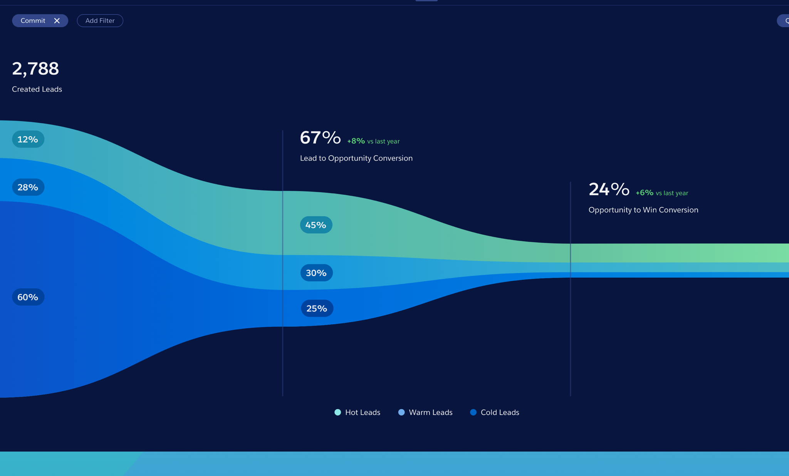
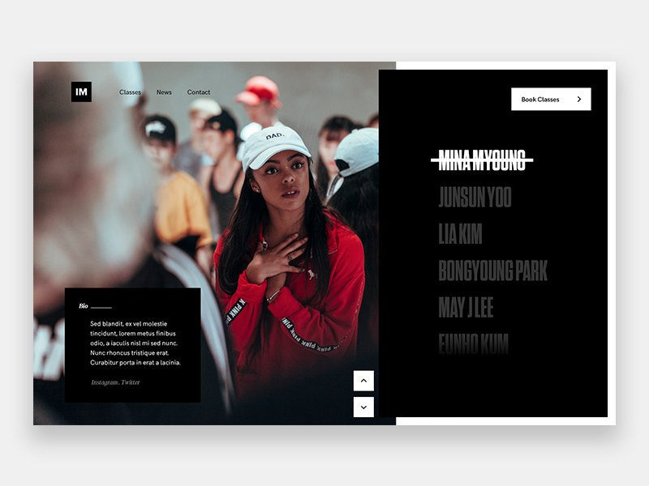
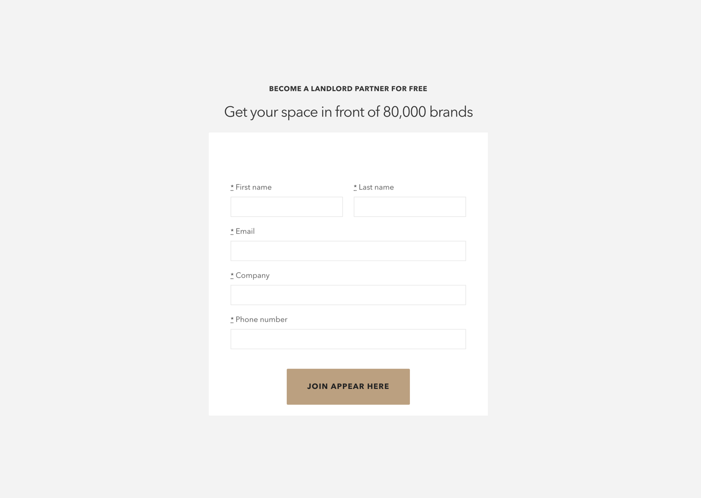

		

				

					
The challenge

					<h2>Disrupting a dinosaur industry</h2>
					

						Appear Here is the world’s leading marketplace for brands looking to rent retail space.  Thousands of brands looking at thousands of spaces around the world.  Thousands of landlords around the world looking for the right brands to rent their empty spaces.   Both sides experience in the marketplace could potentially include a lot of frustration with the other side, causing delays.  Delays in a funnel often lead to people leaving the journey.  
					
							
					 
					

						As the first startup in this industry, Appear Here pushed against an industry where rentals took an average of 6 months to happen, pushing it down to days.  
					

				

				

					

						Process
					

					<h2>Divide &amp; conquer</h2>
					

						With such a potentially large piece of work, from the beginning I want to seperate the two large streams.  For each group, there are two.  The first is studying the existing journeys to identify what we can improve.  The second is helping encourage people to actually join those journeys, join the marketplace.  Each need needs some slightly different approaches - but ultimately, they both have a foundation in understanding what motivates people to act.
					

					

						There is a lot to unpack there &amp;, as with anything, I start with a kind of "zooming in" understanding about the process for both sides of the marketplace - starting off with the big steps from A to B to C, until I have a better understanding to start detailing the steps between.
					
	
					<h3>Understanding motive</h3>
					

						Intercom's Des Traynor has written some insightful work on the four forces that motivate people - the push of now; the pull of a new solution; anxiety of what could happen with that solution; attachment to what they currently have.  I use this as a framework to come up with ideas of what we can do to create users.  
					

					

						Appear Here celebrates its community of brands by hosting events where people interested in looking for space can come hear from those who are using the marketplace.  These are great chances to meet and ask people about their pushes and pulls.  I also kept an eye out for new brands appearing in shops or markets - and would go in and spend a few minutes talking to them.
					

					

						 they couldn’t completely envisage themselves as making the leap.  It goes back to that anxiety of what could happen & attachment to what they currently have.  Its an unknown risk. So I wanted to put the brands words forward, not as curated by Appear Here but their experience in their own words - step by step.

					

				
	

				

						<video class="w100 shadow-one chapter" autoplay="" loop="">
								  <source src="../assets/work/appearhere-funnel/awwwards-nahelmoussi-portfolio.mp4" type="video/mp4">
								  <source src="../assets/work/appearhere-funnel/awwwards-nahelmoussi-portfolio.ogg" type="video/ogg">
								  Your browser does not support HTML5 video
						</video>						
				

				

					

						By putting these into a step by step bitesize format, we can help lead people along a journey that helps reduce some of that anxiety of what could happen.  This is by letting the community speak as experts out loud. 
					

					

						I want these in step by step guide because it follows Kaushiki’s See / Think / Do stages.  We want them to see, over time, its a process they can follow to achieve.  By regularly appearing in their inbox with more information we create a habit loop that rewards them, instead of overwhelming them.
					

				

				

					
				

				

					

						Putting their products into the narrative helps encourage finding out more.
					

					

						These are emotional events.  
					

				

		

	

		

			
Attracting spaces

			<h2>Disrupting a dinosaur industry</h2>
			

				Appear Here’s landlord partnerships team had an outreach strategy that involved calling and talking to landlords who could join the funnel.  I listened to audio recordings of these calls and talked to the partnerships team about what those push and pull factors are for landlords.   
			
							
			

				Landlords care ultimately about vacancy and income.  The immediate competition matters alot to them.  
			

			 
			

				The existing landlord application page.
			

			

				From quantative data I understood there was a drop off of 55% from this page. And of the 32% who completed the application, under half would go on to actually be accepted.  This told two main stories:
			

			<ul>

				<li>Potential landlords not feeling we can solve their problem</li>
				<li>Potential landlords not being what we know our marketplace demands</li>
				<li>The postcode of a property can tell us if its worth our while</li>
			</ul>
			

				I collected qualitative data to identify the why behind these stories.   This was discussing with the in-house landlord partnerships teams and listening to recordings of their outreach phone chats with targeted landlords.
			

			
I learned that, for landlords, their priority was about their space and what they could make from it.  Their pushes and pulls were expenses if the place is empty, the competing spaces in their area.  If this page could better capitalise on that maybe it would work.

		
		

		

			
		

		

			

				Capturing the postcode identifies exactly where the space is.  This enables the partnerships team to know if this space is within a target area.  If yes, it moves into a priority funnel for following up. The more automatic your funnels can be, the more it scales well with your personnel and business.  The existing page started with what we wanted from them (contact details), not what sets us apart from the competition.  It didn't even start with what we really needed anyways.  We weren't showing the value proposition.
			

			<h4>The more automatic the funnel can be designed, the more it scales with personnel and business changes.</h4>
			

				These ideas were tested with the landlord partnerships team.
			

		

	

	

		

			
Improving the markerplace

			<h2>The best additions to an existing product we can make, can often be the things we take out to bring clarity &amp; focus</h2>
			

				Not everything needs to be a new piece added.  I really think the best additions to a product we can make, are the things we take out to bring clarity and focus.  First thing is to understand the existing journeys of both the spaces and the brands.   I documented the existing user journeys to have something.
			
							
			 
			

				Clearly, there are some breakpoints or delays.  Journey's slowed down specifically at the offer stage &amp; the ____.  For each of these stages I would zoom in to try to ideate around the issue.
			

		

		

			<h3>Consistency matters</h3>
			

				A product is kind of like a sci-fi movie set in another universe.  You get the rules of that universe in the first act and, if in the third act the twist contradicts those rules, you think “fuck that.” An inconsistent product is the same thing - fuck that.
			

			

				I did a mini audit of the existing interface, providing some consistency rules, using <a href="">Zeplin</a> to share with developers, and begin designing a pattern library.  One of the best aspects of working at Appear Here was working with a development team that was commited to that consistency.
			

		

		

			<h3>Sign up wall</h3>
			

				In a bid to boost user numbers, we wanted to introduce a wall that would encourage sign ups.  It's a bit of a dark art to do this, blocking people from the content they wanted to see, and if not done right, they can be contribute to a poor brand experience.
			

			

				 Through a sequence of data research, competitor analysis and ideation with the product manager, we arrived at two concepts to trial.
			

			<h3>#1. Block</h3>
			 
			
This idea was proof of the successs

		
		

	

