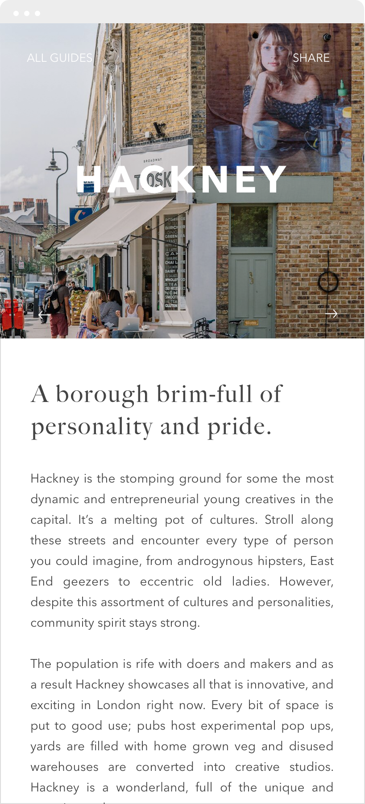
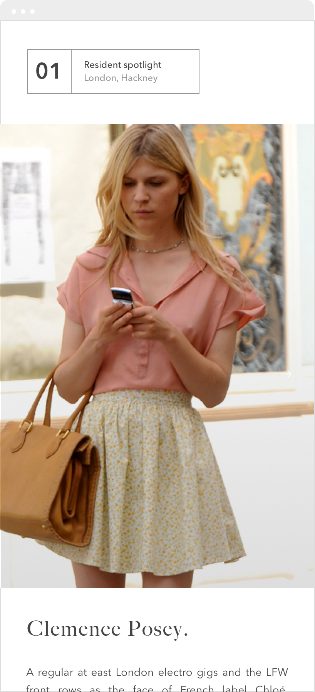
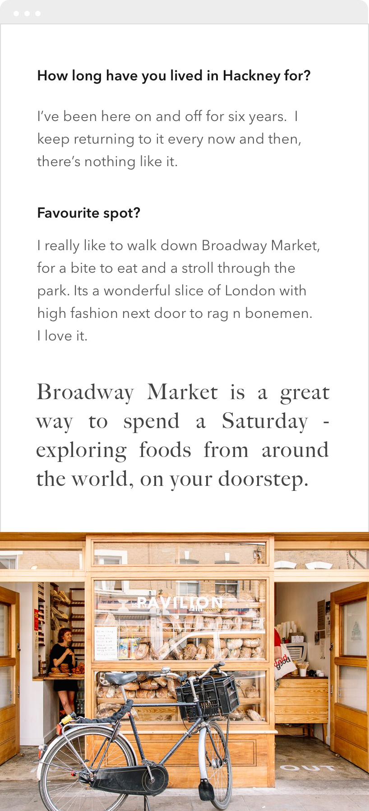
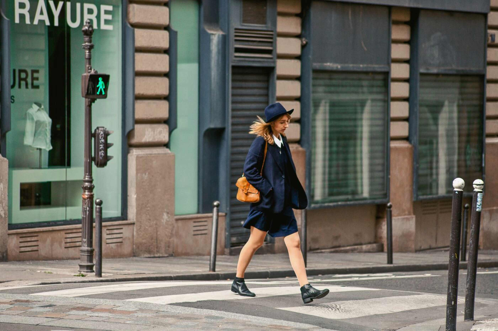
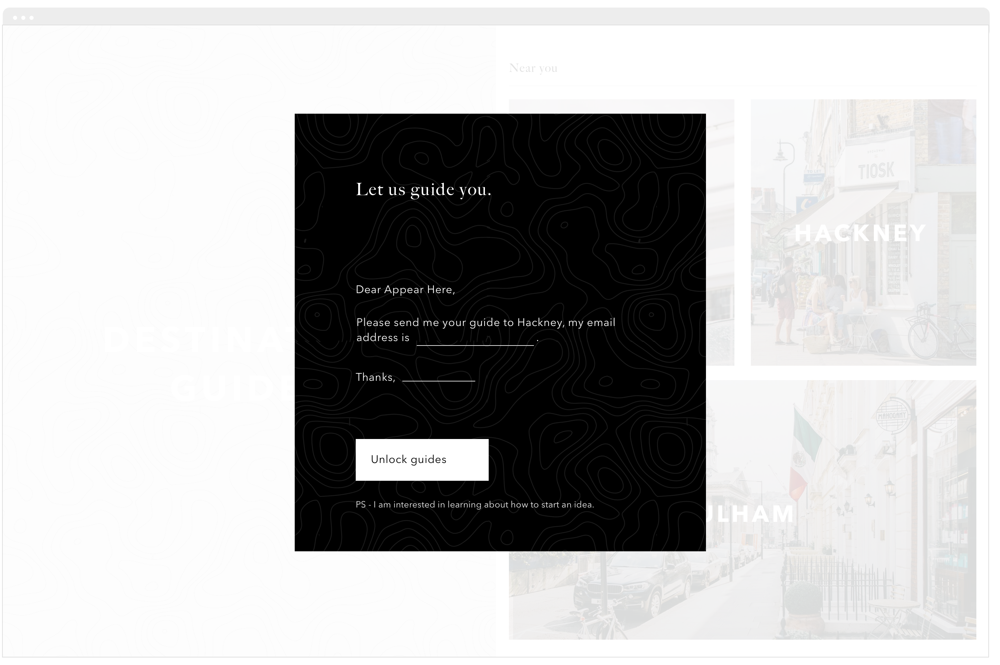

		

				

					

						Appear Here is the premier platform for booking retail space around the world.
					

					

						They needed a design solution to elevate their city guides above those of competitors.
					

					

						In an ambitious start-up you can't take the brief as the end goal of your work.  You should always look beyond it, and towards other problems your bosses might not even forsee.
					

				
 	
		

		 
 
		 	

		 		 
		 	

				

					

						Exploring cities
					

					

						I split the screen to give the locations a strong visual while delivering content.  It also helps visualise the journey of one neighbourhood to the next.	
					

				
 			 	

		 	

		 		 
		 	

				

		 

		 

		 	

		 		 
		 	
	
		 	

		 		 
		 	

		 	

		 		 
		 	
				 				 	
		 
 

		 	

					

						BRANDING
					
		 		
		 		

		 			I went with a dark interface for a few reasons, but chief among them (does anyone say that in real life) was gigs tend to happen at night and I wanted the experience to help users feel that sense of night.
		 		

		 	
			 

		 	

					

						FEATURE TEASE
					
		 		
		 		

		 			When looking for investment its good to think of features that might be the difference maker for possible users.  I thought a share feature would help increase users, as going to gigs is really a social activity.
		 		

		 	
	
	
		 	

		 		 
		 	
		
			

					

						Part of the design involved selecting imagery from freelance photographers, to help tell the story of each location. 
					
						 		 
			

		

				

					

						Designing games from scratch means defining logic and laws, algorythyms and animations.  
					

				
 	
				

						
				

	

