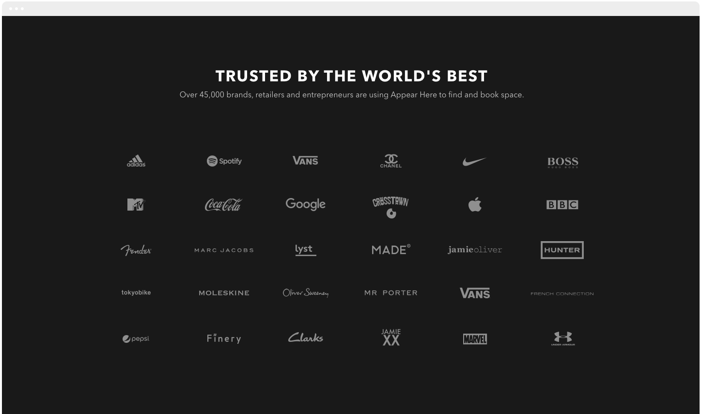
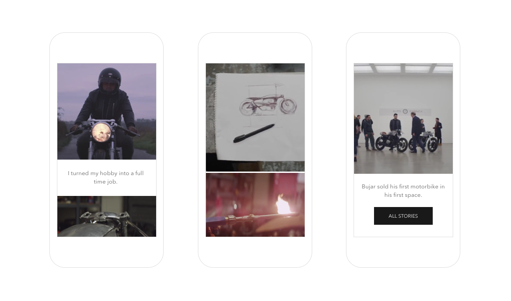
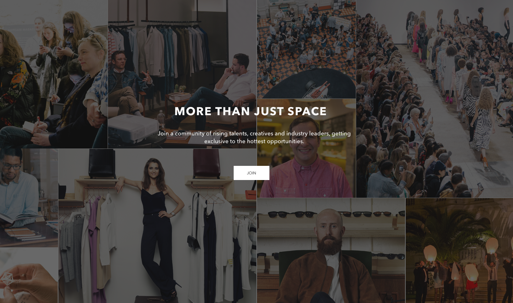
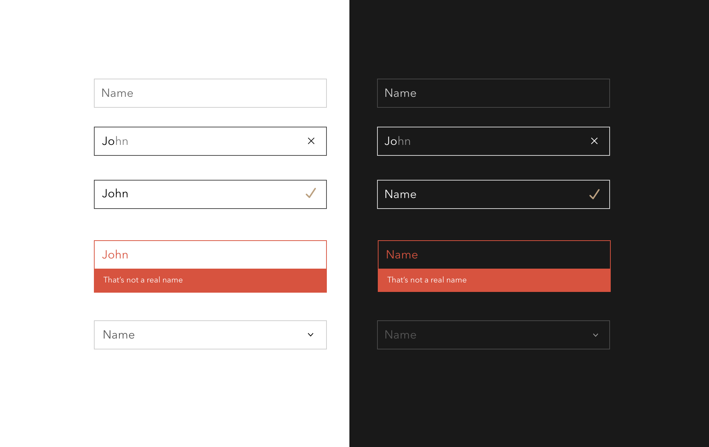
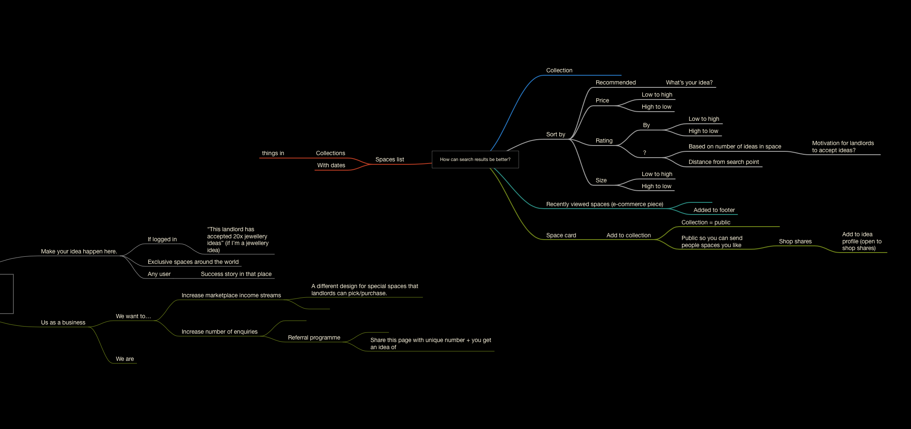

		

				

					

						Appear Here is the premier platform worldwide for renting short term retail space. 
					

					

						As part of a brand &amp; brand refresh, I design how it works pages to guide possible tenants and landlords on how it works.
					
						
				
 	
		

		 
 
		 	

		 		 
		 	

				

					

						DIFFERENT INTERNATIONAL AUDIENCES
					

					

						Tenants are attracted to the concept of joining a community.  As the company expands to become international, I wanted to align product innovation with the storyline of their idea's journey, in a way that visually communicates - even if they didn't read a word.
					

				
 			 	

		 

		 

		 	

		 		 
		 		 		 		
		 	
	

				

					<video class="mAuto w90 dBlock" autoplay="" loop="">
							  <source src="assets/work/ahHow/bujar1.mp4" type="video/mp4">
							  <source src="mov_bbb.ogg" type="video/ogg">
							  Your browser does not support HTML5 video.
					</video>		
				

				

					<video class="mAuto w90 dBlock" autoplay="" loop="">
							  <source src="assets/work/ahHow/Example test1_1.mp4" type="video/mp4">
							  <source src="mov_bbb.ogg" type="video/ogg">
							  Your browser does not support HTML5 video.
					</video>		
				

		 
 

		 	

					

						COMPONENT LIBRRARY
					
		 		
		 		

		 			Alongside designing the screens, I put each component into Zeplin for the developers seperately.  So we have one golden source to build from, and nothing is left undesigned/considered.  Sometimes, if you just think 
		 		

		 	
	
		 	

		 		 
		 	
		 	
				

						MIND MAPPING	
				
	
		 		

		 			I use mind node to gather research into plottable action points for a design or a discussion.  It means we can trace things back to the source in a visual, easy way.
		 		
		 	
		 	

		 		 
		 	
			 

		
		 
	

