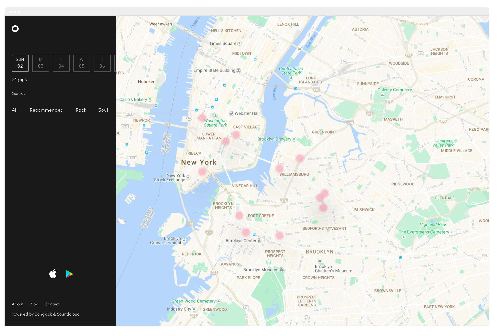
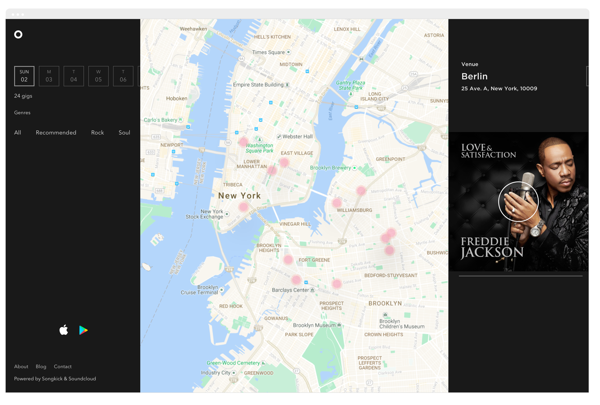
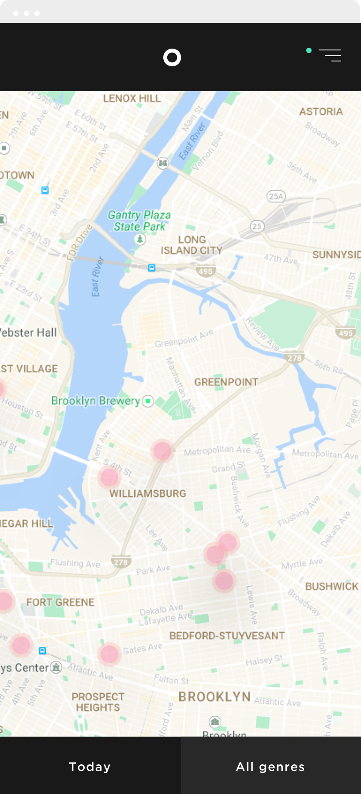
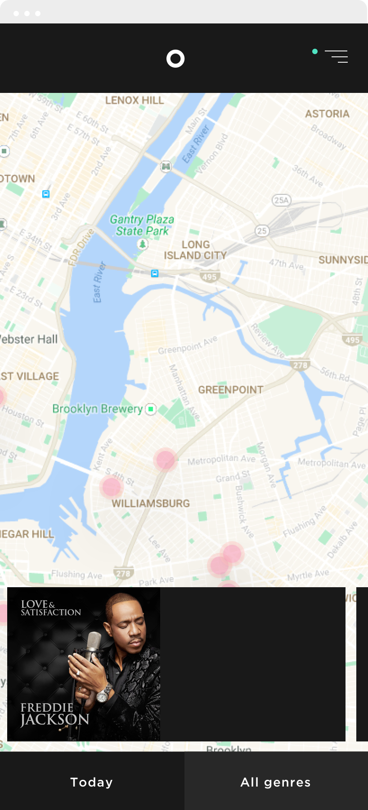
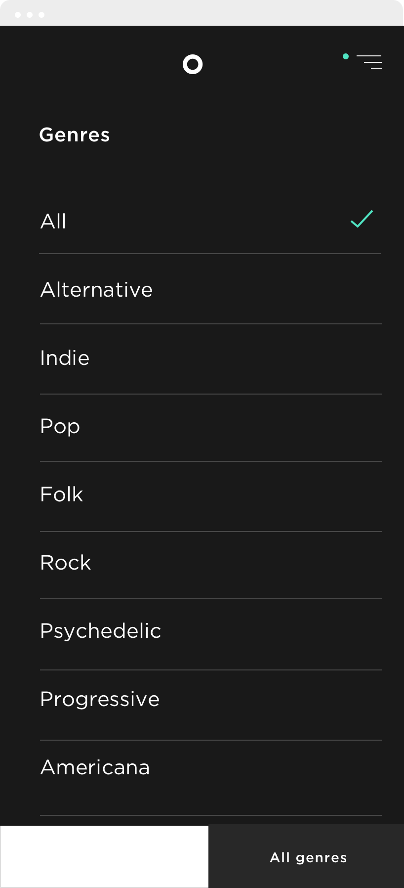
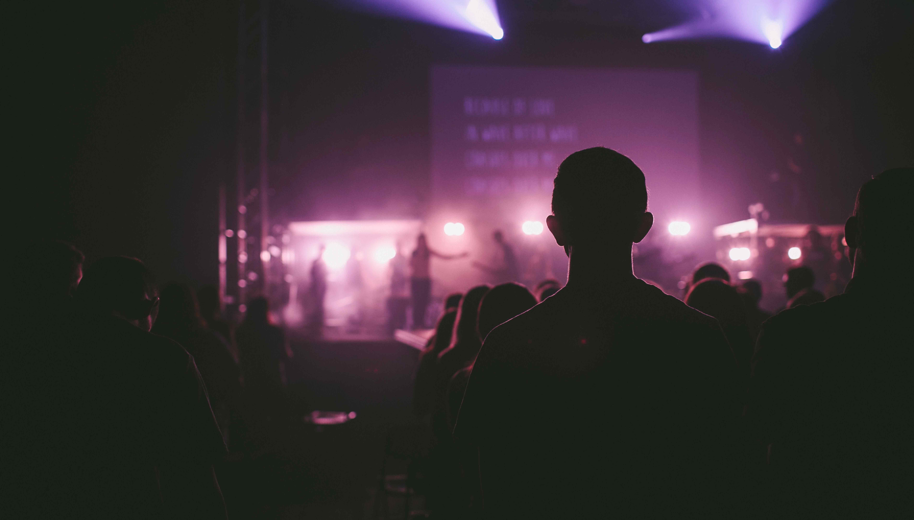

		

				

					

						Citymapper for music gigs.
					

				
 	
		

		 
 
		 	

		 		 
		 	

				

					

						Constraints
					

					

						Some friends asked me to create a vision for their new start-up.  With no real budget or time, I just went with my instincts.  Constraints of time and budget can help drive design decisions, to quick simple solutions that hopefully lead to a simple interface.
					

				
 			 	

		 

		 

		 	

		 		 
		 		 
		 	

		 	

		 		 
		 	
	
		 	

		 		 
		 	

		 	

		 		 
		 	
				 				 	
		 
 

		 	

					

						BRANDING
					
		 		
		 		

		 			I went with a dark interface for a few reasons, but chief among them (does anyone say that in real life) was gigs tend to happen at night and I wanted the experience to help users feel that sense of night.
		 		

		 	
			 

		 	

					

						FEATURE TEASE
					
		 		
		 		

		 			When looking for investment its good to think of features that might be the difference maker for possible users.  I thought a share feature would help increase users, as going to gigs is really a social activity.
		 		

		 	
	
		 	

		 		 
		 	
			 

		

				

					

						Designing games from scratch means defining logic and laws, algorythyms and animations.  
					

				
 	
				

						
				

				

					<video id="myVideo5b" class="mAuto" autoplay="" loop="">
							  <source src="assets/work/nick/thomasCookGame1.mp4" type="video/mp4">
							  <source src="mov_bbb.ogg" type="video/ogg">
							  Your browser does not support HTML5 video.
					</video>		
				

		
		 

		 

		 	

		 		 
		 	
	
		 	

		 		 
		 	
	
		 
	
		 
		 	

		 		 
		 	
	

	

