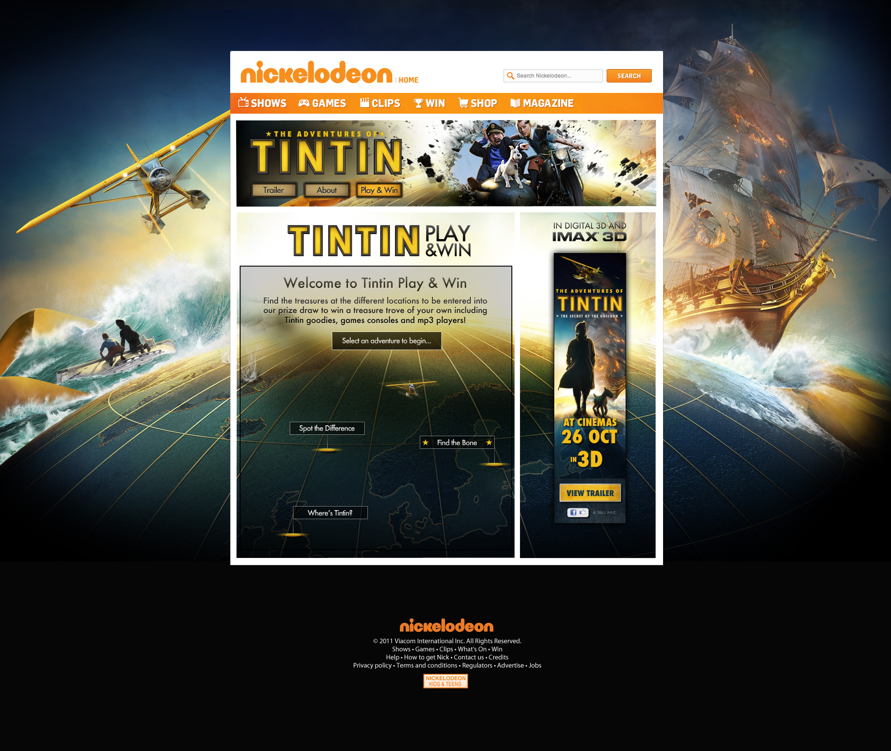

		

				

					

						MTV wanted to boost income for the #1 kids entertainment site nick.co.uk. I helped design flexible templates to help sell microsites, games &amp; campaigns to their big brand partners. Between 2010 &amp; 2013 I worked on 30+ projects, generating ideas &amp; designs to push the templates to meet various briefs, brands &amp; creative needs.
					

				
 	
		

		 
 
		 	

		 		 
		 	

		 

		 

		 	

		 		 
		 	
	
		 	

		 		 
		 	
	
		 
 

		 	

		 		

		 			I took assets from poster designs, and gave them extra depth and texture for interactive.
		 		

		 	
	
		 	

		 		 
		 	
		 	
		 	

		 		 
		 	
			 

		 

		 	

		 		 
		 	
	
		 	

		 		 
		 	
	
		 
	

		

				

					

						Designing games from scratch means defining logic and laws, algorythyms and animations.  
					

				
 	
				

						
				

				

					<video id="myVideo5b" class="mAuto" autoplay="" loop="">
							  <source src="assets/work/nick/thomasCookGame1.mp4" type="video/mp4">
							  <source src="mov_bbb.ogg" type="video/ogg">
							  Your browser does not support HTML5 video.
					</video>		
				

		
		 

		 

		 	

		 		 
		 	
	
		 	

		 		 
		 	
	
		 
	
		 
	

<!--

		 

		      

			        <ul class="blockLi list">
			        	<li>"A beautiful free platform"</li>
			        	<li><a href="https://twitter.com/Tiffy4u/status/560884998828748801" class="default gold" target="_blank">@tiffy</a></li>
			        </ul>
		       

		      

			        <ul class="blockLi list">
			        	<li>"Really easy to use"</li>
			        	<li><a href="https://twitter.com/Tiffy4u/status/560884998828748801" class="gold default" target="_blank">@tiffy</a></li>
			        </ul>
		       
			       		      		 	
		      

			        <ul class="blockLi list">
			        	<li>"In awe of the possibilities"</li>
			        	<li><a href="https://twitter.com/showloveworld/status/571021022301954048" class="gold default" target="_blank">@showloveworld</a></li>
			        </ul>	
		       
		
		      

			        <ul class="blockLi list">
			        	<li>"Really cool technology"</li>
			        	<li><a href="https://twitter.com/KiraOConnor/status/557991587947368448" class="gold default" target="_blank">@Kira</a></li>
			        </ul>
		       
		       	            
		 
	 

			

				

					"Nique introduced a consistent design language allowing developers to iterate on the core web application at breakneck speeds."
				

				
Colin, Product manager
			
			
	

				 <video class="shadow screeniOSVideo" autoplay loop>
				  <source src="http://niquewoodhouse.github.io/assets/cards3.mp4" type="video/mp4">
				  <source src="mov_bbb.ogg" type="video/ogg">
				  Your browser does not support HTML5 video.
				</video>

	

		
 
				

						

							<h2>Premium users included</h2>
						

						 

								
	
								

						 
							 	
				

		

	
	

	

		
 
				

						

							<h2>One in a million</h2>
						

						 

								

									In a world where a million videos are published every day, Wirewax is a platform that lets anyone make their videos stand out from the crowd.  I've had the priveledge of designing a product trusted by some of the world's most renowned brands.
								

						 
							 	
				

		

	
	

		 
 
		 	

		 		<h2 class="textCenter">
		 			Design goals
		 		</h2>
		 	

		 
		
	
		 
 
		 	

		 		

		 			The technology of Wirewax is incredibly complex &amp; feature rich.  People use products because they let them do what they came to do, simply.  The more features, the more powerful a product is but without the correct goals in place this can lead to a bloated product that no one can use, simply.  So I questioned each requested feature &amp; how to make it most useful to users.
		 		

		 		

		 			In lots of these start ups everyone has great ideas but its important, for the end user, these ideas can fit together to make a unified coherent experience.  The best products let users think naturally and conform to us, not the other way around.  
		 		

		 	

		 	
	 	
		 		

		 			A lot of tech start ups think talking deeply about the tech helps sell the product but that can backfire.  I try to hide the technology behind a simple human interface. Show why the product is useful, not how.  That lets people focus on why they logged in in the first place.
		 		

		 	
		 	
		 

		

		      

		        	<h2>One in a million</h2>
		      

		      

			        

			        	In a world where a million videos are published every day, Wirewax is a platform that lets anyone make their videos stand out from the crowd.  I've had the priveledge of designing a product trusted by some of the world's most renowned brands.
			        

			        
			        
		       

		 

-->