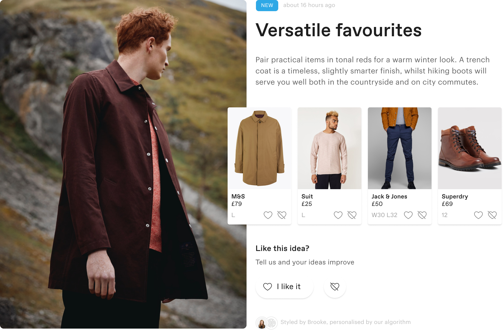

---
layout: work
top-color: dark
bottom-color: white
type: case-study
title: Exploring ideas
img: ../assets/work/thread/insta01.jpg
categories: work case
meta: Responsive website campaign
longTitle: Increasing engagement
year: 2019
role: Research,  Design, IA
jobRole: UX, UI 
jobOutput: Responsive design, Video
tags: [featured-work, work, featured]
order: 1
thumbNail: ../assets/work/thread/insta01.jpg
feature-video: ../assets/work/thread/homepage01video
client: Thread
--- 

		

				

					
Introduction

					<h2>Thread is Spotify for clothes</h2>
					

						Thread learns from a user to suggest outfits and items that match their budget, style and size.
					

					

						One of Thread’s core features is Ideas: a feed of shoppable, personalised outfits.  They're updated weekly, with 10 new suggestions for every user, sent to them by their Thread stylist.  
					

					 							
				

		

		

				

					

						The problem
					

					<h2 class="heading">A core feature had become outdated</h2>
					

						The weekly email users got had created a rigid habit loop that meant users would tend to not visit Thread without the reminder of the email.  If they did open that email, and visit their Ideas feed, they'd have no choice but to scroll through whatever the algorithm and their stylist had created for them.  
					

					
					

						User engagement and purchases from Ideas had declined.  Since the ideas feed was originally created, feed experiences had evolved.  People had grown used to getting specific content on demand.  Things had moved on, and a feed that just sent things to a user didn’t cut it anymore.  
					
	
					

						Thread formed a team of myself and two engineers to solve this.
					

				
	
				

					<h3 class="">
						People had grown used to getting specific content on demand.  Feeds like Instagram, Pinterest, Facebook, Netflix had changed their expectations.
					</h3>
					<h3 class="">
						We had to play catch up and provide ideas on demand.
					</h3>
				

		

		

				

					
Discovery

					<h2>Start with the user</h2>
					

						We knew we needed to provide access to more ideas but, with over 3000 ideas in Thread's machine learning, we needed to discover which ones.  I used a few strategies in a week to build up an insight repository.
					
						
					

						One of the things I most love about designing product is getting close to the user and designing with them.  Collaboarting with them leads to better product - the sooner it happens, the stronger the product gets.
					
					
					

						I grouped users into different behaviour buckets, so when it came to getting close to the user, I had a wide spectrum to learn from.  I needed to both understand the users who regularly visited their Ideas; those who rarely did; those who used to but don't anymore.  Working with an engineer, we generated lists of users who fell into these groups and I emailed them asking for help in exchange for gift cards they could use on Thread.
					

					<h3 class="">
						Knowing how to find and include users early in any problem is one of the most important things you can do to move in the right direction.
					</h3>					
				
	
			

				

					
					

						Surveys and interview outreach helped me understand the types of ideas users would want through quantative and qualitatve methods. 
					

					
					

						Card sorting and personas help me enrich my understanding of diverse users, and better advocate for them throughout the product proces. 
					
	
					<h3 class="two-thirds">
						Alongside interviews I'd test prototypes with users, making the insight:validation loop quick and efficient.
					</h3>
				

				

					
					

						Prototyping a wide variety of interface paradigms with each group helps me understand on deeper levels and build a longer term understanding that could be useful in the future of the product
					
									
				

			
	
			

					

						Exclusion leads to bias, which makes for bad product, and everything else really.  Feedback and perspective are powerful tools, like any software.  I use them at every stage to elevate my understanding and help make sure we're working on the right things.
					

					

						After a week I'd developed a strong understanding of how the various groups would like to explore ideas, why, and what kind of ideas they're looking for.
					

			

		

<!--

		

				

					

						Constraints
					
					
					<h2>Ship to learn</h2>
					

						Thread created this team to increase engagement and orders from the ideas feed.  Knowing this meant that whatever we introduced to achieve that couldn't be detremental to the pre-existing engagement and orders.  If we do something that frustrates the users satisifed with their weekly email flow <em> - our most engaged users -</em>, we'll just be swapping engagement for engagement and not really contributing much at all to our goal.
					
				
					

						This constraint ultimately gave us actually very little phsyical real estate to try to introduce new value to the feed.  We took this as an opportunity to learn by trying a few experiments.  Will people use a filter button?  Will they use tabs?  
					

					

						I think this is an important part of product strategy.  The sooner you ship, the sooner you can start solving the problem for users.  And if you can solve it in less effort than the more visionary version will take, you can move onto solving other problems, and achieving more for the user and business.  
					

				

			

				

					
					

						Filters got a 5% engagement rate and increased orders from the feed by 12%.  Tabs got a 15% engagement rate, and increased orders by 50%. We had validated we were onto something.  
					
										
				

			
					
			
 

-->

		

				

					

						Collaborate
					
					
					<h2>Understand intent</h2>
					

						From these tests, a small pattern was emerging that validated some of the things users had told me in interviews.  The more we optimise the interface to inspire users, the more they'll engage.
					

					

						I started to explore increasing the inspiration to the interface through playlists.  This was a really exciting opportunity to bring more exposure to Thread's excellent content and styling teams. 
					
	
				

			 	

			 			
			 	
	
				

					

						By combining imagery with the copy, we could optimise for short-term engagement from the user, the right memory space to be working with for lower engaged users.
					

				
			 	
		
	

	

		

			

				

					Solution
				
	
				<h2 class="heading plus">Idea playlists</h2>
				

					I believe that great product scales.  That means taking advantage of the patterns that are familiar to users; using and elevating what’s already a part of Thread; and deeply questioning the value of anything that introduces complexity for our users, or ourselves and slows our progress.  Be holistic, not episodic.  
				
	 				
			

			 	

			 			
			 	
			
			

				

					We made the default playlist the ideas from your stylist, so we didn't do anything to affect the existing flows.  This reduced business risk subtantially.  
				
	 				
			
	
			

				<h3>
					Engagement increased by 20% &amp; orders from the feed increased by 100%.
				</h3>	 				
			
	
			

				

					This was a really interesting project, where the constraints gave us a small area to make a big impact.  Probably the biggest lesson I learned was the fact that you can make a big impact with a small area of real estate.  Big impact not just in terms of metrics, in terms of shifting the whole product. 
				
	 			
				

					Before this project, the Ideas feed was a push mechnism.  A user gets an email a week, that email takes them to their feed which has 10 or so new ideas on it.  With this small change, users can find 100s of ideas for themselves.  With this small change, we impacted the core feature to make it more rewarding for our users.
				
	
			
									 	
	 

			

	

