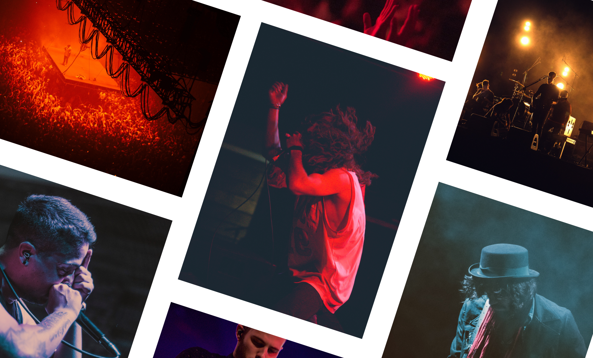

		

				

					<h2 class="heading">The brief</h2>
					

						Some old colleagues were launching their own product - Gigbloc. They needed a design solution to share with potential investors.  
					

					

						Constraints can help create simple solutions.  With this project, I had minimal time and budget so it was a great opportunity to see what I can do over a week of evenings, after my day job, working in a tweaked <a href="https://designsprintkit.withgoogle.com/" target="_blank" class="underline">design sprint</a>.  
					
							
				

				

					 
				

				

					

						Day 1 / 5
					

					<h2 class="heading">Uncover the insights first</h2>
					

						The first step in designing a product or a feature is understanding.  The context, the target users, the brief.  Ultimately, I need to understand the reason behind the brief  - what is the actual problem we're solving and why should we solve it? 
					
	
				
	
		

	

		

		     

		        
"Why are you starting Gigbloc?"

		      

			

				 
"We love music, and we love discovering and supporting up and coming bands."
		
			

		     

		        
"How does Gigbloc help people do that?"

		      

			

				 
"So music lovers can discover local bands playing in their area to support them.  And to help bands promote themselves when they’re getting started."
				 
					 	
			
			
		 
 
	

	

		

				

					

						I turn these insights into thoughts &amp; feelings we want users to have when they interact with Gigbloc.  I think its important to get these emotions and feelings recorded.
					

					

						These will be our north stars and be what we aim for at each decision point.  We have a shared understanding of what success will feel like.
					
						
				
	
				

					 
				
	
		

		

				

					

						Day 2 / 5
					
					
					<h2 class="heading">Sketching together</h2>
					

						I've always liked to sketch out concepts.  This is the time to think big and, when the team looks at the ideas to go small with real world constraints and then scale up.
					

					

						This concepting part of the process is one I've always enjoyed.  Getting thoughts out onto paper jogs creative side.  But I'd not really experienced this as part of a team.
					
	
				

		

		 

		 	

		 		
		 		<!--
			 		

			 			An example idea that comes from doodling for 10 minutes - people travelling to a foreign city give their budget &amp; what music they like and Gigbloc provides suggestions for each night of their stay.
			 		

			 	--> 
		 	
	 					 	
		 
 

		

				

					
Branding: research &amp; execute

					

						With an agreement on the principles of what we want, &amp; a , I have a solid ground to start looking at the first deliverable - the brand.
					
	
				

				

						
				

				

					

						To get a good understanding of how people see gigs I look at the use of .  Gigs are dark, enjoyed by friends &amp; crowds but simultaneously intimate with the performers.  This helps inform the colour scheme and logo ideas.
					
					
				

		

		 

			 	

			 		 
			 	

				

					

						Gigbloc's brand is about the ways we can support local gigs.  Lines move to represent both travelling to gigs and  from A to B &amp; listening to a track, from 00:00 to the last second.
					
					
				
	
			 	

			 			
			 	
	
	 		 					 	
		 
 	 

		

				

					
Create &amp; confirm the flows

					

						Now with some of the basic branding to give visuals to the emotions I want users to feel, I needed to look at the core journeys to discovering music around you.
					
	
				

			 	

			 			
			 	
	
				

					

						For the first draft, the more abstracted from a U.I these flows are, the better as it helps focus on the flow itself - getting that right.
					
	
					

						What does the user want to achieve?  Ok, what do they need to actually help them do that?  By taking a step back from just starting to wireframe everything here you can streamline a user's journey and eventually save them time.
						And that's a big thing. Every second you save someone adds up to hours a year if they're regular users. 
					

				
	
			 	

			 			
			 	
				
			 	

			 			
			 	
	
				

					

						Understanding flows before wireframing things helps the team define what's in scope, and what isn't.  This is where the designer needs to collaborate and negotiate with the wider team.  There's no point now in wireframing or pixel perfecting buying tickets through the app if its something that we won't be able to build in the next 3 months.  Especially when time is of the essence.
					
	
					
 
						So I designed the agreed core flows and the co-founders decided to use Songkick’s API to locate gigs and Soundcloud’s API to play the performer's music.  So Gigbloc would be self-populating, to minimise work.
					

					

						Having defined the flows we wanted users to try, we sketched some U.I options, using the early emotion exploration to help decide which were the most effective.  I'd take those and create a couple of prototypes for testing with friends.
					

				
	
				

					

						Always test early with your market.
					

					

						This helps you get on the right track, and helps remove any personal preference the designer, or anyone has.  What we do is about solving the user's problems. I took the wireframes we most liked and animated prototypes with <a href="http://principleformac.com/" target="_blank" class="underline">Principle</a>.  The more like the real experience the prototype can be, the better feedback you get.
					

					

						One of the prototypes, my favourite, tested the assumption we needed a map to show local music.   
					

				
	
				

						<video class="phone dBlock mAuto chapter m-m-b w50" autoplay="" loop="">
								  <source src="../assets/work/appearhere-suggestions/dice-ticket.mp4" type="video/mp4">
								  <source src="../assets/work/appearhere-suggestions/dice-ticket.ogg" type="video/ogg">
								  Your browser does not support HTML5 video
						</video>					
				
		 							 					
		
	 

	

		

			

				<h2 class="heading plus">Designed for discovery</h2>
				

					A lot of discovery experiences ask the user for their preferences upfront to deliver relevant results. Our final design exposed the nearest gigs to you and encouraged interaction with the music.  Because there's a definite delight in uncovering someone new to listen to.
				
					
			

		 	

		 		
		 	

		 

				

					

							<h3 class="w60 mAuto">Building trust in edge cases</h3>
							

								When a concierge adds a space to the shortlist, we automatically check the brand’s past to say if they’ve got any history with that space.  The positions the tool as a concierge's helper, and helps build a trust relationship between product and user.
							

					

				 	

						<video class="phone dBlock mAuto chapter m-m-b w50" autoplay="" loop="">
								  <source src="../assets/work/appearhere-suggestions/dice-ticket.mp4" type="video/mp4">
								  <source src="../assets/work/appearhere-suggestions/dice-ticket.ogg" type="video/ogg">
								  Your browser does not support HTML5 video
						</video>
				 		<!-- interface lets you know they already liked that space -->		
				 	
										
				

		 
		

				

					

						Your daily feed.
					

					

						Making us of the <a href="https://en.wikipedia.org/wiki/Zeigarnik_effect" target="_blank" class="underline">Zeigarnik</a> effect, we give the user a shortlist of nearby music. Making listening and liking easy means we learn the user's preferences to provide a more personalised list each time.
					

				
	
				

					
				
	

		

		

				

					
				
					
				

					

						Find what you want
					

					

						Discovery shouldn't feel like admin.  By exposing the days of the week, instead of hiding them in a drop down, I can encourage exploration and the chance the user will find something.
					

				
	
		
		
		

				

					

						 Make plans with friends
					

					

						Going to gigs can be a great social activity.  We partner with venues to provide in-app purchases. 
					

				
	
				

					
				
	
		
	
		

				

					
				
					
				

					

						Get the tickets
					

					

						Partnering with venues or Songkick could provide in-app Apple Pay purchases, making it easy for people to buy, and with sharing features, get paid.
					

				
	
		
					

	

