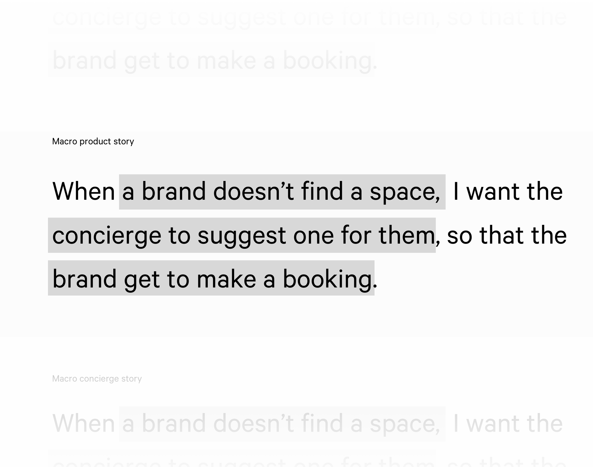
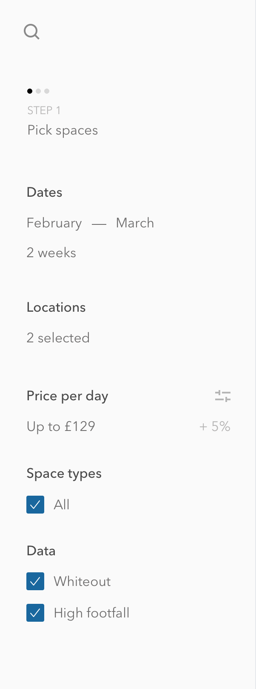
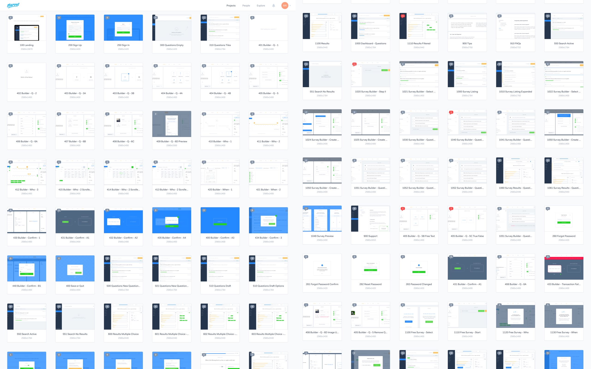

		

				

					
The brief

					<h2 class="heading">The Airbnb of retail</h2>
					

						Appear Here is the world’s leading marketplace for brands looking for space to rent.  There are thousands of brands looking at thousands of spaces around the world.  But, for a number of reasons, sometimes a brand doesn’t get the space it wants.
					
	
					<h4 class="chapter">
						Just in London alone, over £2 milllion a week of possible rent is wasted because of empty spaces. 
					</h4>
					

						Appear Here has a crack squad of people who work in the marketplace to make bookings happen.  This team help match spaces to brands.
					

				

				

					 
					<!-- image showing the 3 main parties - space, concierge, brand -->
				

				

					

						If a brand doesn’t get there preferred space, 84% of them freeze in the marketplace.   Brands not matching to spaces was costing resources, impacting revenue and ultimately stops brands from growing, ideas from happening, and cities from changing.
					

					

						My mission was to affect these business level KPIs through a better system for concierges to suggest spaces to brands.
					

				

			

				<!--/chapter #1-->
			

				

					
The process
					
					<h2 class="heading">Redesigning how concierge's suggest spaces to brands</h2>
				

				

					 
				

				

					

						Ideo's <a href="http://www.designkit.org/resources/1" target="_blank" class="underline">human centered design</a> &amp; Intercom's <a href="https://www.intercom.com/books/jobs-to-be-done" target="_blank" class="underline"> jobs to be done</a>   bring focus to empathy with the user &amp; ieration.
					
				
					<h3 class="m-m-t">Context frames the problem</h3>	
					

						The suggestions a concierge sends a brand is the first time a brand virtually meets someone from Appear Here. You only get one chance to make a first impression, especially when you're a service representative.
					

					

						A lot of times an internal tool’s design can be treated as second class to the public facing product so I want to keep that business reason and context permanelty in mind by writing simple user and business stories.
					

				

				

					 
				
		
				
	
					

						Starting with a plain-language statement about what a successful outcome would be, in human terms, helps to create metrics to properly identify success; keep everyone pointed in the same direction &amp; (especially for designers) minimise unecessary over-thinking of U.I.
						</ul>						
					

				

			

			<!-- /chapter 2-->
			

				
						
					
Research

					<h2 class="heading">Digging for insights</h2>
					

						There were four themes to the research
						<ul>
							<li>Go through the existing flows</li>
							<li>Identify &amp; record the metrics that matter according to our agreed stories</li>
							<li>Challenge assumptions; interviewing &amp; studying the concierges &amp; brands</li>
							<li>Most importantly, look for connections between them all</li>
						</ul>
					

				
	
			

				

				 								
				

			

				

					<h3>Be confident that well executed research reveals the real problems to solve</h3>
					

						Historically, most research begins with a theory in mind, and anything that doesn’t conflict or agree with that gets dismissed out of hand.  By just recording as much as possible <b>and then</b> trying to find connections, I discovered some deeper issues.
						<ul>
							<li>New concierges didn’t have the inherent knowledge of experienced concierges about spaces and brands.</li>
							<li>Data about spaces were in many different resources, its hard to know where to look let alone what to look for</li>
							<li>Most importantly for the business - as the business scales &amp; new concierge teams appear in major cities around the world, this issue will affect the bottom lines more.</li>
						</ul>						
					
	
					 
					

						The divide between new &amp; experienced concierges became a clear blocker to meeting the business goal &amp; succeeding.
					
		
				

				

					<h3>The problems of scale &amp; information</h3>
					

						Now we had an understanding of the insights, the problem and the context it was time to ideate on how the suggestion tool could solve these.					
					
	
					 	
					

						Once we’ve decided what we want to try,  I prototype with Invision the same workflows I watched concierges go through with the existing product.  We go through 6 scenarios and score it on each until we’ve got the solution ready.			
					
		
				

				

				

					
Step 1

					<h2>A new way to meet your customer</h2>
					

						This is the first step in a service relationship.  To encourage empathy for the brand, data tables are turned into natural language.   The experience is given the context of a real conversation.
					
	
				
		
				

						<video class="w100 shadow-one" autoplay="" loop="">
								  <source src="../assets/work/appearhere-suggestions/thomasCookGame1.mp4" type="video/mp4">
								  <source src="../assets/work/appearhere-suggestions/search-eg-1.ogg" type="video/ogg">
								  Your browser does not support HTML5 video
						</video>					
				
	

				

				 	

				 			
				 		
<b>Before</b> concierges had tables of data that took time to digest.

				 	
						
				 	

				 		<!--
						<video class="" autoplay="" loop="">
								  <source src="../assets/work/appearhere-suggestions/search-eg-1.mp4" type="video/mp4">
								  <source src="../assets/work/appearhere-suggestions/search-eg-1.ogg" type="video/ogg">
								  Your browser does not support HTML5 video
						</video>	
						-->
							
				 		
<b>Now</b> concierges can better engage with the same data, presented as a conversation.
				
				 	

				
	
				
				
						

							Putting the job into a communication context is integral to long-term relationship management.  By recording which data points were most important to each brand type in the research stage, this introduction statement could be optimised to highlight each brand's needs.
						
	
					
		
				
					
					<h2>Save people time</h2>
					

						For every experience, <em>every flow</em>, I try to ask myself "Do we need this? Does this help the user with their goal?".  Before concierges were looking at what a brand wanted &amp; then manually applying that to the spaces inventory to make suggestions.  It took a mininum of 3 minutes. 3*50 a day.  50*5 days a week.  Its a lot of resources.
						Now spaces would be pre-filtered according to what a brand wanted - with all of the search &amp; filter controls consolidated in one place.
					

				

					

					 	

							
							<!-- Search filter bar -->
					 	
	
					 	

					 		
					 		
					 		<!-- Some interaction from the filter bar -->	
					 	
					
					
	

				

					<h2>Spaces with faces</h2>
					

						Providing inventory knowledge with clarity &amp; confidence re-assures the concierges, and lets them dig deeper if ever needed.
					
	
				
		
				

				 		
				 		<!-- space cards -->
				
	
				

					

						Finally the concierge has a golden source for truth on each space.  We're building trust into the tool. 
					
	
				
					

				
				
					<h2>Reward your user</h2>
					

						Data models require training, the act of training should feel rewarding. The design employed habit loops that reward giving negative or positive information on a space the system suggests.  
					
	
				
		
				

				 	

						
						<!-- Concierge rejecting a space -->
				 	
	
				 	

				 		
				 		<!-- Concierge adding a space -->	
				 	
					
				

				

					<h3>Principle of reciprocity</h3>				
					

						People are more likely to give to those who have given them something already. If a waiter brings sweets with the bill, tips go up. With this design, I wanted to extend that beyond the screen by rewarding the most giving concierges with real life rewards.
					

					
 Just like the relationship between the concierge &amp; the brand, the relationship between the concierge and all this complicated data inventory is becoming more human.  The more they give the suggestion tool &amp; it gives back to them, the more they'll trust it to provide ever-improving suggestions.  
					
	
					
					<!-- email saying you did it -->
					

						 Rewards to the most giving concierges starts new patterns of reward &amp; motivation to use. Simple designs that re-inforce a company's unique culture help ensure internal tools work.
					

				
	

				
	
					<h3 class="">Building trust in edge cases</h3>
					

						When a concierge adds a space, we automatically look through the brand’s history for anything with that space or landlord.  This helps build a trust relationship between product &amp; user.  The product should do all the legwork.
					

				 	

				 		
				 		<!-- interface lets you know they already liked that space -->		
				 	
										
				

				
				

					
Step 2
				
					<h2>Words matter</h2>
					

						Once a concierge has picked the spaces to suggest, they're explaining to the brand why these picked spaces are good for them.  
					

				
	

				

				 	

				 			
				 		
<b>Before</b> concierges had a text box to write about all their suggestions at once, and they were ordered alpahbetically.

				 	
						
				 	

				 		
				 		<!--
						<video class="w100" autoplay="" loop="">
								  <source src="../assets/work/appearhere-suggestions/search-eg-1.mp4" type="video/mp4">
								  <source src="../assets/work/appearhere-suggestions/search-eg-1.ogg" type="video/ogg">
								  Your browser does not support HTML5 video
						</video>	
						-->
				 		
<b>Now</b> concierges could re-order suggestions and write a statement for each if they want to.
				
				 	

				 

					
				
						

							By enabling re-ordering of suggestions we could use psychological devices of order depending on the brand's personality.  With markdown enabled concierges could emphasise their messages where apprropriate, to save the brand time and get the message across.
						
	
					

					
	
						<h3>Tighten the information loop</h3>			
						

							We started with understanding the 3 entities - space, brand, concierge.  Through research, it became clear that spaces wanted particular information to say yes to a brand.  So here, at this stage of the marketplace, we have a strong chance - <em>with that principle of reciprocity</em> - 
						
	
					
	
				 	

				 		
				 		<!-- interface when writing text, asks the yes / no questions -->		
				 	
		
				 	

				 		

				 			 These statements were written with experienced concierges, so help ensure a certain quality of service with even novice concierges.  Not just saving time for users, but maximising how we use the company's assets (experienced concierges, ) to make bookings happen.  
				 		

				 	
 
					
	
				 		
I believe that everything you commit to at a start up needs to be focused on the company's ultimate aim.  If its not clear how, you might not understand the problem yet and need to explore it further.
				 		
							
					
	

				

					
Step #3

					<h2>Send</h2>
					

						The last step is sending suggestions to a brand.  Its ultimately just completing the task but its an optimum time to help the concierge feel good, celebrate their action and let them know their choices are feeding the inventory data.  So, the more they use it, the more they'll trust it and let it help them.
					
	
				
	
			 	

			 		
			 		<!-- animation when someone sends suggestions, data improves -->		
			 	
	

				

					

						Ultimately in designing a tool like this I think you have to consider not so much the quality of data we have <em>today</em> but how good can this data be and how can we help it get there?  
					
	
				
					 	

		

				

					

					<h2>Building out the ecosystem</h2>
					

					 Looking back on the original analysis, we understood this project as the first step in a relationship the concierge has with a brand.  But the brand’s judgement of the concierge’s value is made sooner - when they find out what a concierge is.  If you don't believe someone is an expert in your field, their words won't influence you so much.  
					

				
	

				

				 	

				 			
				 		
Email correspondance would introduce the concierge

				 	
						
				 	

				 		
				 		<!--
						<video class="w100" autoplay="" loop="">
								  <source src="../assets/work/appearhere-suggestions/search-eg-1.mp4" type="video/mp4">
								  <source src="../assets/work/appearhere-suggestions/search-eg-1.ogg" type="video/ogg">
								  Your browser does not support HTML5 video
						</video>	
						-->
				 		

				 			Landing pages showcase how concierges champion brands
				 		
				
				 	

				 
		

				

					<h3>Get a free helping hand with habit loops</h3>
					

					 	I wanted a way that brands can feed the data without a concierge, as soon as they enter the marketplace.  By positioning the concierge as a time-saving expert, we can have brands understand a new value to them.  At the same time, putting locations to brands straight away helps get more information about their prefernces into the system.
					

				

			 	

			 		
			 		<!-- animation of location switching -->		
			 	
	

				

					

					 	Brands change over time.  Budgets, locations, needs.  Before concierges had to go through a backlog of messages and bookings to understand what a brand might like.
					 	I wanted a system that lets brands respond to suggestions smartly &amp; quickly.  So the system has all possible automatic data access points feeding it information.
					

				
		
			 	

			 		
			 		<!-- animation of location switching -->		
			 	
						 									 		
				<!--
				

				 								
				
	
				-->

		

