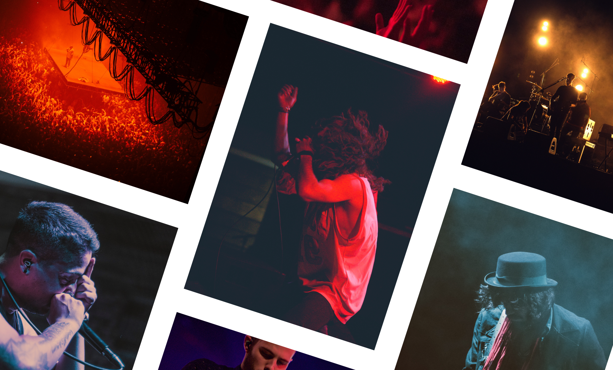
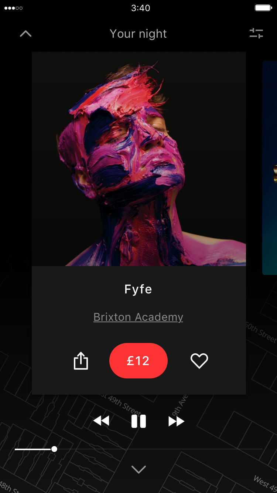
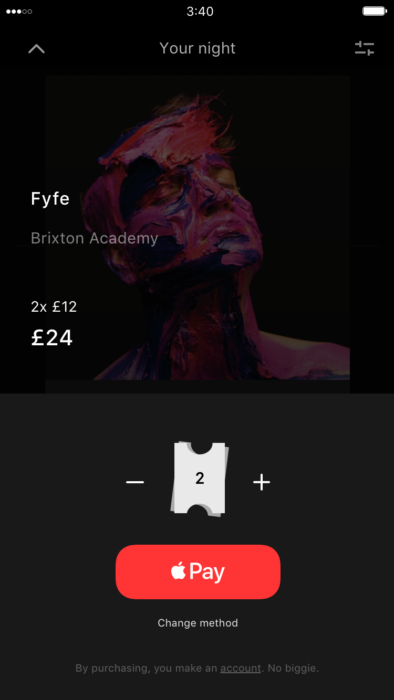
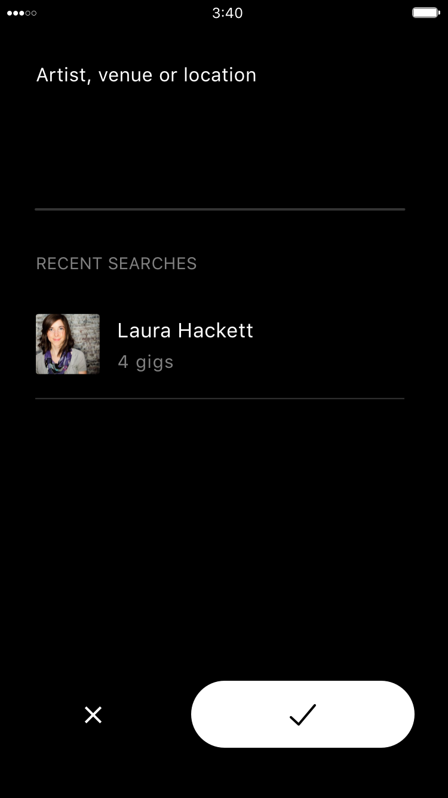
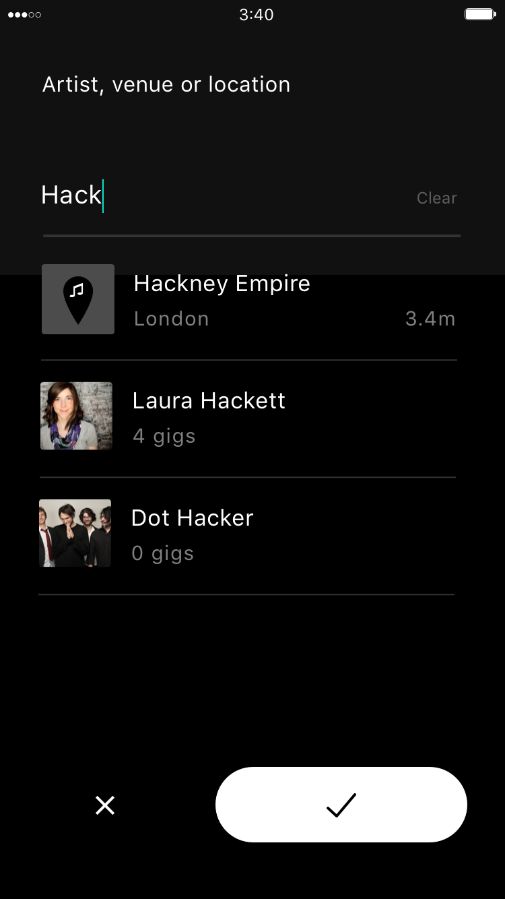
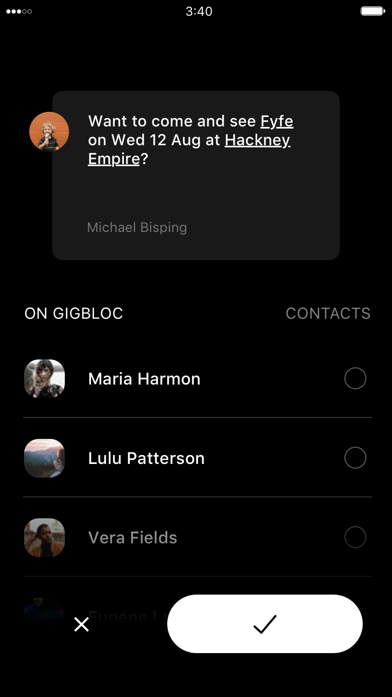
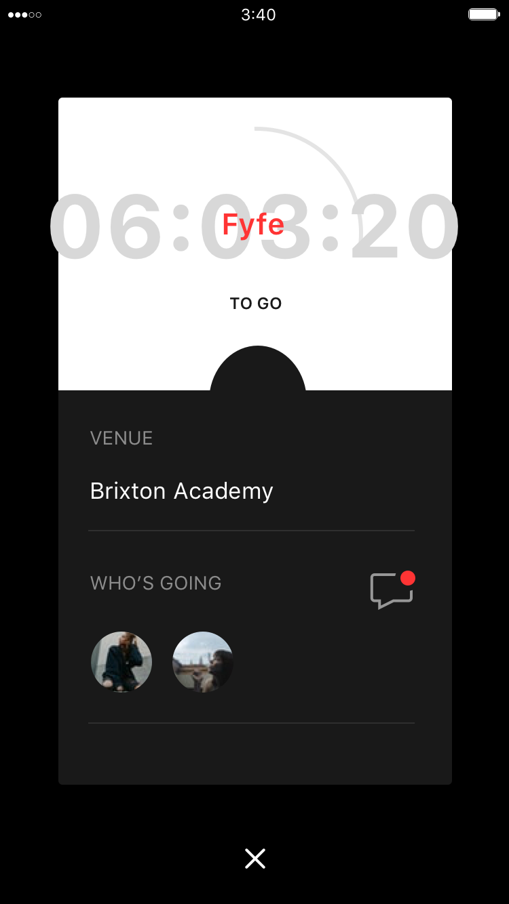
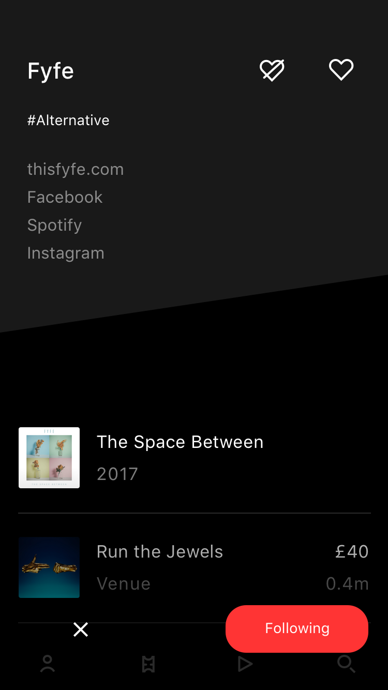

---
layout: work
top-color: dark
bottom-color: white
type: case-study
title: Live music discovery
categories: work case
meta: Responsive website campaign
longTitle: Discover your city's music scene
year: 2017
role: Designer
jobRole: UX, UI 
jobOutput: Responsive design, Video
tags: [featured-work, work, featured]
order: 1
thumbNail: ../assets/work/gigbloc/project-thumbnail-1.gif
feature-video: ../assets/work/gigbloc/gigbloc-intro-video-1
client: Gigbloc
opening-sentence: Gigbloc is a startup that helps people find live music in their city. In a design sprint, I helped create a vision and identity for a new version.
--- 

		

				

					
The challenge

					<h2>Sprint from the start</h2>
					

						Some old colleagues are re-launching their own product - Gigbloc. They want a product design and brand to share with potential investors, and work towards.
					

					

						Constraints can help create simple solutions.  With this project I had minimal time, and no real budget, or much access to the founders.  That makes for a great opportunity to see what I can do working in a minified <a href="https://designsprintkit.withgoogle.com/" target="_blank" class="underline">design sprint</a>.  
					

					 							
				

		

		

				

					

						Day 1 / 5
					

					<h2 class="heading">Uncover the insights first</h2>
					

						The first step in designing a product or a feature is understanding.  The context, target users, brief and ultimately, what is behind the brief.  What is the actual problem we're solving and why should we? 
					
	
				
	
		

		

		     

		        
Why are you starting Gigbloc?

		      

			

				 
We love music, and we love discovering and supporting up and coming bands.
		
			

		     

		        
How does Gigbloc help people do that?

		      

			

				 
So music lovers can discover local bands playing in their area to support them. And to help bands promote themselves when they’re getting started.
				 
					 	
			
			
		 
 

	

		

				

					

						I put these conversations into thoughts &amp; feelings we want users to have, and not have, when they interact with Gigbloc.  I think its important to get these recorded as they become the north stars we use to guide us at each decision point.  They provide something to hold ourselves mutually accountable to.  
					

					

						A lot of times here people just look at what they want to happen (the pull), and ignore what they don't want (the push).  I think you have to do both to make the best experience possible.
					
						
				
	
				

					 
				
	
		

		

				

					

						Day 2 / 5
					
					
					<h2>Diverge</h2>
					

						I've always liked to sketch out concepts individually but in a sprint, this phase proves good ideas can come from anyone on a team, and the team can make any idea better by collaborating from the start.
					

				

				

	

		

			
			
		

	
		

		

				

					<h4>Branding: research &amp; execution</h4>
					

						To make prototypes really effective for user testing, they have to be as close to the real thing as possible.  Part of this means giving Gigbloc a cohesive brand.
					
	
					

						First, to get a quick understanding of how people see gigs I look at social networks to see what imagery associate with the word.
					

				

				

						

				

				

					

						Gigs are a real mix of things.  They're bright but happen at night in the dark.  They're enjoyed by groups of close friends surrounded by lots of strangers.  All of this helps inform the interface I'll later test.
					
					
				
	 	
			 	

			 		
			 	

				

					
 
						The branding I played with conceptually reflects those beginning insights.  The lines mechanisms represent both travelling to gigs, going from A to B, &amp; listening to a track from 0:00 to the last second.
					
				
				
			 					 	
		 
 	 

		

				

					

						Day 3 / 5
					
					
					<h2>Decide</h2>
					

						After a night's sleep to contemplate the ideas, we vote on which we're going to test.  After our decision, we work on the user journey, deciding the features that help the user to the next stage at each step.  
					

					

						I like to start with the beginning of their journey, to put the product in its proper context.  A users experience doesn't stop and start with whatever you're making.
					
	
				

			 	

			 			
			 	
	
				

					<h3>
						Take a step back when looking at flows because people use products to solve problems.  What was their problem, how did they discover your solution, what happens afterwards?  Context matters. 
					</h3>	
					

						By taking that zoomed out view we can make decisions in the right context, so we're cutting out the truly unecessary.  And that's a big thing, especially if you're designing something with the intention of regular use.  
					

				
	
	
				

					

						Day 4 / 5
					
					
					<h2>Prototype</h2>
					

						I love that in design you're never finished learning.  Recent years have seen a plethora of prototyping tools created to help people test ideas in increasingly realistic ways.  I use them to make a high-fidelity prototype of our picked idea, and with left over time, some lower-fidelity versions of others we liked.
					
	
					

						I like to make others because the more I can test, the more I can learn.  In this industry, costly mistakes can happen when we assume things.
					

				
	

		
	
		
		

			

				<video class="dBlock mAuto chapter" autoplay="" loop="">
						  <source src="../assets/work/gigbloc/prototypes-collage-1.mp4" type="video/mp4">
						  <source src="../assets/work/gigbloc/prototypes-collage-1.ogg" type="video/ogg">
						  Your browser does not support HTML5 video
				</video>
			
			
			

				

					I used this as an opportunity to try out Framer to prototype the flows.  I found the learning curve a little steep to execute to the realistic level needed in a day, so I returned to Flinto which I was more familiar with.  Even with a small taste, Framer was very appealing to use and something I'll look to learn in my spare time for the next chance.

				

				

					When testing prototypes out in the wild its good to record responses audible (words, sighs, joyful yelps) &amp; non-audible responses (body language, facial expressions).  I test here for flows and emotions.  Gigbloc is a service people will use to find music they like.  That's a committment people make with their free time, which is really valuable to everyone.  So the emotional impact carries a significant influence in its success.
				
	
				

					After testing we look through the results and, after discussion, we're ready to move onto refining the experience.
				

			
	
			

				 	

						
				 	
				
				 	

										
				 	
								
			 
	
			

				

					I used this as an opportunity to try out <a href="http://framer.com" class="underline" target="_blank">Framer</a> to prototype the flows.  I found the learning curve a little steep to execute to the realistic level needed in a day, so I returned to Flinto which I was more familiar with.  Even with a small taste, Framer was very appealing to use and something I'll look to learn in my spare time for the next chance.

				

			
			 			
		

	

		

			

				

					Day 5 / 5
				
	
				<h2 class="heading plus">Design for discovery &amp; delight</h2>
				

					A lot of discovery experiences ask the user for all their preferences upfront to deliver relevant results.  We needed to provide that ability but also invite discovery and quick interaction with music.
				
	 				
			

			

				

					

						
					

					

						
					
	
					

						
					

					

						
					
	
					

						
					

					

						
					

					

						
					
	
					

						
					

					

						
					
	
					

						
					

				
															
			

	 

		

		 	

		 		

		 			
Feature 1

			 		<h3 class="xs-m-t">Your personal soundtrack</h3>
			 		

			 			Using the <a href="https://en.wikipedia.org/wiki/Zeigarnik_effect" target="_blank" class="underline">Zeigarnik</a> effect, we give the user a curated list of nearby music they might like. 
			 		

			 		

			 			Making listening and liking easy means we can learn to provide a more personalised list each time.  The more someone puts into something, and get back from it, the more likely they'll continue using it.
			 		

			 	

		 	
						
		 	

				<!--  -->
				<video autoplay loop class="phone m-auto chapter m-m-b w50 autoplay">
					  <source src="../assets/work/gigbloc/onboarding-2.mp4" type="video/mp4">
					  <source src="../assets/work/gigbloc/onboarding-2.ogg" type="video/ogg">
					  Your browser does not support HTML5 video
				</video>
		 	

		 
	
		 

			 

					

						<video autoplay loop class="m-auto chapter m-m-b autoplay">
							  <source src="../assets/work/gigbloc/gigbloc-flinto-filters-1.mp4" type="video/mp4">
							  <source src="../assets/work/gigbloc/onboarding-2.ogg" type="video/ogg">
							  Your browser does not support HTML5 video
						</video>
					
	
					

						
					
								 	
			 
	
		

		

		 	

		 		

		 			
Feature 2

			 		<h3 class="xs-m-t">Play your night</h3>
			 		

						Tapping the artwork or play from the menu bar starts the core experience.
			 		

			 	

		 	
				
		 	

				<video autoplay loop class="phone m-auto chapter m-m-b w50 autoplay">
					  <source src="../assets/work/gigbloc/playing-2.mp4" type="video/mp4">
					  <source src="../assets/work/gigbloc/playing-2.ogg" type="video/ogg">
					  Your browser does not support HTML5 video
				</video>					
		 	
								
		 
	
		 

			 

					

						
					
	
					

						
					
												 	
			 
	
		
	
		

			

				First impressions take seconds.  Gigbloc 2.0 will play through the opening 10 seconds of a track, before moving onto the next.  The experience becomes fluid, and doesn't require the user to make a decision at every turn. If the user interacts with the timeline, we switch to playing the full song, or until they swipe or skip.
			

			

				
			

			

				The whole discovery interaction exists within two core swipes.  Listening to a track, if you like it, swipe the Y axis to see the gig details.  Not liking a track, swipe the X axis to move on.  Keeping these actions simple is important.
			
			
		

	

		

		 	

		 		

		 			
Feature 3

			 		<h3 class="xs-m-t">Find what you need</h3>
			 		

			 			Some users will know exactly what they're looking for.  Making the search and play functions easy to access caters for the two main use cases.
			 		

			 	

		 	
				
		 	

						
		 	
								
		 
	
		 

			 

					

						
					
	
					

											
					
										 	
			 
	
		

		

		 	

		 		

		 			
Feature 4

			 		<h3 class="xs-m-t">Plan ahead</h3>
			 		

						Gigs are social events so we make sharing easy, and fun.  
			 		

			 	

		 	
				
		 	

						
		 	
								
		 
	
		 

			 

					

						
					
	
					

						
						
					
	
									 	
			 
	
		

		

			

				Recieving a gig should feel exciting, and whatever your response, Gigbloc should reward you.  The reciever needs a dislike option but we removed this for the general Gigbloc user to remain true to that emotional discovery &amp; delight.
			

		
		

		

		 	

		 		

		 			
Feature 5

			 		<h3 class="xs-m-t">Get your tickets</h3>
			 		

			 			You've listened, you've liked and shared.  Now its time to buy your tickets.
			 		

			 	

		 	
						
		 	

				<video autoplay loop class="phone m-auto chapter m-m-b w50 autoplay">
					  <source src="../assets/work/gigbloc/gigbloc-ticket-purchase-1.mp4" type="video/mp4">
					  <source src="../assets/work/gigbloc/onboarding-2.ogg" type="video/ogg">
					  Your browser does not support HTML5 video
				</video>				
		 	

		 
	
		 

			 

					

						
					
	
					

						
					
											 	
			 
	
		

		

			

				The day of the gig is a time to build anticipation, excitement and re-assure of all details so they can focus on enjoying local music.
			

		
	

		

		 	

				
		 	
	
		 	

		 		
		 	
					
		
	

		

		 	

		 		

		 			
Feature 7

			 		<h3 class="xs-m-t">Banding together</h3>
			 		

			 			After the gig, we offer the chance to follow that artist. In one tap you could stay up to date with their releases and news on any platform.
			 		

			 	

		 	
						
		 	

				
		 	

		 
	

			

		

			

				

					Day 6 / 5
				
	
				<h2 class="heading plus">Decompress &amp; learn</h2>
				

					I followed up these refined concepts with another round of testing.  I don't want to assume any issues have been solved.  Everything came back pretty positive and we were ready to put the concepts together for potential investors for stage 2.
				

				

					I really enjoyed the sprint aspects of this project.  We learned about what users might do relatively cheaply and I personally learned a lot about how enjoyable designing like this can be.  Designing used to usually be a process where a designer gets a brief, disappears into a montage of pencil sharpening and paper crumpling, and returns from hibernation with a genius idea.  This sprint process feels smarter, or to be more precise, its a way to make mistakes quicker.   
				
					
				

					Ultimately, the sprint is a process that forces you to keep momentum day by day and thus build up energy.  Those forces are powerful and being super aware of them is something I'll certainly be taking into my next project.
				

			

			

				 
			
				

	

