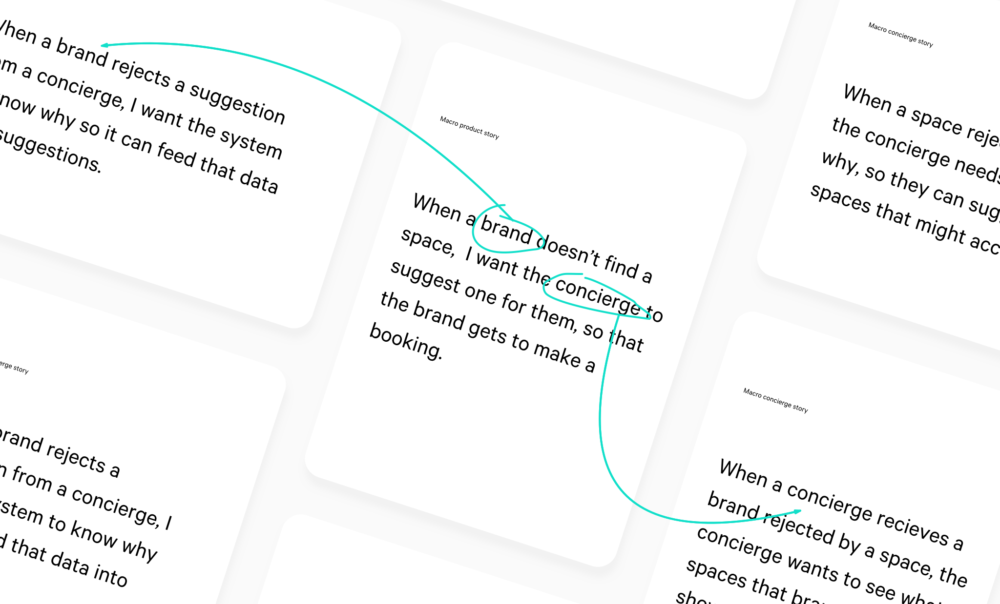
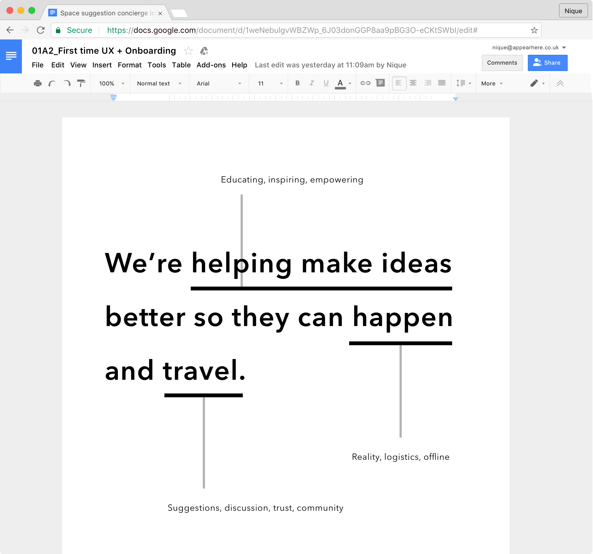
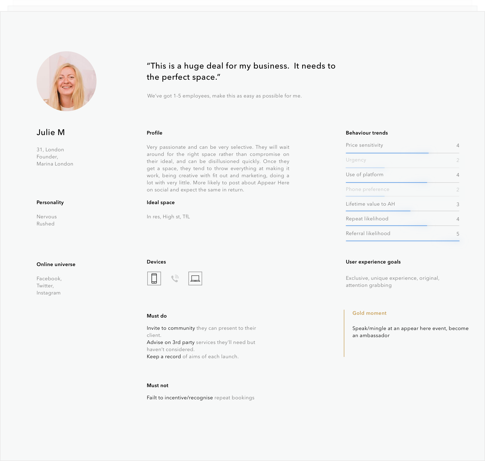
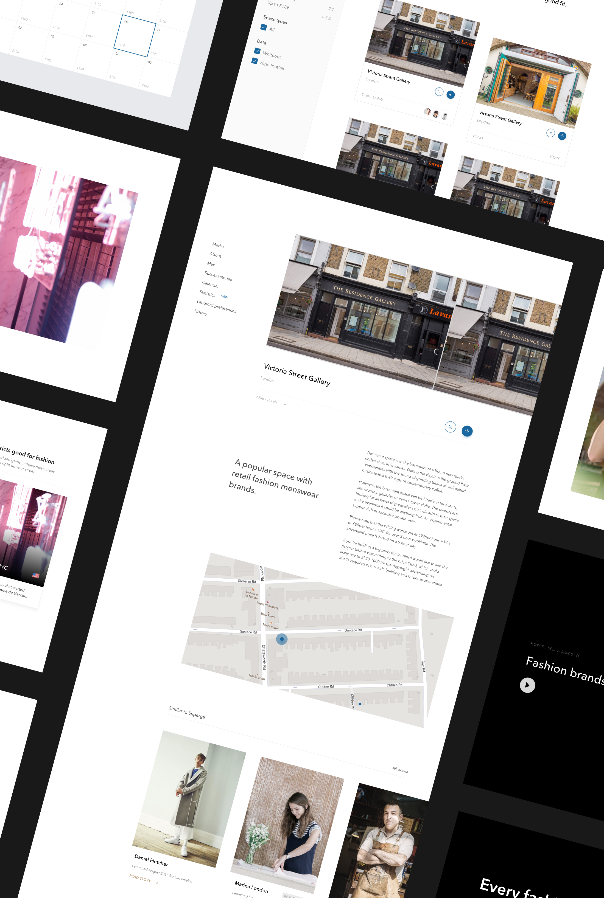
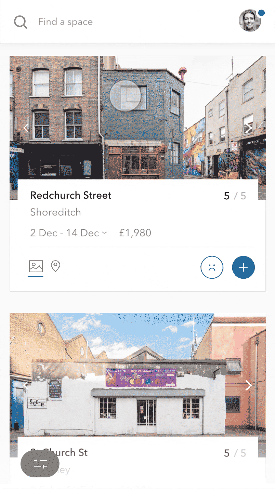
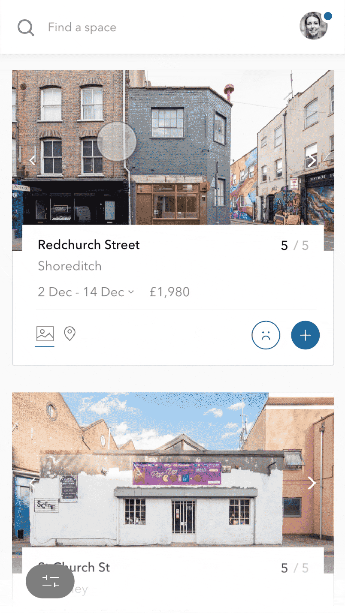

		

				

					
The challenge

					<h2 class="heading">The Airbnb of retail</h2>
					

						Appear Here is the world’s leading marketplace for brands looking to rent retail space.  Thousands of brands looking at thousands of spaces around the world.  But, for a number of reasons, sometimes a brand doesn’t get the space it wants. Appear Here has a crack squad of people - the concierge team - who work in the marketplace to make bookings happen.  

					
	
					<h4>
						Just in London alone, over £2 milllion a week of possible rent is wasted because of empty spaces. 
					</h4>
					
				

<!-- 				

					 
				

				

					

						Brands not matching to spaces was utlimately killing the marketplace.  If brands can't book a space, they'll leave the platform.  If spaces can't get bookings, they will look elsewhere.  With over 80% of brands struggling to find a space themselves, the ability of the concierge team to suggest spaces, and get them booked, was central to achieving the business goals.
					

				

			

				<!--/chapter #1-->
			

				

					
The process
					
					<h2 class="heading">Redesigning how concierge's suggest spaces to brands</h2>
				

				

					 
				

				

					

						Ideo's <a href="http://www.designkit.org/resources/1" target="_blank" class="underline">human centered design</a> &amp; Intercom's <a href="https://www.intercom.com/books/jobs-to-be-done" target="_blank" class="underline"> jobs to be done</a>  provide a strong framework to understand the problem and then focus to on a feedback loop with users. 
					
				
					

						<em>Context always frames the problem.</em>  The suggestions a concierge sends a brand is the first time a brand meets someone from Appear Here. You only get one chance to make a first impression, especially when you're a service representative.  How the concierge suggest spaces is the internal tool I'm designing.  I want to keep that context &amp; that business problem in mind throughout the project cycle.  
					

				

				

					 
				
		
				
	
					

						Starting with plain-language when-this-so statements in human terms gives the team a north star to push towards every day, on every micro-decision.  By creating ones for each scenario &amp; actor, we ensure the intricate relationships in the marketplace are fully understood.
									
					

				

			

			<!-- /chapter 2-->
			

				
						
					
Research

					<h2 class="heading">Digging for insights</h2>
					

						There are four themes to the one week long research stage.  When researching its important to have regular check-ins at each step with the wider product team, to bring them on the journey.  I was fortunate to work with some amazing product managers and developers who encouraged me through these phases.  
						
						<ul>
							<li><b>Go through the existing flows.</b> See how concierges are currently suggesting spaces &amp; how brands recieve them.</li>
							<li><b>Interview &amp; study the concierges &amp; brands.</b> Reveal and challenge any assumptions from step 1. </li>
							<li><b>Agree &amp; record the metrics according to our agreed stories. </b> Identify what success will look like, what bottom lines are we looking to impact?</li>
							<li><b>Look for hidden connections between everything.</b> Connect the metrics &amp; insights to the underlying business goals</li>
						</ul>
						
					

				
	
			

				

				 								
				
 

<!-- 		

			

				

					

						
					

					

						
					
	
					

						
					

					

						
					
	
				
															
			

		
 

		 

			 

					

						
					
	
					

						
					
												 	
			 
	
		
	
		 

			 

					

						
						

							Let people share however they like.
						

					
	
					

											
					
										 	
			 
	
		
	

				

					

							
					

					

							
					

				

				

					

							
					
	
					

							
					
	
				
		
				

					

							
					

				
	
				

					

							

					

					

							
					

					

							
					

					
				

				-->							

			

				

					

						Well executed research reveals the real problems to solve.
						Most researchers begin with a set theory in mind and things that don't conflict or agree with that gets dismissed out of hand.  It's commonly called confirmation bias.  It can also happen during the research phase itself - picking up a few insights early, thinking you have a solution to them, and then for the rest of the By just recording as much data, qualitative and quantitative, as possible <em>and then</em> trying to find connections, I discover the deeper issues.  
					
					
	
					<h4>
						The knowledge gap between new &amp; experienced concierges is blocking the business goals.   As the business scales, with new concierge teams around the world, the suggestion tool needs to help reduce that gap.
					</h4>	
					<!--				
					 
					

						The divide between new &amp; experienced concierges became a clear blocker to meeting the business goal &amp; succeeding.
					

					-->		
				

				

					

						Now we had an understanding of the insights, the problem and the context it was time to ideate on how the suggestion tool could solve these.					
						
					<!---->
				
						With a small team of developers &amp; experienced concierges, we have a crazy 8s session.  I low-fi prototype the selected idea with Invision &amp; Principle, going through the same workflows as witnessed in the first stage of research. This is an iterative process, with each version being tested with concierges and then rated according to the metrics the team has agreed. After a week of this, we have a solution ready for high fidelity design &amp; prototyping.
					
		
				

				

				

					
Step 1

					<h2>A new way to meet your customer</h2>
					

						This suggestion tool is the first step in a service relationship.  To encourage empathy for the brand, data tables are turned into natural language giving the experience the context of a real conversation.
					
	
				
	

				

											
				

					
				
	
					<h3>In tests, this design took an average of 50 seconds to send suggestions.  The existing product took between 3 and 5 minutes. </h3>			
						

							Putting the job into that communication context is integral to long-term relationship management.  By recording which the topology of data points most important to each brand type in the research stage, this intro statement would be optimised to highlight each brand's core needs.  With tests, this new chat interface saved concierges minutes, every time.
						
	
					
		
				
					
					<h3>Save people time</h3>
					

						For every experience, <em>every flow</em>, I try to ask myself "Do they need this? Does this help the user with their goal?".  Before, concierges were looking at a brand's wants &amp; then manually applying that to the spaces inventory to make suggestions.  It took an average of 3 minutes. 3 X 50 a day.  50 X 5 days a week.  Its a lot of time.
						With our solution, spaces would be pre-filtered according to a brand's wants - with all of the search &amp; filter controls consolidated in one place.
					

				

					

					 	

							
							<!-- Search filter bar -->
					 	
	
					 	

					 		
					 		<!---->
					 		<!-- Some interaction from the filter bar -->	
					 	
					
					
	

				

					<h3>Give everyone the inside track</h3>
					

						Providing inventory knowledge with clarity &amp; confidence re-assures the concierges on what is important for them to know &amp; lets them dig deeper when needed.  
					
	
				
		
				

				 		
				 		<!-- space cards -->
				
	
				

					

						The concierge gets a golden source of truth on each space.  There is no more second guessing on what matters.  Introducing data in this way helps educate new concierges and build trust into the tool. 
					
	
				
					

				
				
					<h3>Reward your user</h3>
					

						From the research &amp; tests we learned concierges would trust a suggestion tool that feels like it takes their feedback into the data model.  It was important to make the act of training that data feel rewarding, positive &amp; worthwhile.  
					
	
				
		
				

				 	

						
				 	
	
				 	

				 					 		
				 	
					
				

				

					<h3>Principle of reciprocity</h3>				
					

						People are more likely to give to someone who has already given them something. When a waiter brings sweets with the bill, tips go up. With this tool, I wanted to extend that principle beyond the screen by rewarding the most giving concierges with real life rewards.
					

				

				
	
					<h3 class="">Building trust in edge cases</h3>
					

						Designing a product involves not treating the unlikely incidencies as after thoughts.  
						When a concierge picks a space to suggest, the tool automatically looks through that brand’s history for any interaction with that space or its landlord.  Again, the design enhances trust &amp; saves people time.
					

				 	

				 				
				 	
										
				

				
				

					
Step 2
				
					<h2>Words matter</h2>
					

						Once a concierge has picked the spaces to suggest, they're onto step two - explaining to the brand why these picked spaces are right for them.  
					

				
	

				

				 		
				 

				
				
					

						The interface brings the suggestions into a conversational context.  To save concierges' time, we'd include pre-written comments to support selections.  If a space had a success story from a similar brand, because from research we knew those stories inspired brands, we would drop it in as a comment automatically.  
					
	
				

				
	
					<h3>Tighten the marketplace information loop</h3>			
					

						At the start of this case study we looked at the 3 entities at the core of this marketplace - space, brand, concierge.  Even if a brand agrees with a suggested space, if that space says no to a brand, no booking has been made, putting us back to square one.
					
	
					

						Through the research, it became clear that spaces repeatidely say no to brands for the same reasons.  It was a different reason for each space, but it was consistent for every space.  114 High St in New York (yes, its made up name) only wanted brands if the landlord could see their Instagram.   Of course, 114 High St would still reject some brands after seeing their feed.  But, with that information provided, a brands chances went from 0% to 50%.  That's huge.
					

					

						Here, when the brand first meets someone from Appear Here, we have a strong chance - <em>with that principle of reciprocity</em> - to plug those informtation gaps.
					
	
				
	
			 	

			 		
			 		<!-- interface when writing text, asks the yes / no questions -->		
			 	
		
			 	

			 		<h3>Hearing the experienced voice</h3>
			 		

			 			 These helpful statements were pre-written by experienced concierges ensuring conisstency, a high quality of service &amp; providing new concierges a strong example of how to represent Appear Here.  We're saving all concierges time &amp; maximising how we utilise the company's assets (the most experienced concierges) to help make bookings happen.
			 		

			 	
 
					
	
				 		<h3>I believe everything you commit to at a start up should be focused on the company's ultimate goal.  If its not super clear how it connects, you just might not understand the problem yet.  And that's ok.
				 		</h3>							
					
	

				

					
Step #3

					<h2>Send</h2>
					

						The last step is sending your suggestions to the brand.  Its ultimately just completing the task but underneath that it is an optimum time to make the concierge feel good, celebrate their action &amp; let them know their choices are feeding the data model.  That last feeling is important because it means the more they use it, the more they'll trust it.  
					
	
				
	
			 	

					<video class="shadow-one chapter" autoplay="" loop="">
							  <source src="../assets/work/appearhere-suggestions/suggestions-walkthru-2.mp4" type="video/mp4">
							  <source src="../assets/work/appearhere-suggestions/suggestions-walkthru-2.ogg" type="video/ogg">
							  Your browser does not support HTML5 video
					</video>	

			 		<!-- animation when someone sends suggestions, data improves -->		
			 	
	

			 	

					
 
						Just like the relationship between the concierge &amp; the brand, the relationship between the concierge and all of this space data is becoming more human.  The more feedback they give the tool, the more they'll trust it to provide ever-improving suggestions.  
					
	
					

						 Rewards to the most giving concierges starts new patterns of motivation.  Internal tools are a great opportunity for start-ups to reflect &amp; enhance their culture.  These simple details bring new patterns of motivation to that crack squad between the spaces and the brands. 
					

				
	

				

					

						Ultimately in designing a tool with a data model I think you have to consider the quality of data we have <em>today</em>, how good can this data be and how can we get it there.  By celebrating &amp; rewarding concierge feedback; recording brand &amp; space decisions &amp; reasons we're building brick by brick to the ultimate goal where the tool can be confident its suggestion will get booked.   
					
	
				
					 	

		

			

				

					
Outside the tool

					<h2>Building out the ecosystem</h2>
					

					 Looking back on the original analysis, we understood this project as the first step in a hopefully long relationship the concierge has with a brand.  In order to maximise its impact, we needed to scope out the areas of the markeptplace that could support it.   
					

					<!--
					

						If you've got a leaking bathroom and the plumber says its coming from the under the sink, and I'm there saying "no, its coming from the bed" who do you listen to?
					

					-->
				
	

				

				 	

				 		

					 		<!--	-->
					 		<h3>Customer, meet your champion</h3>
					 		

								The brand’s judgement of the concierge’s value is part made when they find out what a concierge is.  If you don't think someone is an expert in the field they're talking about, why would their advice matter to you?  We needed to boost the perception of the concierge.  This involved working with one of Appear Here's excellent in-house phoographers, Adam Kang, to re-market the concierge team.
					 		

					 	

				 	
						
				 	

				 				
				 	

				 
		

				

				 	

				 		

							<h3>Teaching a new dog old tricks</h3>
					 		
By putting some experienced cocnierge knowledge into the product flow, we're helping new concierges grow.  We also planned for a seperate resource which concierges could refer to, during training or later. 

					 		

					 			As we used a conversation interface, if an important update happened, we had a way of getting it ito concierges immediately.
					 		

					 	

				 	
						
				 	

				 				
				 	

				 
						 

<!-- 				

				 	

				 			
						<video class="w100 shadow-one chapter" autoplay="" loop="">
								  <source src="../assets/work/appearhere-suggestions/auto-suggest-1.mp4" type="video/mp4">
								  <source src="../assets/work/appearhere-suggestions/auto-suggest-1.ogg" type="video/ogg">
								  Your browser does not support HTML5 video
						</video>					 			
				 	
						
				 	

				 		

					 		<h3>Helping hand from habit loops</h3>
					 		

					 			To make the data model strong, it needed to accept any brand input automatically.  Their needs change over time.  Budgets, locations, amenities.  
					 			Emails &amp; landing pages would celebrate the value of getting a concierge.
	
						
		
				 	

				 
 -->

<!-- 				

				 	

				 			
				 	
						
				 	

				 		

					 		<h3>Data models</h3>
					 		

					 			These are great things to model.  I was lucky to work in amazing team to help form these kind of structures and topography.
	
						
		
				 	

				 
	 -->

			

		

					 									 		

	

		

			
The impact

			<h2>Positive start, much to do</h2>
			

				The true impact of introducing a robust data model into the product is long term.   We're building something to help scale worldwide.  That kind of long-term planning is difficult in a busy start-up.  Indeed, midway through the first sprint for this work, the tech team pivoted to other product areas and I left Appear Here before they returned to it.
			

			

				I learned that designing tools that don't get made is unfortunate because the real-world learning is limited, but by testing at each fidelity stage you can still learn plenty.  I also learned that it is fine to have a big plan for where to take a product but, as a small team, its worth more to look at the constraints of where we are today and take iterative baby steps. When we did that, we impacted the bottom line.  
			

			<h4>It's fine to have a comprehensive big plan for where to take a product but, as a small team, its worth more to look at the constraints of where you are today and take iterative baby steps towards it.  
			</h4>
		
	
	

		

