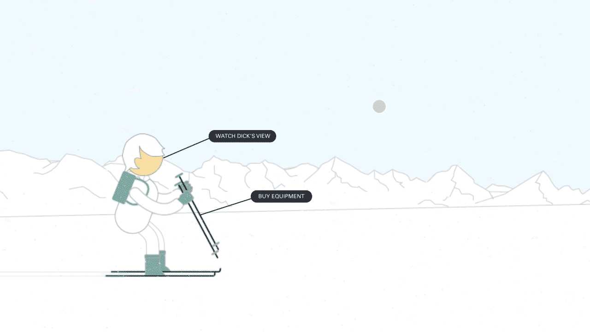
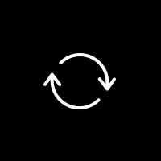
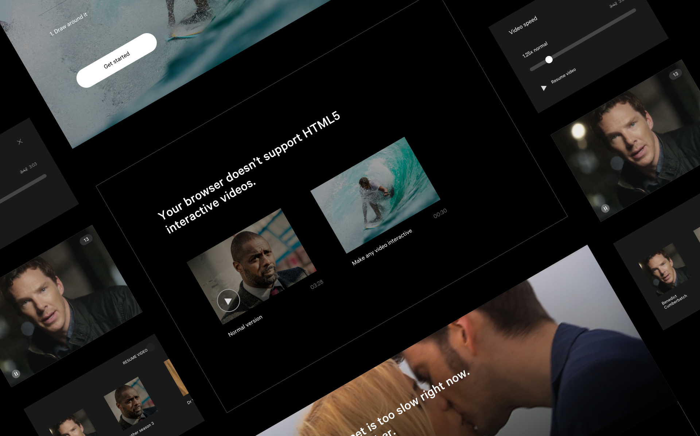

	

		

				

					
The problem

					<h2 class="heading">Inheriting bias</h2>
					

						Video players have been, on the whole, homogeneous for years.  Past experience generates user bias.
						Tens of tiny things we've been trained to anticipate that we don't even realise until something breaks those expectations. 
					
	
					

						And it makes sense for video players to be the same.  It's easier for us all and the experience of watching any video is the same -  it's passive.  Sit back and watch.  Until Wirewax.  Since their 2013 launch, Wirewax had created a new kind of video: interactive.
					
	
					<h4>
						Wirewax videos are the opposite.  The audience can interact with tags in the video and control what happens.  And anyone can upload any video and use Wirewax to make it interactive.
					</h4>
				

				

				 	

				 			
				 		
<b>Normal videos</b> you sit back and watch content.

				 	
						
				 	

							
				 		
<b>Wirewax videos</b> lets viewers interact with anything the creator has tagged.
				
				 	

				 

				

					

						So the challenge was designing a video player that conforms to that strong status quo, but allows for a completely new experience that can easily be understood &amp; enjoyed by the viewer.  In just three years since their launch, Wirewax videos had gone from being seen by 50 friends in London to a global audience of 10 million across 40 countries.  The original video player had reached its limits.  Being built in Flash, it was being phased out by new devices &amp; browsers.  During Wirewax's growth its basic usability had been challenged This was the perfect time to design a player that uses the emerging possibilities of HTML5 and keep Wirewax at the forefront of an increasingly competitive industry.
					
	
					

						This was my one my first projects as the sole designer at a start up.   I wanted to help create products that empower people to express their creativity or make their jobs easier.  With a then 10,000 strong userbase from media producers like Universal &amp; BBC investing millions into interactive entertainment, to teenage Taylor Swift fans just wanting to make her face interactive there was a hugely diverse group regularly making Wirewax videos.   
					

				
			 

				

					
					
The original player had plenty of powerful features but had become challenging for the modern audience.

				

			

				
The process

				<h2>A good prototype is worth a thousand meetings</h2>
				

					From the very start of any project, the designer has to be aware of the final product.  To test designs, options need to be as realistic as possible.  Here, the end product is a video player so to iterate effectively, I need to be creating designs that move, like a video.  This project was a great opportunity to learn new things, something as a self-taught designer, I'm always excited to do.
					In 2015, After Effects was the best option so in my spare time I'd comit to learning it.  So when it came to the execution &amp; testing phase I could maintain momentum &amp; effectively validate decisions.  
				
													
				<h4>
					When designing something that will be used by an existing userbase to create, the first step is always observe, discover &amp; record.
				</h4>
			

			<!-- this should be a video -->
			<video class="w100" autoplay="" loop="" muted>
					  <source src="../assets/work/wirewax-player/research-videos-1.mp4" type="video/mp4">
					  <source src="../assets/work/wirewax-player/research-videos-1.ogg" type="video/ogg">
					  Your browser does not support HTML5 video
			</video>	

		

			

				I watched hours &amp; hours of user's videos sped up, recording datapoints like what is being made interactive; how many tags in each video &amp; how long each tag is.  I did this before even realising I could ask the in-house data scientist to run some scripts and do this automatically.  Lesson #12 of design at a startup ✅.  
			

			

				Although the team was very experienced in video, I wanted quantative data to help inform the solution, not just our perceptions of user behaviour.  It helped give me an understanding of edge cases from the very start and empathy for what users are really doing which was important because, without them, there was no-one using the video player because there would be no videos to play.  
			

		

	

		

			
			

				On one extreme, Loreal would use tags selectively one at a time. to show off one product.
			

		

		

			
			

				On the other, ABC would show multple tags in a frame.  
			

		

	

	
		

			

				One of the most interesting data discoveries was, on average, under 50% of viewers interacted with a video's tags.  A number of metrics indicating reasons why and most of those hinted at problems in the creator's experience but the end result was negatively impacting everyone. Creator, viewer &amp; ultimately, Wirewax's chances to push forward this disruptive change in how people watch videos.  
			

			

				Even if this wasn't directly to do with the player re-design, I wanted to keep it in mind as an underlying behaviour.  <em>Can this redesign encourage viewers to interact &amp; encourage creators to add tags?</em> 
			

			
			<h4>
				Nothing is ever a straight forward re-skin of an old product, because expectations &amp; technology have moved forward.  Its important to discover the real problems underneath the surface and work towards resolving them.
			</h4>
			

				With data points recorded, I wanted an understanding of <em>why</em> our users go with Wirewax, over the increasingly greater options.  Without that, the design could jeopordise Wirewax's pole position.
				This involved competitor and user research.   

			

				Amongst a diverse list of reasons, two key themes consistently came up. Wirewax was easier to use and didn't try to overpower the user's brand with its own - a powerful testament to the vision of Wirewax's team who had paved the way in a complicated technology and were now fighting competitors with double the budget.  
			

<!-- 			The second aspect I wanted to understand upfront was brand consistency.  The solution needed consistency with the other touchpoints these customers have with the product and brand.  No one likes a surprise from a product they use - this is a microcosm of the inherited bias challenge we started with.  --> 
			
			
		

		

			
The solution

			<h2>Use the legacy to introduce the innovation</h2>
			

				Hearing that users found Wirewax easier than our competitors helped me realise we could use the expectations people have with video interfaces to our advantage.
				Constraints can lead to simple solutions.  I identified the major expectations people have with video interfaces, asking myself if there is someway they can be turned into a tool to help inform the audience they're watching an interactive video.  
			

			<h3 class="m-m-t">Expectation #1. Figure:ground</h3>
			

				Video players use figure:ground to seperate the player interface (the foreground) from the video content (the background).  Think of the controls on Youtube that sit on top of the video.  It's a common principle found across many forms of screen entertainment (video games, videos, music players, VR) and an effective way to tell the audience how they can control their experience.  
			

		

		

			<video class="chapter m-auto" loop="" autoplay="">
					  <source src="../assets/work/wirewax-player/foreground-1.mp4" type="video/mp4">
					  <source src="../assets/work/wirewax-player/foreground-1.ogg" type="video/ogg">
					  Your browser does not support HTML5 video
			</video>	
		
			
		

			

				By showing a teaser we ccould help creators get more viewers.  Drawing attention to the tag number, using figure:ground, helped get interest in the tags.  Using a number helped make the solution international &amp; we anticipated, influence the video creators to add more tags to their videos.  We're trying to bring that disruptive side out.
			

			<h3 class="l-m-t">Expectation #2. Time moves on the X axis</h3>
			

				As a video plays, there is usually some visual indicator of linear progress, from 00:00 to the final second. Its usually on the bottom of the video and is used by viewers looking for either a specific scene or something to entertain them.
			
	
		

		

				
		
		
		
	
			

				Knowing that users would interact with the timeline when they would want to discover something, I wanted to use that core function to indicate the interactive elements.
			

			

				By using these expected mechanisms to inform the viewer this player and this video are different, I'm letting the utility drive the engagement.  This way the solution involves minimal cognitive load for the viewer &amp; gets out of their way.   
			
	
				
		

		

			<h3>Improving the iconography</h3>
			

				Designing an interface for an audience of millions around the world, means looking 
			

		

		

			

				

					

						

							
						

					

					

						
						
							
						

					
	
					

						
						
							
						

					

					

						

							
						

					
	
					

						
						
							
						

					

					

						

							
						

					

					

						

							
						

					
	
					

						

							
						

					

					

						

							
						

					
	
					

						

							
						

					

					

						

							
						

					

					

						
						
							
						

					
	
					

						

							
						

					

					

						

							
						

					
	
					

						

							
						

					
					
				
															
			
	
		
	

		

			
Microinteractions

			<h2>Delight in the details</h2>
			

				When designing something with such established inherited expectations, the microinteractions can seperate one interface from the rest.  In a good way, and in a bad way.  
			

			<h4>
				The difference between a product you love and one you tolerate is often the microinteractions you have with it. They can make our lives easier and funner. 
			</h4>
				
			<!-- micro-interactions -->		
			

				<a href="http://microinteractions.com/">Dan Safer's book</a> has some great advice &amp; examples of microinteractions.  He defines them as moments built around single tasks.  
			
 

			
Rounding out the solution

			<h2>Create rules for the what ifs</h2>
			

				If you're designing something that is intended for use around the world you must include solutions for the not-ideal scenarios.  Old devices, slow internet, big thumbs.  If you're designing something that is going to contain user-generated content, you have to create rules for what if scenarios.  What if the title is lonnnnnnnnnnngggg.  Whatifthevideois2secondslong.  What if what if what if what if.These things, might seem unlikely to the team but they're really what when not ifs because you a user's content, and their aims, is not in your control.  Here, I learned its not about what solution is the most beautiful.  It is about which solution covers these rules.
			

			

				In 2015, this HTML5 stuff was cutting edge and it was amazing to be part of a team at that cutting edge.  But that didn't mean we'd leave viewers out to dry.  Where possible, the developers would divide the interactive from the normal video so 
			
	

		

		

	

	

		

			
Testing the solution

			<h2>User testing</h2>
			

				To get to that solution, I tested multiple ideas with Wirewax users &amp; anyone we could find really.  This is where learning some After Effects came in handy.  From the user videos watched during the research phase, I could divide users into groups for testing.  For each group, I changed the video being shown in the player so it reflected their interests - it might be something they'd actually watch online to make the tests as realistic as I could.  If you liked Katy Perry on Facebook, and I knew you, you'd probably be getting a Katy Perry Wirewax video in a few different skins.  Sorry, Dad.
			

		

		

		 	

		 			
		 		
One prototype involved a teaser loader to help.

		 	
						
		 	

				<video class="" autoplay="" loop="">
						  <source src="../assets/work/wirewax-player/player-test-1.mp4" type="video/mp4">
						  <source src="../assets/work/wirewax-player/player-test-1.ogg" type="video/ogg">
						  Your browser does not support HTML5 video
				</video>	
		 		
One of the player prototypes tested - using the timeline to let viewers scroll through the interactive tags.
				
		 	

		 

		

			

				I used <a href="http://lookback.io/">Lookback</a> to film people's reaction as they went through these options.  
				I filmed the tests because I knew, with this being my first time in the field testing, I would miss things &amp; it gave me a golden resource to return to because it can be challenging to organise testing alongside other duties, especially as a 1 man design crew in a busy start up.  
			
			
			

				I learned alot in this stage about testing &amp; collaborating with users, and what product design is about to me.  I had come from agencies where designs were mostly about creating something different to the norm &amp; putting a unique spin on something.  
			

			<h4>
				Re-inventing the wheel is a bit of a bullshit thing to do in product design.  The product will be used by humans.  We don't want to learn how to use a new wheel, and that's ok.  
			</h4>
			

				One of the player designs I liked had so many details I "believed to be" unecessary removed, leaving a crisp interface.  Virtually everyone who tried it liked it, but many did not feel comfortable using it.  "It's not like Youtube/Vimeo/VLC".   I learned that re-inventing the wheel is a bit of a buulshit thing to do in product design.  The product will be used by humans.  We don't want to learn how to use a new wheel, and that's ok.  You can still design something a bit different in the right places but you have to know, from the start, that the differences have to be in the best interest of the user, not the designer.
			

			

				In the end, our roadmap for the product changed and we halted the design work as we identified how the existing HTML5 technology wasn't ready for all of these features.  In hindsight, I wish I made a more concerted effort to involve the developers in the earlier design stages.  Everyone on the team was always busy but you have push things as a designer.  I think it would have made a big difference. However, when working on the cutting edge of an industry you have to know there will be plenty of trial and error because you're the ones pushing through.
				Even so, lesson learned. 
				A way watered-down version was built and Wirewax was able to maintain its position as the leading interactive video platform, winning broadcast awards around the world.
			
		
		

	

		

<!-- 

		

				

					
Customer insights &amp; experience strategy

					

						Of all the hundreds of videos Wirewax users had uploaded, were there common traits in what they are making interactive?  Looking at user generated content is a great way to connect with your users realities &amp; uncover the hidden insights that can connect to make a consistent product.
					

					

						What uploaders made interactive in their videos
					

					<ul class="shopping-list">
						<li>Permanent link 60%</li>
						<li>People 34%</li>
						<li>Objects 21%</li>
					</ul>
									
				
 	
		

 -->

		 
	
<!-- 

	

		

		      

		        <h1 class="noline display ghost">"Really easy to use, must try."</h1>
		      

			

				
A user
		
			

		 
 
	

	 -->

<!--

				

					
The problem

					<h2 class="heading">Inheriting legacy vs challenging expectations</h2>
					

						Consistency leads to expectation.  After so many years of digital experiences we all expect every new e-commerce experience to be essentially the same.  Even if its a totally new brand to us, if its not essentially the same as every brand's online shop we do know, we're not going to take the time to learn it, to adapt.  We'll just go somewhere else.
					

					

						Video players are the same.  We expect controls at the bottom; a scrubber so we can speed to the good bits or skip the boring ones; a time stamp.  Tens of tiny things we've been trained to anticipate that we don't even realise until something breaks those expectations.
					
	
					

						And it makes total sense for video players to be the same.  Not just because its easier for us all to then be entertained by the content.  Its because the content is all the same, really.  The material is different, sure, but the underlying concept is the same from Tellytubies to Terminator.  You press play, sit back and watch. 
					
	
					
	
						Wirewax videos aren't like that. 
					

				

-->

