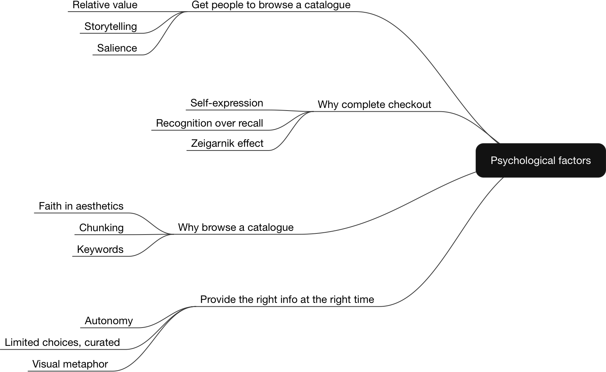
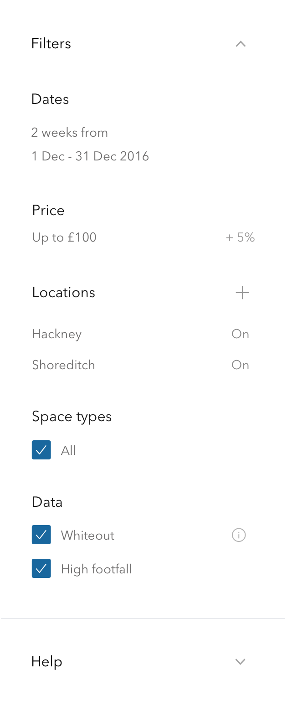

		

				

					
The challenge

					<h2 class="heading">The Airbnb of retail</h2>
					

						Appear Here is the world’s leading marketplace for brands looking to rent retail space.  Thousands of brands looking at thousands of spaces around the world.  But, for a number of reasons, sometimes a brand doesn’t get the space it wants. Appear Here has a crack squad - the concierge team - that works in the marketplace, between spaces and brands, to make bookings happen.  

					
	
					<h4>
						In London alone, over £2 milllion a week of possible rent is wasted because of non-booked spaces. 
					</h4>
					
				

				

					

						Brands not matching to spaces was utlimately killing the marketplace.  When brands can't book space, they eventually leave the platform.  If spaces can't get booked, they'll go elsewhere.  With over 64% of brands struggling to find a space themselves, the ability of the concierge team to suggest spaces, and get them booked, is central to achieving the business goals.  So this internal tool can have a big impact on the business.
					

					

						At the same time, the very talented tech team had been working through spaces data, so the system could make betetr suggestions to concierges for each brand.  The new suggestion tool would have to assimilate that work into a rich data tool.
					

				

			

				<!--/chapter #1-->
				<!-- ../assets/work/appearhere-suggestions/suggested-districts-mini-1.gif -->
			

				

					
The process
					
					<h2 class="heading">Redesigning how concierge's suggest spaces</h2>
				

				

					 
				

				

					

						Ideo's <a href="http://www.designkit.org/resources/1" target="_blank" class="underline">human centered design</a> &amp; Intercom's <a href="https://www.intercom.com/books/jobs-to-be-done" target="_blank" class="underline"> jobs to be done</a>  provide a strong framework to understand the problem and then focus to on a feedback loop with users. 
					
				
					

						<em>Context always frames the problem.</em>  The suggestions a concierge sends a brand is the first time a brand meets someone from Appear Here. You only get one chance to make a first impression, especially as a service representative.  How the concierge suggest spaces is the internal tool I'm designing.  I want to keep that context &amp; that business problem in mind throughout the project cycle.  
					

				

			

			<!-- /chapter -->
			

				
						
					
Research

					<h2 class="heading">Digging for insights</h2>
					

						The research extended from the start of work, into the prototyping.  With some of the target users in the same office as me every day, I had regular opportunities to learn.
					

				
	
			

		 

			 

				

					
					

						I start a research phase with the mission.  What are we all trying to achieve, what does success look like for the business?  Starting with that common understanding helps make clear how the project actually matters.  And if it isn't clear, its probably not worth doing - just because you can do something doesn't mean you should.   Focus improves execution.
					

					

						By branching off themes from the mission I can tie work back to that statement and it helps me tell, and sell, stakeholders a story through the research. 
					

				

				
				

					

						Then I map the marketplace.  Where do these three entities - brands, spaces and conciergres - connect?  If you're working on an aspect of a marketplace its worth making the effort to fully understand how your work will impact that entire place, because to each user, nothing happens in silo. Its all connected to them.
					

				

				
				

					

						With journey maps for each entity I can empathise with their needs at each step of their journeys and see the usual pain points.  I like to have visuals of these journeys because it helps bring focus &amp; helps any ideas be grounded in the reality.  
					

				
	
					 

				

					

							
					

					

							
					
			
				
	

				

					

						There's learning about the brand, concierge and space. And there's learning about essential human psychology - and each of those users, is deep down, a human.  At the same time, I start to create UX artefacts, from personas of brands to process maps of how concierges currently operate. 
					
 
					

						Documentation is really important.  In a startup, there can be a lot of cyclical staff turnover and a record helps any new staff get caught up with the business and gives the existing team a  solid foundation for generating/challenging ideas.
					

				
	
			
	
			

				 	

						
				 	
				
				 	

										
				 	
								
			 
	
			 

			 	<h3>
			 		What someone says happens and what actually happens are two very seperate things and both are needed for good research.  I spend a day interviewing concierges, shadowing their workflow in suggesting saces to brands.  
			 	</h3>
			 
	
			 

				

					
				

				

																
				 
		
				

																
				 
	
				

																
				 
		
			

		

		

			

				

					Working at Appear Here was an amazing learning curve in how storytelling can empower a designer to build a narrative that the team can get behind.  The CEO played a close role in product and the way he questioned designs and insights behind whatever designers presented really challenged each of us to build those storytelling skills, an inavluable trait I'm grateful for.  
				
 
				<h3>
					Coming up with an idea with evidence behind it is one skill.  Being able to sell that to the wider team is a super-power and without the second, the first goes nowhere.
				</h3>
			
	
			

				

						
					

						The existing suggestion tool didn't tell concierges why a space was recommeneded.
					

				

				

						
					

						Concierges in action, photography by <a href="https://www.adamkang.com/" target="_blank" class="underline">Adam Kang</a>.
					
					
				
			
			

			

				

					Spending time with your users, understanding their flows, the context of them, their frustrations, the language - body and words - that exist in that space is so important to desgining anything that has a chance of succeeding.  
				
 
			
								
			

				

						
				

				

						
				
			
			
	
			

				

					In the tech team daily standup I'd keep people informed of the progress &amp; in a seperate scrum team, I'd present the findings and align with the data science team, to see how the new suggestion tool could absorb their work. 
				
 
			
						
			

				

						
				

				

						
				
			
			
	
												
		

		

			

				

					From boiling the data down to bitesize narratives, specific patterns emerge that can be tracked.  These are product truths.  This is where I turn the interviews &amp; data into clear narratives that make sense &amp; feel relevant to everyone in the business. 
				
 
				 
				

					The gap between new and experienced concierges was too vast. As mentioned earlier, turnover can happen and the ratio of new concierges to the experienced increases every month, as the business scales, as new concierge teams appear in different cities to deal with new spaces.  New concierges only had two real ways of becoming experienced with brands and spaces - learning on the job or spending time with the experienced.  Both cost the resources, and that's the narrative to senior management.  But the narrative to concierges' is <em>this new design will save you time and make it easier</em>.  
				

				

					Success of the new suggestion tool would reduce the time it takes to send suggestions &amp; increase the % of suggestions becoming bookings.
					Working with a small team of the experienced concierges and other stakeholders, I created stories that would humanise those metrics into actionable guidelines.
				

			
		
			

				 
			
		
			
	
				

					Starting with plain-language stories gives the team a north star for every micro-decision, every day.  By creating them for each persona to represent their scenarios, we ensure the intricate relationships in the marketplace are understood and checked.  It'll act as a checklist to find out if we have solved the problem.
				

				

					Next, we go through crazy-8s sessions, ideating around the problem of how can concierges better suggest spaces to brands so those brands and spaces can match.  We vote on what we think will have the most impact on those metrics and statements.  And then, with the tech team we try to break it down into chunks of work.  
				

				

					This is the prototyping &amp; validating stages.  I make low-fidelity prototypes with Invision to test 8 of the most usual flows with the concierges and product managers. An iterative process, going back and forth, with each version tested with concierges and then rated according to the metrics the team has agreed.  The more we get into the solution, the higher the fidelity becomes where we test specific interactions and messaging. 
				

			
	
			

				

						
				

				

						
				

				

						
				

			
	
			

				

						
				

				

						
				

				

						
				

			
														
		
	

					

			

				

					

						Well executed research reveals the real problems to solve.
						Lots of research suffers from confirmation bias, where anything that doesn't conflict or agree with a set theory gets dismissed out of hand.   It can also happen during the research phase itself - picking up a few insights early, thinking you have a solution to them, and then being blinkered to just those problems for the remaining reaearch.  I believe, if you're working on a piece of a complicated marketplace, you should just record as much data, qualitative and quantitative, as possible <em>and then</em> trying to find connections. 					
					
	
					

						Within a week, we arrived at a solution that passed the test, and everyone could get behind as the future for the tool.
					
	
				

				

				

					
Step 1

					<h2>A new way to meet your customer</h2>
					

						This suggestion tool is the first step in a service relationship.  To encourage empathy for the brand, the tables of data concierges used to loook through are turned into natural language giving the experience the context of a real conversation.   
					
	
				
	

				

											
				

					
				
	
					<h3>In tests, this design took an average of 50 seconds to send suggestions - that's over 10 minutes quicker. </h3>			
						

							Putting the job into that communication context helps with long-term relationship management.  By recording the topology of information most important to each brand type, this introduction statement would be optimised to highlight each brand's core needs.  This new conversation interface makes conceptual sense and saves concierges minutes, every time.
						
	
						

							It also gave the data model some necessary time to process which spaces to suggest for this brand.
						

				
	
				

						
				
	
				
					
					<h3>Save people time</h3>
					

						For every experience, <em>every flow</em>, I ask myself "Does the user need this? Does this help with their goal?".  Before, concierges would look at a brand's requirements and manually apply that to the spaces inventory to find matches.  With thousands of spaces, being added to daily, it was a tough job for even the most experienced concierge.   The new had no chance.  
					

					

						Spaces would now be pre-filtered according to a brand's requirements - with all of the search &amp; filter controls consolidated in one scalable place. 
					

				

				

				 	

						
				 	
	
				 	

				 		
				 	
					
				
	

				

					<h3>Give everyone the inside track</h3>
					

						Following that pattern, giving concierges one place that tells them exactly what matters for each space, in relation to the brand they're looking for, provides every concierge a clarity &amp; confidence they never had before.  
					

					

						With a golden source of truth on each space, there is no more second guessing on what matters.  We're building trust into the tool.  This is the empowerment &amp; education theme in practice. 
					
	
				
	
				

				 	

						
						

							How a concierge finds out more about a space on mobile
						

				 	
	
				 	

				 		
						

							Expanded on desktop design
						
				 		
				 	
					
				
				
				
				
					<h3>The data talks with the concierge</h3>
					

						From research &amp; tests we learned that concierges would trust a suggestion tool more, if it absorbed their feedback into the data model.  It was important to make it clear their voice was being heard whenever they gave it, without disrupting their flow.  This is the discussion &amp; trust theme in practice.
					
	
				
		
				

				 	

												
				 	
	
				 	

				 					 		
				 	
					
				

				
				
					<h3>Make the complicated simple &amp; automatic</h3>
					

						There were simple, quick wins to make the system seem more simple.  For example, the marketplace rules meant every booking request needed to have dates, like a hotel resevation.  Previously, the concierge would have to look at both the brand's ideal dates and a space's calendar to manually input dates.  Now the tool would look at these &amp; if they matched, just add them straight to the suggestion.  
					
	
				
		
				

				 	

						

				 	
	
				 	

				 					 		
				 	
					
				
				
				

					<h3>Reciprocity</h3>				
					

						People are more likely to give to someone who has already given them something. When a waiter brings sweets with the bill, tips go up.  The best thing this tool can give concierges is, ultimately, time.  They have an ever increasing list of things to do.  Suggesting spaces should be quick and easy.  
					

					

						If, for example, there are no spaces that match a brand's requirements.  Before, the concierge would have to explain from scratch each time.  Now, the tool would recognise this, and with just pressing one button, the concierge can have a perfectly written draft message to encourage the brand to alter their requirements.
					

					
					
This message, being written by the most experienced concierges, helps show new concierges how to communicate with brands.

					
  
						Other ways we save time is when a concierge picks a space to suggest, we automatically looks through that brand’s history for any interaction with that space or its landlord.  Reassuring in these edge cases is how the tool gives back to concierges because now instead of being able to do 30 of these a day, they could do 140 in the same time.  So those cases are bound to come up for each concierge at some point.
					

				 	
				 				
				 										
				

				

					
Step 2
				
					<h2>Words matter</h2>
					

						Once a concierge has picked the spaces to suggest, they're onto step two - explaining to the brand why these picked spaces are right for them.  
					

				
	

				

				 		
				 

				
				
					

						The interface brings the suggestions into a conversational context.  To save concierges' time, we'd include pre-written comments to support selections.  If a space had a success story from a similar brand, because from research we knew those stories inspired brands, we would drop it in as a comment automatically.  
					
	
				

				
	
					<h3>Tighten the information loop</h3>			
					

						At the start of this study, we looked at the three entities at the core of this marketplace - space, brand, concierge.  Even if a brand agrees with a suggested space, if <em>that</em> space says no to <em>that</em> brand, no booking has been made, sending us back to square one.
					
	
					

						Spaces repeatedly say no to brands for the same reasons.  It might be a different reason for each space, but it is consistent for every space.  114 High St only wanted brands if the landlord could see their Instagram.   Of course, 114 High St would still reject some, after seeing their feed.  But, with that information provided, a brands chances went from 0% to 50%.  That's a big difference.  
					

					

						Here, when the brand first meets someone from Appear Here, we have a strong chance - <em>with that principle of reciprocity</em> - to fix that feedback loop before its even given.
					
	

				
		
			 	

			 		<h3>Hearing the experienced voice</h3>
			 		

			 			 These helpful statements were pre-written by experienced concierges ensuring conisstency, a high quality of service &amp; providing new concierges a strong example of how to represent Appear Here.  We're saving all concierges time &amp; maximising how we utilise the company's assets (the most experienced concierges) to help make bookings happen.
			 		

			 	
 
					
	
				 		<h3>I believe everything you commit to at a start up should be focused on the company's ultimate goal.  If its not super clear how it connects, you just might not understand the problem yet.  And that's ok.
				 		</h3>							
					
	

				

					
Step #3

					<h2>Send</h2>
					

						The last step is sending your suggestions to the brand.  Its ultimately just completing the task but underneath that it is an optimum time to make the concierge feel good, celebrate their action &amp; let them know their choices are feeding the data model.  That last feeling is important because it means the more they use it, the more they'll trust it.  
					
	
				
	
			 	

					<video class="shadow-one chapter" autoplay="" loop="">
							  <source src="../assets/work/appearhere-suggestions/suggestions-walkthru-3.mp4" type="video/mp4">
							  <source src="../assets/work/appearhere-suggestions/suggestions-walkthru-2.ogg" type="video/ogg">
							  Your browser does not support HTML5 video
					</video>	

			 		<!-- animation when someone sends suggestions, data improves -->		
			 	
	

			 	

					
 
						Just like the relationship between the concierge &amp; the brand, the relationship between the concierge and all of this space data is becoming more human.  The more feedback they give the tool, the more they'll trust it to provide ever-improving suggestions.  
					
	
					

						 Rewards to the most giving concierges starts new patterns of motivation.  Internal tools are a great opportunity for start-ups to reflect &amp; enhance their culture.  These simple details bring new patterns of motivation to that crack squad between the spaces and the brands. 
					

				
	

				

					

						Ultimately in designing a tool with a data model I think you have to consider the quality of data we have <em>today</em>, how good can this data be and how can we get it there.  By celebrating &amp; rewarding concierge feedback; recording brand &amp; space decisions &amp; reasons we're building brick by brick to the ultimate goal where the tool can be confident its suggestion will get booked.   
					
	
				
					 	

		

			

				

					
Outside the tool

					<h2>Building out the ecosystem</h2>
					

					 Looking back on the original analysis, we understood this project as the first step in a hopefully long relationship the concierge has with a brand.  In order to maximise its impact, we needed to scope out the areas of the markeptplace that could support it.   
					

	 		
			 		<h3>Customer, meet your champion</h3>
			 		

						The brand’s judgement of the concierge’s value is part made when they find out what a concierge is.  If you don't think someone is an expert in the field they're talking about, why would their advice matter to you?  We needed to boost the perception of the concierge. 
			 		

										 		
					 	
					<h3>Teaching a new dog old tricks</h3>
			 		
By putting some experienced cocnierge knowledge into the product flow, we're helping new concierges grow.  We also planned for a seperate resource which concierges could refer to, during training or later. 
	

					

					<h3>Habit loops for brands</h3>
			 		
With brands being left out in the cold, having not liked a suggestion or been rejected by a space, we needed to remind them of our offerings around the world. 
	

					

				 
						
			 
		
		

					 									 		

	

		

			
The impact

			<h2>Positive start, much to do</h2>
			

				Introducing a data model into the product is a long term strategy, a necessary stage in helping an ambitious startup go to the next level.  But in those kind of environments, busy startups, finding the time to work the long-term game is hard.  Indeed, midway through the first sprint dedicated to building this design, the tech team pivoted to other areas and I left the company before they restarted it.
			

			
			

				I learned the importance of documenting design reasons, selling ideas to stakeholders, that it can be hard to justify spending time on internal tools &amp; most importantly, as a product designer you have to comit time daily to speaking with and understanding every type of user that product has to grasp their problems and how your work can impact them. 
			

			<h4>As a small busy team, look at the constraints of where you are today and take iterative baby steps forwards to impact the bottom line quicker.
			</h4>
		
	
		

				
		

	

