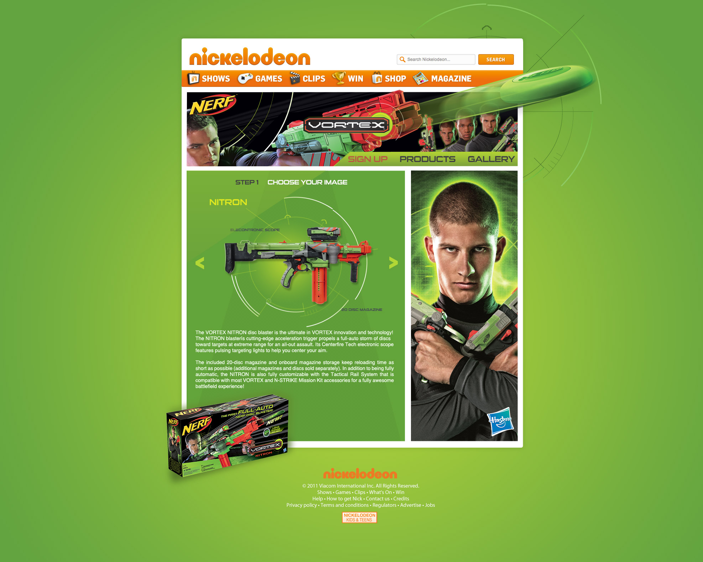

	

		

				

					
The problem

					<h2 class="heading">Inheriting bias vs challenging expectations</h2>
					

						Video players have been, on the whole, homogeneous for years.  Past experience generates user bias.
						Tens of tiny things we've been trained to anticipate that we don't even realise until something breaks those expectations. 
					
	
					

						And it makes sense for video players to be the same.  It's easier for us all and the experience of watching any video is the same -  it's passive.  Sit back and watch.  Until now.
					
	
					
	
						Wirewax videos are the opposite.  
					

				

				

				 	

				 			
				 		
<b>Normal videos</b> you watch, maybe skip through, content.

				 	
						
				 	

						<video class="" autoplay="" loop="">
								  <source src="../assets/work/appearhere-suggestions/search-eg-1.mp4" type="video/mp4">
								  <source src="../assets/work/appearhere-suggestions/search-eg-1.ogg" type="video/ogg">
								  Your browser does not support HTML5 video
						</video>	
				 		
<b>Wirewax videos</b> lets viewers interact with things in the video.
				
				 	

				 

		

			
The process

			<h2>A good prototype is worth a thousand presentations</h2>
			

				I try to have empathy for the context of what I'm designing.  The end product will be a video player so to iterate effectively I need to be designing in motion.  But I'd not really used any video software before.  So this would be a learning curve.   
			
													
			<h3>Look to the data</h3>
			
I want to understand what is being made interactive by the thousands of creators using the Wirewax platform.  This helps me prioritise in prototyping and build empathy with the people creating content to upload to Wirewax. Without them, there is no player for people to use, because no one would be watching.

		

		

			 
			<!-- image showing the 3 main tag types people make (people) (objects) (static elements) -->
		

		

			

				So over 66% of the things being made interactive are moving - objects and beings. So my prototypes for need to be start there.  Before tackling how the player will let people interact with those things, I need to tackle the basics of the player.
			

		

		

			<h3>Figure:ground</h3>
			

				Video players use figure:ground to seperate the player interface (the foreground) from the content (the background).  It's a common principle in video games 
			

		

		

		

				

					
Customer insights &amp; experience strategy

					

						Of all the hundreds of videos Wirewax users had uploaded, were there common traits in what they are making interactive?  Looking at user generated content is a great way to connect with your users realities &amp; uncover the hidden insights that can connect to make a consistent product.
					

					

						What uploaders made interactive in their videos
					

					<ul class="shopping-list">
						<li>Permanent link 60%</li>
						<li>People 34%</li>
						<li>Objects 21%</li>
					</ul>
									
				
 	
		

	

		
						 	
	
						
{{page.title}}

						
{{page.subtitle}}

					
	
	

	

		
	

		

		 
 
		 	

		 		 
		 	

				

					<h2 class="w50 mAuto smallGapBott uppercase">
						Tags
					</h2>
					

						Tags are the objects viewers can interact with.  With a wide user base, I designed various tags to give our users more options to customise their interactive videos.
					

				
 			 	

		 

		 

		 	

		 		 
		 	
	
		 	

		 		 
		 	
	
		 
 

		 	

					

						USER EXPECTATIONS
					
		 		
		 		

		 			Knowing that users would interact with the scrubber to scroll through the video, I wanted to use that key functionality to indicate the interactive elements.
		 		

		 	
	
		 	

		 		 
		 	
		 	
		 	

		 		 
		 	
			 

		

				

					

						Designing games from scratch means defining logic and laws, algorythyms and animations.  
					

				
 	
				

						
				

				

					<video id="myVideo5b" class="mAuto" autoplay="" loop="">
							  <source src="../assets/work/nick/thomasCookGame1.mp4" type="video/mp4">
							  <source src="mov_bbb.ogg" type="video/ogg">
							  Your browser does not support HTML5 video.
					</video>		
				

		
		 

		 

		 	

		 		 
		 	
	
		 	

		 		 
		 	
	
		 
	
		 
	

	

		

		      

		        <h1 class="noline display ghost">"Really easy to use, must try."</h1>
		      

			

				
A user
		
			

		 
 
	

	

<!--

				

					
The problem

					<h2 class="heading">Inheriting legacy vs challenging expectations</h2>
					

						Consistency leads to expectation.  After so many years of digital experiences we all expect every new e-commerce experience to be essentially the same.  Even if its a totally new brand to us, if its not essentially the same as every brand's online shop we do know, we're not going to take the time to learn it, to adapt.  We'll just go somewhere else.
					

					

						Video players are the same.  We expect controls at the bottom; a scrubber so we can speed to the good bits or skip the boring ones; a time stamp.  Tens of tiny things we've been trained to anticipate that we don't even realise until something breaks those expectations.
					
	
					

						And it makes total sense for video players to be the same.  Not just because its easier for us all to then be entertained by the content.  Its because the content is all the same, really.  The material is different, sure, but the underlying concept is the same from Tellytubies to Terminator.  You press play, sit back and watch. 
					
	
					
	
						Wirewax videos aren't like that. 
					

				

-->

