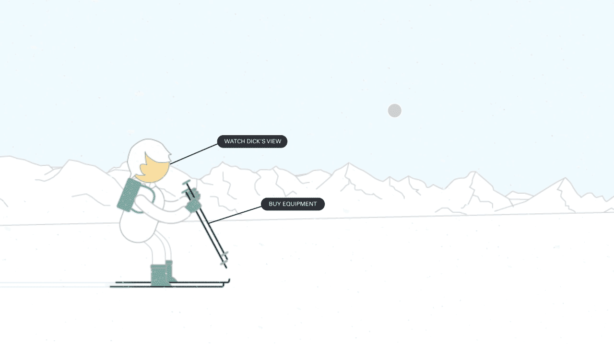
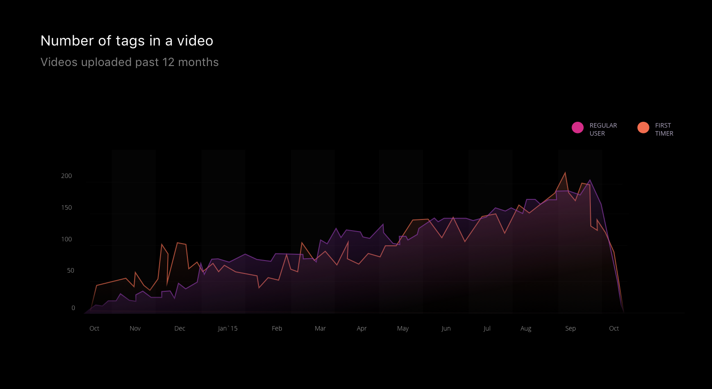
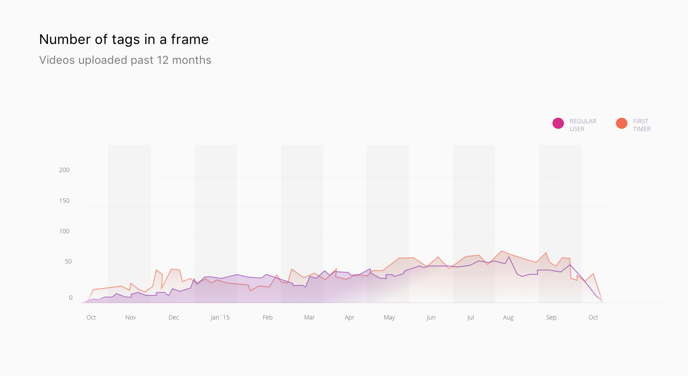
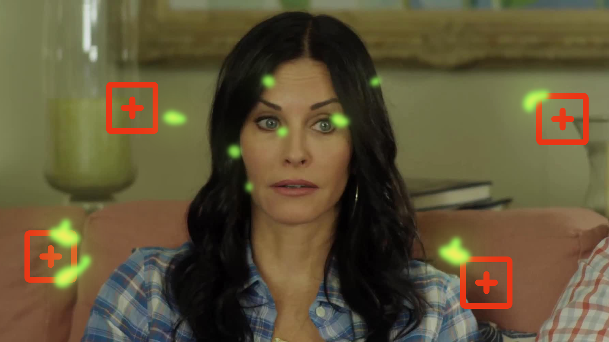
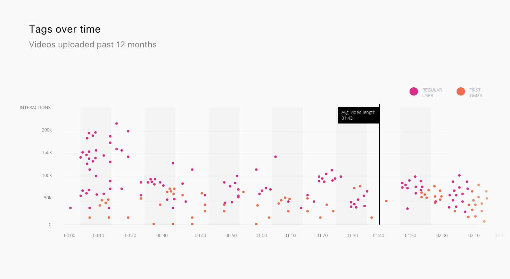
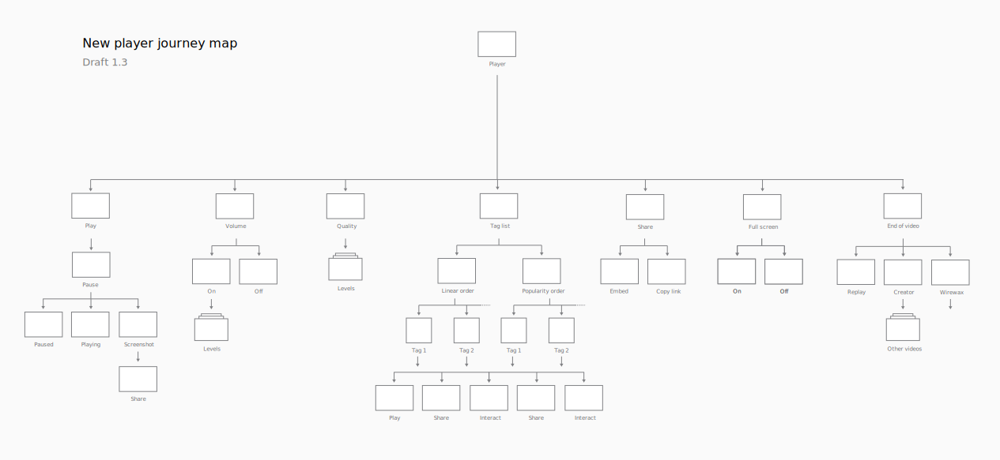
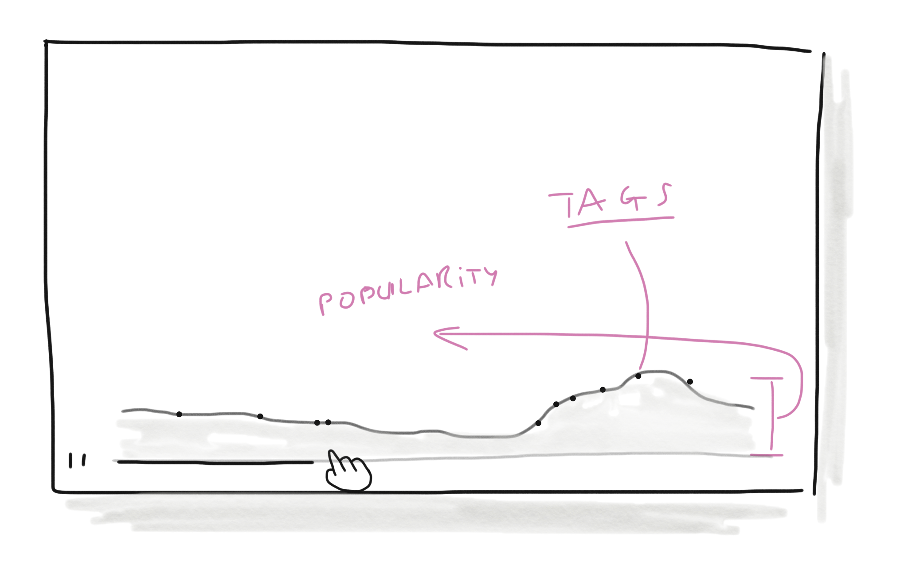
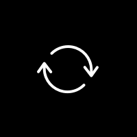
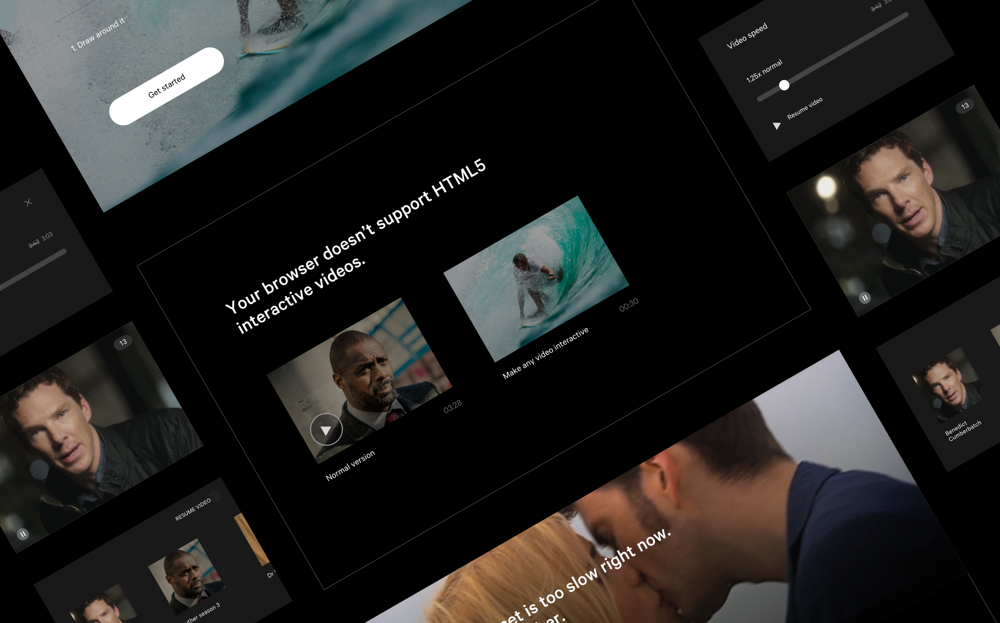

	

		

			
The problem

			<h2 class="heading">Inheriting bias</h2>
			

				Video players have been, on the whole, homogeneous for years.  Past experience generates user bias.
				Tens of tiny things we've been trained to anticipate that we don't even realise until something breaks those expectations. 
			
	
			

				And it makes sense for video players to be the same.  It's easier for us all and the experience of watching any video is the same -  it's passive.  Sit back and watch.  Until Wirewax.  Since their 2013 launch, Wirewax had created a new kind of video: interactive.
			
	
			<h4>
				Wirewax videos are the opposite.  The audience can interact with tags in the video and control what happens.  And anyone can upload any video and use Wirewax to make it interactive.
			</h4>
		

		

		 	

		 			
		 		
<b>Normal videos</b> you sit back and watch content.

		 	
						
		 	

					
		 		
<b>Wirewax videos</b> lets viewers interact with anything the creator has tagged.
				
		 	

		 

		

			

				So the challenge was designing a video player that conforms to that strong status quo, but allows for a completely new experience that can easily be understood &amp; enjoyed by the viewer.  In just three years since their launch, Wirewax videos had gone from being seen by 50 friends in London to a global audience of 10 million across 40 countries.  The original video player had reached its limits.  Being built in Flash, it was being phased out by new devices &amp; browsers.  During Wirewax's growth its basic usability had been challenged This was the perfect time to design a player that uses the emerging possibilities of HTML5 and keep Wirewax at the forefront of an increasingly competitive industry.
			
	
			

				This was my my first project as the sole designer at a start up.  I wanted to help create products that empower people to express their creativity or make their jobs easier.  With a then 10,000 strong army of creatores, from media producers like Universal &amp; BBC investing millions into interactive entertainment, to teenage Taylor Swift fans just wanting to make TayTay's face interactive, there was a hugely diverse group regularly using Wirewax to make videos interactive.   
			

		
			 

		

			
			
The original player had plenty of powerful features but had become challenging for the modern audience.

		

		

			
The process

			<h2>A good prototype is worth a thousand meetings</h2>
			

				To test designs, options need to be as realistic as possible.  Here, the end product is a video player so to iterate effectively, I need to be creating designs that have motion, like video.  I'd never used any motion graphics software at this time but as a self-taught designer, I'm always excited to broaden my abilities.  In my spare time I learned Adobe After Effects so when it came to the execution &amp; testing phase I could maintain momentum &amp; effectively validate decisions.  
			
													
			<h4>
				When designing something that will be used by an existing userbase, the first step is always observe, discover &amp; record.
			</h4>
		

		<video class="w100" autoplay="" loop="" muted>
				  <source src="../assets/work/wirewax-player/research-videos-1.mp4" type="video/mp4">
				  <source src="../assets/work/wirewax-player/research-videos-1.ogg" type="video/ogg">
				  Your browser does not support HTML5 video
		</video>	
		

			

				I watched hours &amp; hours of user's videos, recording what is being made interactive; how many tags in each video &amp; how long each tag is.  I did this for one day before even realising I could ask the inhouse data scientist to do this with me.  Lesson #12 of design at a startup ✅.  
			

			

				Although the team was very experienced in video - the CEO had created and sold many ideas to broadcast televsion - I wanted quantative data to inform me, not just our perceptions of user behaviour.  Recording all this helped give me an understanding of edge cases from the very start and most importantly, empathy for what users are really doing. This was important because, without them, there would be no-one using the video player because there would be no videos to play.  
			

		

		

			

				
				

					First time users struggle to add lots of tags
				

			

			

				
				

					Sometimes, one frame might have multiple tags in it. 
				

			

		

		

			

				Overall, a formula presented itself to help define what a good interactive video was like.  Videos needed five tags, at least.  Viewers needed regular visuals to shout at them "interact with me".  However, a good interactive video had a balance.  Like with all design, too many options gives choice paralysis.  Too many tags on screen at the same time, meant fewer interacted and disrupted those enjoying the actual video content.
			

		

		

				

					
					

						L'oreal used Wirewax to promote individual products.
					

				

				

					
					

						ABC partnered with Target to sell every item seen in episodes of Cougar Town.
					

				

		

		
	
			
 
				

					One of the most interesting data discoveries was, on average, under 50% of viewers interacted with a video's tags.  Some users who embraced the technology, like the BBC, had much higher interaction rates of 90+% but, over all users, the % was lower.  The result was negatively impacting everyone. Creator, viewer &amp; crucially, Wirewax's chances to push forward this disruptive change in how people watch videos. 
				

				

					A disruptive startup needs to be able to shift its industry, or it doesn't really disrupt. <em>Can this redesign encourage viewers to interact &amp; encourage creators to add tags to videos?</em> 
				

				
				

					 Regular creators learned to tag something at the video's start so viewers could understand to interact.  Indeed, most popular tags were near the beginning.  Beyond those trends, tags could appear anywhere in the video.
				

				<h4>
					Nothing is ever a straight forward re-skin of a product, because expectations &amp; technology have moved forwards.  Discover the real problems under the surface and resolve them.
				</h4>
				

					With data points recorded, I had one huge chunk of isnight missing. Why do our users pick Wirewax, over the increasingly competitive options?  Without that, the design could jeopordise Wirewax's pole position. This involved competitor and user research.  
				

				

					Amongst a diverse list of reasons, two key themes were consistent. Wirewax was easier to use and didn't overpower the user's brand with its own.  Creators from Nickelodeon to Naughty America could make everything look like it was their own tech.
				

			

			

				
				

					With these insights it was time to define the deliverables &amp; the user journeys.
				

			

		

	

		

	

			

				
The solution

				<h2>Use the legacy to introduce the innovation</h2>
				

					Having identified the major expectations people have with video interfaces, I wanted to turn them into a tool informing viewers they're watching an interactive video.  
				

				<h3 class="m-m-t">Expectation #1. Figure:ground</h3>
				

					Video players use figure:ground to seperate the interface (the foreground) from the video (the background).  For example, the controls on Youtube that sit on top of the video.  It's a common principle found across many forms of screen entertainment (video games, videos, music players, VR) and an effective way to tell the audience how they can control the experience.  
				

			

			

				<video class="chapter m-auto" loop="" autoplay="">
						  <source src="../assets/work/wirewax-player/foreground-1.mp4" type="video/mp4">
						  <source src="../assets/work/wirewax-player/foreground-1.ogg" type="video/ogg">
						  Your browser does not support HTML5 video
				</video>	
			
			
			

				

					In the transition from play -> playing, we used figure:ground to bring attention to the tags number, as it animated from the play button to rest in the top right corner.   
					Drawing attention to the tag number helped attract interest to the tags.  It helped give viewers easy access to all the video's tags - regardless of where they appear in the video.  
				

				

					Showing the number of tags helped make it work for an intended international audience, with Wirewax videos being watched in 70+ countries.  Most importantly, by showing the number of tags I anticipated this would influence creators to add more tags to their videos.  We're trying to bring that disruptive business mission forwards.  
				

				<!-- incl. about creators needing the play btn -->
				<h3 class="l-m-t">Expectation #2. Time moves on the X axis</h3>
				

					In video players, there is usually a visual indicator of linear progress, from 00:00 to the final frame, at the bottom of the video.  Viewers use it to look for specific scenes or just anything to entertain them.
				
	
			

			

					
			
		
			
	
				

					Knowing viewers would use the timeline to discover something, I used that core function to indicate the interactive elements &amp; their popularity.
				

				

					By using these expected mechanisms to inform the viewer this video is different, we're letting the utility drive the engagement.  So the solution involves minimal cognitive load for the viewer &amp; gets out of their way - like any good content showcase product should.
				
			
			

			

				<h3>Improving the iconography</h3>
				

					Designing an interface for an audience of millions around the world involves tightening up the details, like iconography.
				

			

			

				

					

						

							

								
							

						

						

							
						
								
							

						
	
						

							
						
								
							

						

						

							

								
							

						
	
						

							
						
								
							

						

						

							

								
							

						

						

							

								
							

						
	
						

							

								
							

						

						

							

								
							

						
	
						

							

								
							

						

						

							

								
							

						

						

							
						
								
							

						
	
						

							

								
							

						

						

							

								
							

						
	
						

							

								
							

						
					
					
															
				
	
			
	

			

				
Microinteractions

				<h2>Delight in the details</h2>
				

					When designing something with such established inherited expectations, the microinteractions can seperate one interface from all the rest.  In good and bad ways.  
				

				<h4>
					The difference between a product you love and one you tolerate is often the microinteractions you have with it. They can make our lives easier and funner. 
				</h4>
				

					<a href="http://microinteractions.com/">Dan Safer's book</a> has some great advice &amp; examples of microinteractions.  He defines them as moments built around single tasks.  Playing a video.  Pausing a video.  Working with one of the developers, we played with SVGs in groups to animate from one stage to the other.
				
 				
						
				
Rounding out the solution

				<h2>Create rules for the what ifs</h2>
				

					If you're designing something intended for use around the world, you need solutions for the not-ideal scenarios.  Old devices, slow internet, abnormally large thumbs.  And in designing for user-generated content, you have to create rules for what if scenarios.  These things might seem unlikely to happen but that's not up to you.  Its not about what solution is the most beautiful here, it's about which solution covers these with consistency and simplicity.
				

			

			
	

	

		

			
Testing the solution

			<h2>Users as colleagues</h2>
			

				To get to the chosen solution, I tested multiple ideas with Wirewax creators.  This is where learning some After Effects helped.  From watching the creators videos in research, I could divide them into groups for testing.  For each group, I changed the video being shown in the player to reflect their interests - it might be something they'd actually watch or put online to make the tests as realistic as I could.
			

		

		

			<video class="m-auto w100" autoplay="" loop="">
				  <source src="../assets/work/wirewax-player/player-test-1.mp4" type="video/mp4">
				  <source src="../assets/work/wirewax-player/player-test-1.ogg" type="video/ogg">
				  Your browser does not support HTML5 video
			</video>
			
One of the player prototypes - animating the timeline to help viewers scroll through tags.
	
		

		

			

				I learned much more in tests when I treated the users as co-workers &amp; not someone I'm presenting to.  Wirewax was my first startup role, and in previous roles, I'd been trained to present designs like they were the full stop at the end of a project.  Job done.  Well done everyone.  Lets get pissed.
			

			

				At Wirewax I learned the true value of questions over sentences.  From "<em>this design solves A, so C goes up</em>" to "<em>I think this helps with A, what do you think? Feel more C?</em> ".  This collaborative approach brings more out of everyone involved. And then we get pissed.   
			

		

		

			<video class="m-auto w100" autoplay="" loop="">
				  <source src="../assets/work/wirewax-player/foreground-1.mp4" type="video/mp4">
				  <source src="../assets/work/wirewax-player/foreground-1.ogg" type="video/ogg">
				  Your browser does not support HTML5 video
			</video>
			
A prototype showing a tag's size so viewers can focus on it.
	
		

		

			
 
				I filmed the tests because I knew, especially with this being my first time in the field testing, I would miss things &amp; it gave me a golden resource to return to because it can be challenging to organise more testing, especially as a 1 man design crew in a busy start up.  
			
		
				
			

				I learned alot in this stage about testing &amp; collaborating with users, and what good product design is about, to me.  I had come from agencies where designs were mostly about creating something different to the norm - putting a unique spin on something.  
			

			<h4>
				Re-inventing the wheel is a bit of a bullshit thing to do in product design.  The product will be used by humans.  We don't want to learn how to use a new wheel, and that's ok.  
			</h4>
			

				One of the designs I liked had details I believed unecessary removed, leaving a crisp interface.  Virtually everyone who tried it was wowed, but many did not feel right using it.  "It's not like Youtube/Vimeo/iPlayer".  You can still design something different in the right places but you have to know, from the start, that the differences have to be in the best interest of the user, not the designer.  That, to me, is a foundation of good product design.
			

			

				In the end, we halted the work as it became clear how the existing HTML5 technology wasn't quite ready.  In hindsight, I wish I made a more determined effort to involve the developers in the earlier design stages.  Everyone on the team was always busy but as the 1 designer on a tech team, you have to be both persistent &amp; patient.  However, when working on the cutting edge of something you have to be comfortable with plenty of trial and error.  I felt like every error was someone's time I'd wasted, not realising that bigger picture.
			
	
			

				A way watered-down version was built and Wirewax was able to maintain its position as the leading interactive video platform, winning broadcast awards around the world.	
			

			

				I'll always be hugely grateful to the team at Wirewax for giving me my first taste of modern product design, working closely with amazing developers, data scientists, and inspiring founders.  I would thoroughly recommend it to anyone interested in designing the future of interactive technology.
			

		

		

			

<!-- 			<blockquote class="twitter-tweet" data-lang="en">
<a href="https://twitter.com/niquewoodhouse?ref_src=twsrc%5Etfw">@niquewoodhouse</a> love you <a href="https://t.co/k6irKWvGy2">pic.twitter.com/k6irKWvGy2</a>
&mdash; steve poxson (@stevepoxsonfoto) <a href="https://twitter.com/stevepoxsonfoto/status/671115313904230400?ref_src=twsrc%5Etfw">November 29, 2015</a></blockquote>
 -->

			

	
		

	

