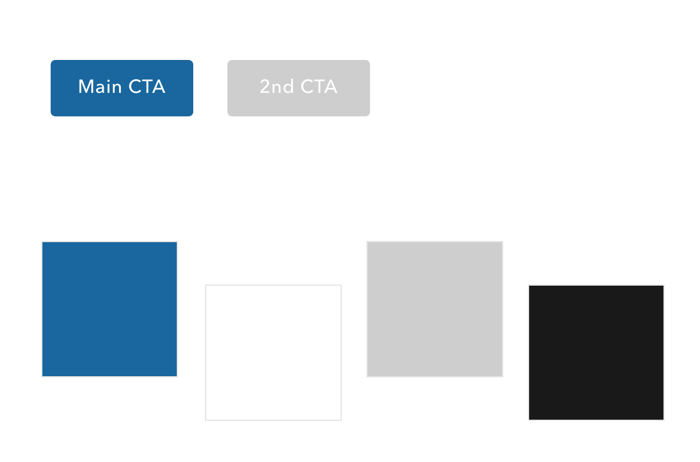
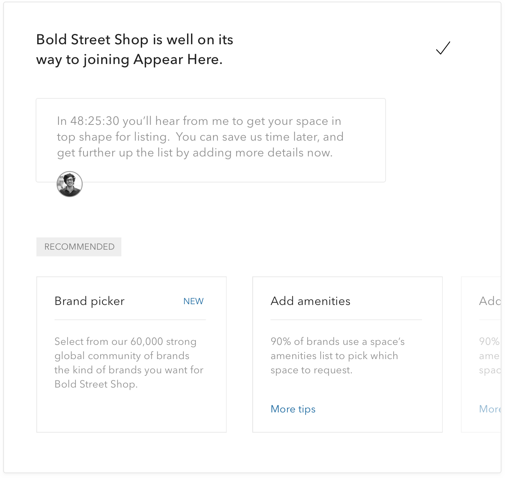

		

			

				
The challenge

				<h2>Closing the loop</h2>
				

					By the beginning of 2016, Appear Here had fought off many challengeres to become the established world’s leading marketplace for brands looking to rent retail space.  It was time to introduce ways to help scale, so more and more cities worldwide could join the market.  
				

				

					The most dramatic change to introduce would be the landlord dashboards - a way for space owners to do almost everything themselves for their spaces.  Manage bookings, edit calendars, send messages, track finances, add new spaces, analyse data.  Since day one Appear Here's concierge team had been doing all of this for the landlords, to ease their onboarding into an online marketplace. But the next stage was here - it was time to remove the concierge where possible to help the marketplace organise itself.  
				

			

			

				
				

					Visuals from the landlords dashboards
				

			

			

				
Being openly dumb

				<h2>Start with questions</h2>
				

					What is a dashboard?  What is a landlord?  Why would a landlord want a dashboard?  Any designer joining a team with immense industry specific experience has a responsibility to quickly question and understand as much as possible.  And keep questioning as you go.  
				

				
			
		

			

				 	

						
						
Starting with the goal shows why the project actually matters, and starts themes you can divide.

				 	
				
				 	

							
						
Breaking down questions starts trains of thoughts.
			
				 	
								
			 
	

			

				 	

						
						
Mapping out journeys identifies existing pain-points.

				 	
				
				 	

							
						
Working with the landlord team to create personas for landlord types.
			
				 	
								
			 
						

			

				<h3>The more effort you put into research, the more designs can achieve.</h3>				
				

					Sometimes you have to be creative with your research sources.  Whilst I couldn't speak directly to landlords during this introductory phase, I could listen to audio archive of phone calls between them and the landlord team to back up findings and schedule 1:1s with internal teams.
				

			

			

				 	

						
				 	
				
				 	

									
				 	
								
			 
				
			

				<h3>Trust the process</h3>
				

					With the insights, generating personas that we can plot along the customer journey feels solid.  It helps create a character you can champion.  Even if your drawings are rubbish, it brings you closer to them and that's what this is all about.
				

			
	
		

		

			

				
The solution

				<h2>A consistent system</h2>
				

					The system must work with any content, and situation, not just the ideal. Don’t just design for the best case scenario — account for all scenarios.  Consistency means ease of use. This would all be pointless if the concierge was just replaced with a thousand questions. 
				

				

					Someoene's experience of your service doesn't stop and start at logging in.  Its in the phone calls, the emails, the terms and conditions, the error messages.  So, seeking that consistency became a bigger challenge, but one worth pursuing even more.
				

			

			

				 	

						
				 	
				
				 	

									
				 	
								
			 
					
			

				

					We took a component approach to the design and build.  This would start with identifying and defining components in Google docs, I'd 
					keep this up to date throughout the design phase so when it came to building, developers could make the bricks individually, using tools like <a href="https://zeplin.io/" target="_blank" class="underline">Zeplin</a> and then good old pairing for final tweaks. 

				<h3>Document your reasons, define your principles</h3>
				
				

					I use the research to create principles I can use to influence the dashboards in every detail.  For example, it has to be simple so a subtle palette that doesn't disctract from the content is needed. But it has to tell people what to do, so bright colours are used to convey direction and draw impact.
				

				

					You do need awareness when creating a design pattern system.  It can easily become a default template.  That starts a rigid categorical thinking and so can, at times, feel like forfeiting any ability to think creatively about a solution to a new problem.  New problems don't always fit in the categories you have already.  That's how innovation happens.  The best way to find out if expanding the patterns is worthwhile is finding out if its the interests of both the user and your business.  If not, its probably ego.
				

			
	
		

	

		

			
Journey 1

			<h2>Adding a new space</h2>
			

				One of the main tests of the dashboard would be if landlords used it to add new spaces to the marketplace.  If they just kept on with the old pattern of calling the concierge, this project wouldn't succeed.
			

			

				The amount of information required to add a space is considerable - legals, bank information, location, pricing.  So it was crucial to keep the job as streamlined as possible.  
			

		
	
		

			
			
Asking what their aim is, and then responding to it shows empathy.
	
		

		

			

				Breaking the form down into these chapters helps edcuate landlords on the required steps, visually indicate progress &amp; reduce cognitive load.  By asking landlords upfront what their aim is we're capturing the real intent, which represents the litmus test they'll give the marketplace.
			

			
			

				Working with the landlord aquisition teams and developers, we mapped out the steps so landlords would get the cards they most wanted recorded first.
			

			

				The business decision behind this project was to move onto the next stage, now the offering had proven itself worthwhile to brands and landlords, to offload some of the work back onto the marketplace.  Part of that is removing the work of adding spaces from the concierges.  But another part is helping the landlord team to be able to order incoming spaces.  If you just let landlords add unlimited spaces, the workload to go through them and decide what to let onto the marketplace, passes onto another team, and nothing is achieved.
			

			

				So it was important to ensure we capture the most crucial information for us for every space added.  That's the postcode (to identify its location) &amp; if its available now.
			
 
		

		

			
			
The postcode would map to our data to identify if its in a high rental yield area.  This helps the team prioritize work.
	
		

		

			<h3>323% increase in spaces added</h3>
			

				Within six months of lauching, the number of spaces added to the marketplace increased by 3x over the previous six months.  Over 70% of landlords who had been using the concierge team to add spaces were now doing it themselves.
			

			

				Most important was connecting the spaces to our data, increasing our inventory knowledge.  
			

			
		
				
	

	

		

			
Journey 2

			<h2>Booking brands</h2>
			

				The whole reason behind a landlord listing their spaces on Appear Here is to make bookings.  Before, landlords did this through emails and phone calls.  There wasn't a place where they could easily see every request for their space and go through them.
			

		
	
		

			
			
		

		

			

				In the research stage, after creating personas with the landlord team, I signed up to the software landlords used to 
			

			

				Its important to make decisions easy and quick to do.  Nothing should feel like a cumbersome chore.  Spaces could have 100 requests, they could have 1 request.  Both experiences need to be considered &amp; catered for. 
			

			<h3>Reduce everyone's workload and achieve more.</h3>
			

				Landlords are busy, or so they like to think so.  They don't have time to read a lot of text.  Brands don't always have time to type up their idea for a space.  To reduce the resources required for everyone to make a booking, we asked brands to provide their social media links and automatically pulled images to give the landlords a quick and effective idea of a brand.    We could use the same information to show the brand's social following.  
			

		

		

		 	

				
		 	
	
		 	

		 					 		
		 	
					
		
	
		

			<h3 class="m-m-b">
				By asking, really asking, why something should be in a product you can discover quicker and simpler ways to achieve the same thing, if not better.
			</h3>
			

				When it came to the landlord's decision the product minimises the risk of ignored information, and helps them create rules that can reduce their future workload.  Empathy helps.
			
		
		

		

			
			
		

		

			<h3>30% decrease in rejecting brands; 80% increase in landlords approving without concierge help</h3>
			

				We'd create solid habit loops that, through either rejecting or accepting a brand, the landlord would gain something to improve their dashboard experience.  
			

			
Throoughout the conversation between landlords and brands, the interface and the terminology need consistency.  

		
	
		

		 	

				
		 	
	
		 	

		 		
		 	
					
		
						
	

	

		

			
Journey 3

			<h2>Understanding your data</h2>
			

				Landlords depend on knowledge to make decisions.  Its important to fully understand the logic and maths behind the industry jargon.  Portfolio void rate; quarter trend analysis.  
			

		
			
		

			
			
Letting people filter the data make its more powerful for them.
	
		

		

			

				From the research it became clear landlords are competitive, even more so when it comes to specific spaces.  They want to see how they stack up to the other spaces around them.  Allowing comparison reflects back to those feelings we saw in the storyboards.
			

		

		

		 
						 					
		
						
	

<!-- 

	

		

			
Journey 4

			<h2>Editing a space</h2>
			

				After you've added spaces, booked brands and learned from your data, you may want to alter your space to make it more appealing to brands you like or to increase your income. 
			

		
			
		

			
			
Landlords, on average, changed the price more often than anything else.
	
		

		

			

				The interface is their supporter.  There to equally re-assure, reward and warn where necessary.  We're taking that personable service the concierge provided, making it instantaneous, automatic.
			

		

		

		 	

				
				

					The landlord cares about what profit they will make, so a handy expandable breakdown helps them see.
				

		 	
	
		 	

		 		
				

					Landlords can create seasonal prices that repeat every year to minimise maintenance.
				
				 		
		 	
					
		
						
	

 -->

	

		

			
Plan ahead

			<h2>Balancing the quick fix and the future</h2>
			

				There's a huge amount of negotiation in building out dashboard tools.  Its not just a case of how many developers can we get, its a case of are we ready for this stage of the project as a business.  Are our users ready for this? The development of a dashboard is also challenging and we were fortunate to have some very smart and dedicated developers who  
				Sometimes the idea you've had might solve the problem perfectly but the infrastructure won't support it.
			

			
There is a time to create new ideas and there is a time to sit down with the existing interface and polish the pixels and craft every detail with the developers.

			<h3>I believe the best product designers know when its time to innovate, and when its time to execute.</h3>
		
			
		

			

				It takes a brave startup to push an industry forwards &amp; eradicate the old-fashioned tactics.  Appear Here is doing that worldwide now.  These dashboards were the missing piece in a push to scale up.  Within six months of their launch, Appear Here was in another city and had gotten a further round of investment.  Onto the next stage.
			

		

<!-- 		

		 	

				
				

					The landlord cares about what profit they will make, so a handy expandable breakdown helps them see.
				

		 	
	
		 	

		 		
				

					Landlords can create seasonal prices that repeat every year to minimise maintenance.
				
				 		
		 	
					
		
	 -->					
	

<!-- 

	

		

			
Learnings

			<h2>Identify your individual weaknesses</h2>
			

				Working at Appear Here 
			

		
			
		

			
			
Landlords, on average, changed the price more often than anything else.
	
		

		

			

				The interface is their supporter.  There to equally re-assure, reward and warn where necessary.  We're taking that personable service the concierge provided, making it instantaneous, automatic.
			

		

		

		 	

				
				

					The landlord cares about what profit they will make, so a handy expandable breakdown helps them see.
				

		 	
	
		 	

		 		
				

					Landlords can create seasonal prices that repeat every year to minimise maintenance.
				
				 		
		 	
					
		
						
	

 -->
