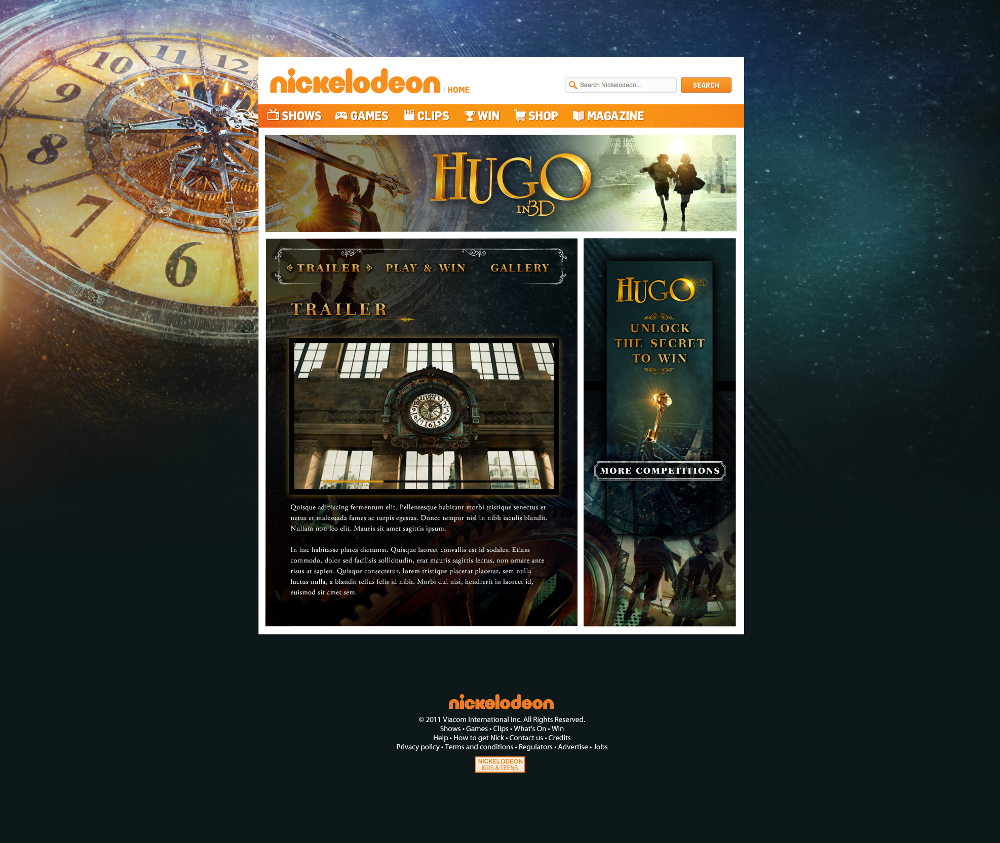

		

				

					
The challenge

					<h2>Doing it for the kids</h2>
					

						MTV wanted to boost income for the #1 kids entertainment site nick.co.uk. I helped design flexible templates to help sell microsites, games &amp; campaigns to their big brand partners. Between 2010 &amp; 2014 I worked on 30+ projects, generating ideas &amp; designs to push the templates to meet various briefs, brands &amp; creative needs.
					
							
				

				

					
					
					
					
					
					
					

					
				

				

					

						Each microsite would involve a game mechanic and a Flash banner ad campaign that would be promotoed throughout Nickelodeon's marketing - broadcast, print and online.  These projects were a great opportunity to get experience in game design, usability guidelines, brand consistency, project management and even .NET coding.
					

				

			

				<h2>Starting from scratch</h2>
				
MTV's clients would vary from international cinema releases with a million assets that needed editing and organising to ideas that were just that...ideas that needed assets created from scratch.

				
				

						Gabi the Camel game.
				

				

					One of the projects that needed starting from scratch was a game based on the adventures of Gabi the Camel and his animal friends, as they toured the world, trying to save water. Those crazy kids.  That meant designing and creating a 6 level tower defence game.  Creating everything in the game, working with a Flash developer and another designer.  A game is like watching a science fiction movie.  At the start you're introduced to the rules of the world, you're supposed to see everything you need to know.  So, when it comes to the later twist you're not caught off guard, going "WTF, he was a lizard all along?!".  In designing a game you have to come up with everything from the rules, the universe, the tiniest of details to the sense of random pleasure and fun you want players to feel. 
				

				

					A lot of product design is about rationale and logic to get users through a journey.  I think the importance of understanding the underlying irrationality in people, especially in designing something around entertainment or fun, is often understated.  
				

			
		

			

					

						
					

					

						
					
	
					

						
					

					

						
					
	
					

						
					

					

						
					

			

			

				<h3>All these projects helped build an ability to empathise and put myself completely into someone else's world to give them experiences they wanted.</h3>				
				

					Sometimes these games would involve creating the idea of the game and testing it with children to ensure its a balance of fun, challenging and achievable.  That's not just limited to visuals, its copy, interaction and sound design.
				

				
				

						Gabi the Camel and his friends are there to celebrate with the winners.
				

				

					One of the projects that needed starting from scratch was a game based on the adventures of Gabi the Camel and his animal friends, as they toured the world, trying to save water. Those crazy kids.  That meant designing and creating a 6 level tower defence game.  Creating everything in the game, working with a Flash developer and another designer.  A game is like watching a science fiction movie.  At the start you're introduced to the rules of the world, you're supposed to see everything you need to know.  So, when it comes to the later twist you're not caught off guard, going "WTF, he was a lizard all along?!".  In designing a game you have to come up with everything from the rules, the universe, the tiniest of details to the sense of random pleasure and fun you want players to feel. 
				

				

					A lot of product design is about rationale and logic to get users through a journey.  I do think that is important.  But I also believe the underlying irrationality in people, especially in designing something around entertainment or fun, is often understated.  
				

			
	

		

			

				
				
			
	
		

		

			

				<video class="chapter" autoplay="" loop="">
						  <source src="../assets/work/nick/thomasCookGame1.mp4" type="video/mp4">
						  <source src="../assets/work/nick/thomasCookGame1.ogg" type="video/ogg">
						  Your browser does not support HTML5 video
				</video>	
			
	
		
			

		

			

				
				
			
	
		

		

			

				
			
	
		

		

			

				
			
	
		

			

				
				
Although I learned how to put massive drop shadows and gradients on buttons, I also picked up some of the soft skills that surround product design.  Being able to empathise with your audience, their needs, their context, helped me create designs that didn't reflect my personal taste <em>and</em> better understand the role of the designer. 

				
As a self-taught designer,  this whole period gave me a lot of exposure to many things.  I got to see how huge marketing campaigns structure their creative assets, and I got to structure some of them.   One day was deep in Photoshop adding textures, the next was deep in Illustrator creating vectors of TinTin.  The next was creating project timelines for Nickeoldeon's campaign team, or sketching a new game idea.

				
Throught the three years of my time working with Nick.co.uk it recieved over 5 million unique visitors, of which over a third visited our microsites.  

			
	

	

