

		

			

				
The challenge

				<h2>Demistifying data</h2>
				

					Wirewax had made video an interactive medium.  Viewers can tap on anything in a video to make something happen.  Tap a dress to buy it.  Tap an actor to see their credits.  It was all up to the creator of the video.  Huge brands used this technology to introduce their audience to new storytelling, or engage them even more.  
				

				

					These creators needed to know what their audience was interacting with.  When it came to the bigger brands, they needed bespoke information to identify their considerable ROI.  
				

			

			

				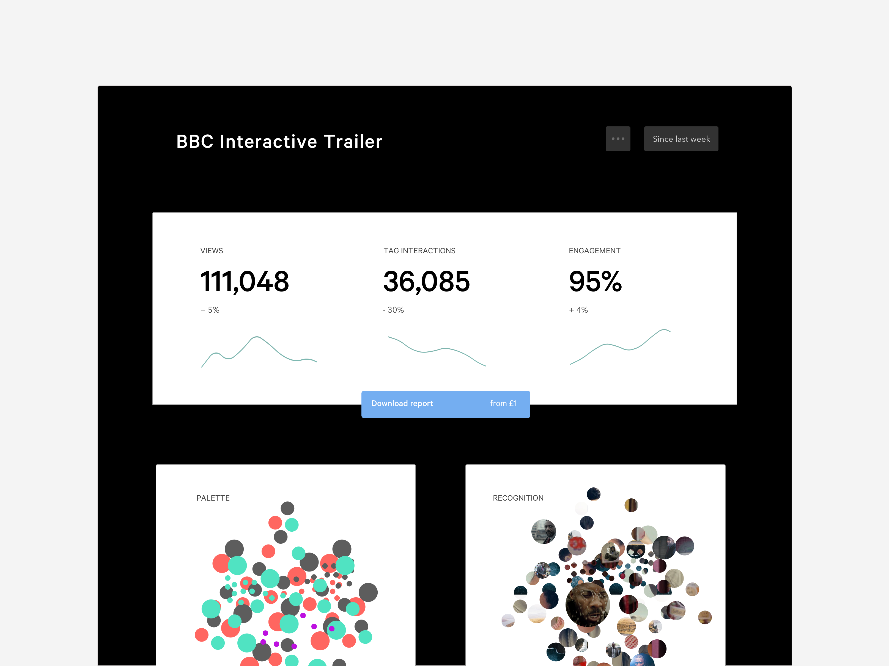
				

					Hero content of a video's metrics page lets users dig deeper into the big chapters.
				

			
				

			

				
Identify the point

				<h2>Ask the right questions.</h2>
				

					When it comes to any experience, especially data dashboards, its good to clearly identify why each data point is being shown?  Are we informing people? Are we just trying to show off? Does this measurement in anyway help them or does it just serve our own needs?  
				

				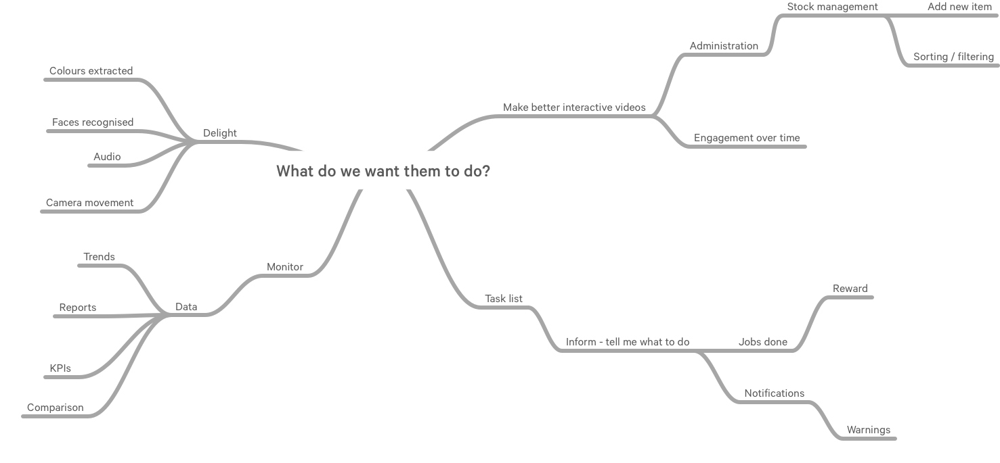	
				
Breaking down questions starts trains of thoughts.
				
				<h3>Trust the process</h3>				
				

					I had been wanting to work with data for a while.  The works of digital designers like <a href="http://feltron.com/" target="_blank" class="underline">Nicholas Feltron</a> &amp; <a href="http://oberhaeuser.info/" target="_blank" class="underline">Martin Oberhäuser</a> showed that real data could be as stunning as it could be informative.  My first task was research across three key areas - what data can we show; what data would be helpful; how can data be displayed. 
				

			

			

				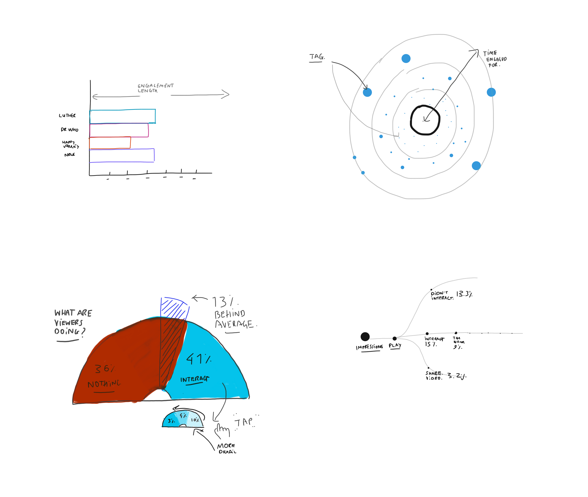
				
Its quick to sketch out ideas and discuss them.
	
			

			

				<h3>If you're designing something you've not designed before, in an new industry, stick to your process.</h3>
				

					<b>Research &#8702; Insights &#8702; Ideate &#8703; Test &#8702; Execute</b> 
					Uncovering what data can we show involved working with the data science team and senior management to identify what's possible for <em>every</em> video. Its important, from the start, you're not just considering the preferrable states of things.  These videos are user generated content.  These metrics will be created by viewers.  We have super limited control over both.  You have to be doubly concious of it when designing a professional tool.  People are depending on your product for their jobs. 
				

				

					To understand what data would be helpful involved researching our users, and working with the sales team to get a picture of what moves the needle when they're selling the platform.  To its credit, Wirewax was a rarity in the 2015 London start up scene, in making a considerable consistent profit.  So that information was crucial.
				

				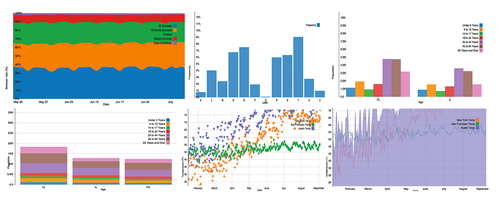
				

					Working with a devloper we picked D3 as a playground to try out ideas and eventually, a foundation for the data visualisation. 
				

			
	
		

		

			

				
The solution

				<h2>Identify the experiences</h2>
				

					We used a chapter system to break the data down into bitesize info around themes and reduce cognitive load. 
				

				

					<b>Views - </b> 
					A section all about your viewers.  When they view, how they view, where they view.  Even though this had nothing much to do with the interactive video elements, which is why they use the SaaS platform, its very important to our users.
				

				

					<b>Interactions - </b> 
					Are your viewers interacting with the video?  When are they?  How often?  This is where we can add value to our USP - making any video interactive.
				
				
				

					<b>Engagaement - </b> 
					Because viewers could interact with a video, their experience would change.  A 1 minute video could become a 5 minute experience, because viewers tap on a dress, see if its in stock nearby, and buy it.  This is where the more high value users would spend more to get more information because, in 2015, capturing someone's attention online, was really the prime KPI for many businesses.
				
	
			
	
		

	

		

			
Theme One

			<h2>Delight</h2>
			

				We wanted to expose to the user the information the science automatically extracted from their videos.  
			

		
	
		

			 	

					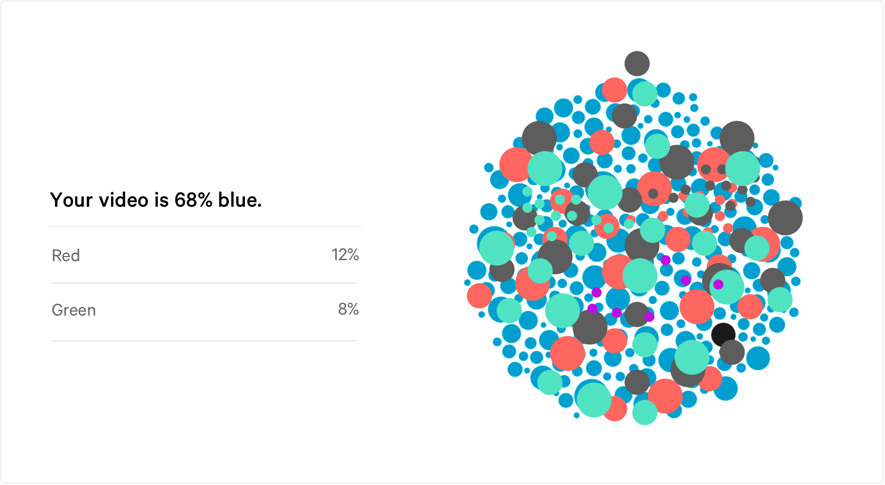
					
Videos are pixels, pixels have colours so we could give videos personality. 

			 	
				
			 	

					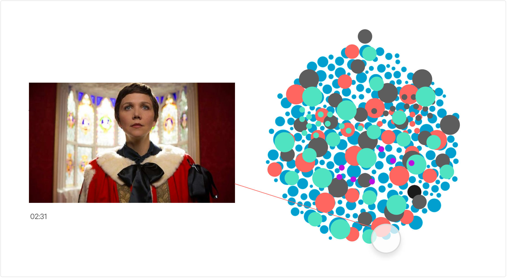	
					
Part of delightful data is letting people explore it, if they want to.
			
			 	
								
		 
			
		

			

				Delight is hard to measure.  We used <a href="http://www.inspectlet.com" target="_blank" class="underline">Inspectlet</a> to record users in this area to help make iterative tweaks.  Being able to see users movements is really powerful for SaaS platforms.
			

		

		

			 	

					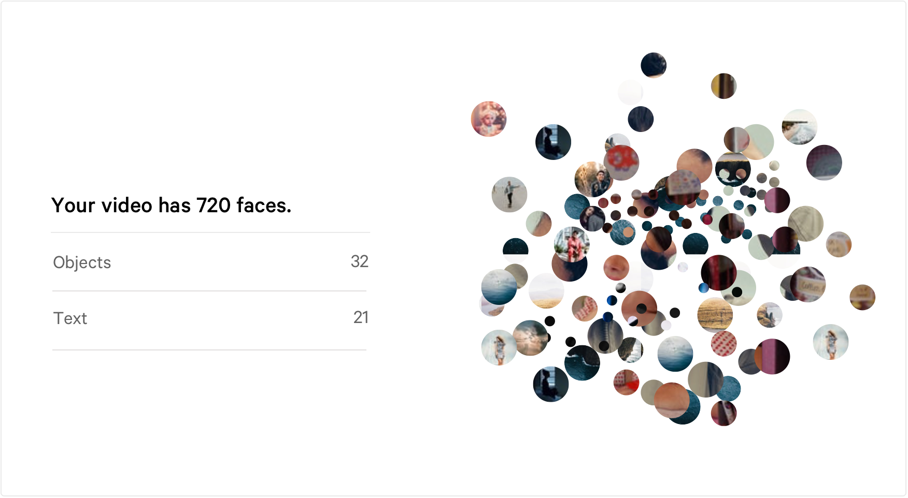
					
Videos are pixels, pixels have colours so we could give videos personality. 

			 	
				
			 	

					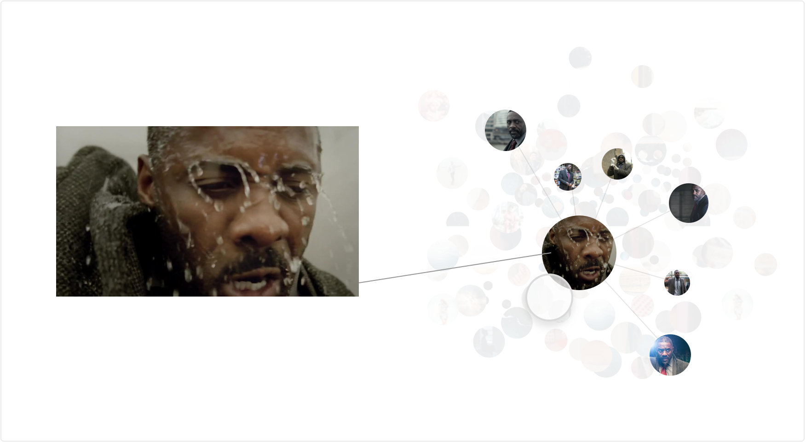	
					
Part of delightful data is letting people explore it, if they want to.
			
			 	
								
		 
				
		

			

				Capturing and showing this information helped give users the impression that our product was more powerful than they could know - that there was more going on under the hood.  
			

		
				
	

	

		

			
Theme Two

			<h2>Inform</h2>
			

				A SaaS product needs to deliver strong, clear metrics to users to let them evaluate their success.  The more success they have, the more the product benefits.  But failure is just as important to record and reveal.  That's how people get better.
			

		
	
		

			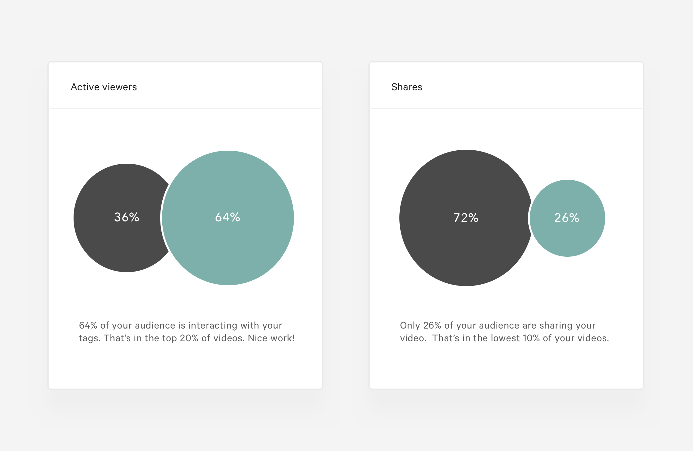
			
In binary metrics, where its 2 directly competing values, circles can tell a story visually.
	
		

		

			

				To inform people its important to follow conventions they're used to.  Data dashboards are for quick glances and deeper digs.  Tables, line charts, graphs.  This is a time to follow the expected.
			

		

		

		 	

				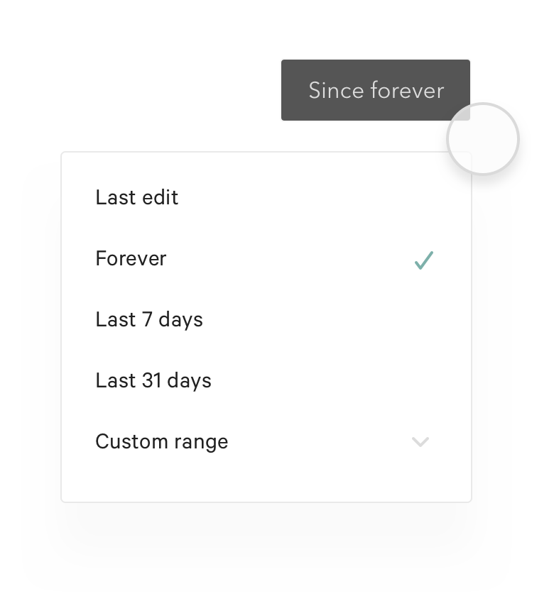
		 	
	
		 	

		 		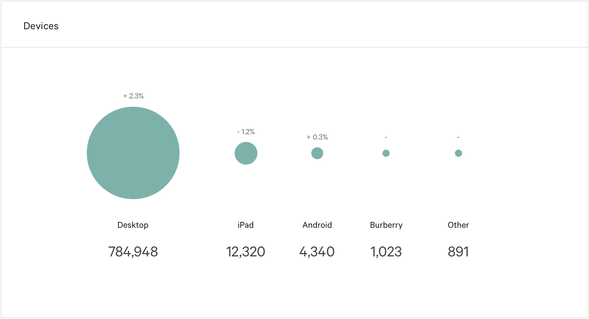				 		
		 	
					
		
			
		

			<h3>Group information to keep it simple</h3>
			

				We used this principle to connect types of metrics, but it can also bring order and clarity to things as basic as sources of traffic.  
			

			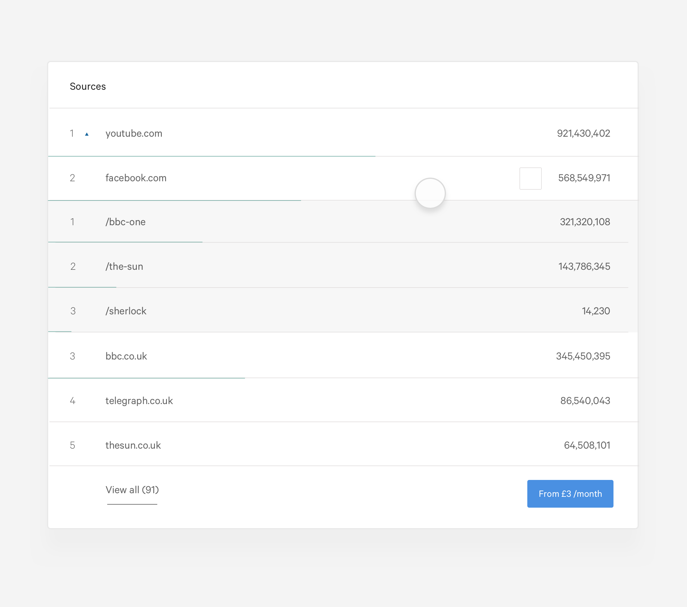
			

				Grouping url sources into domains helped simplify the list, and let users dig deeper if they liked.
			
			
		

		

		 	

				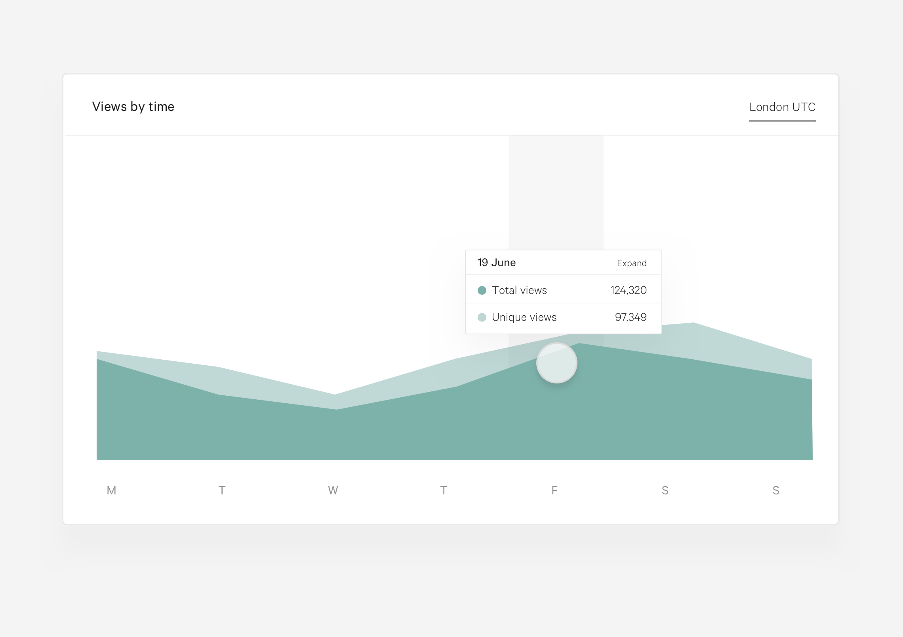
				

					Views by time of day
				

		 	
	
		 	

		 		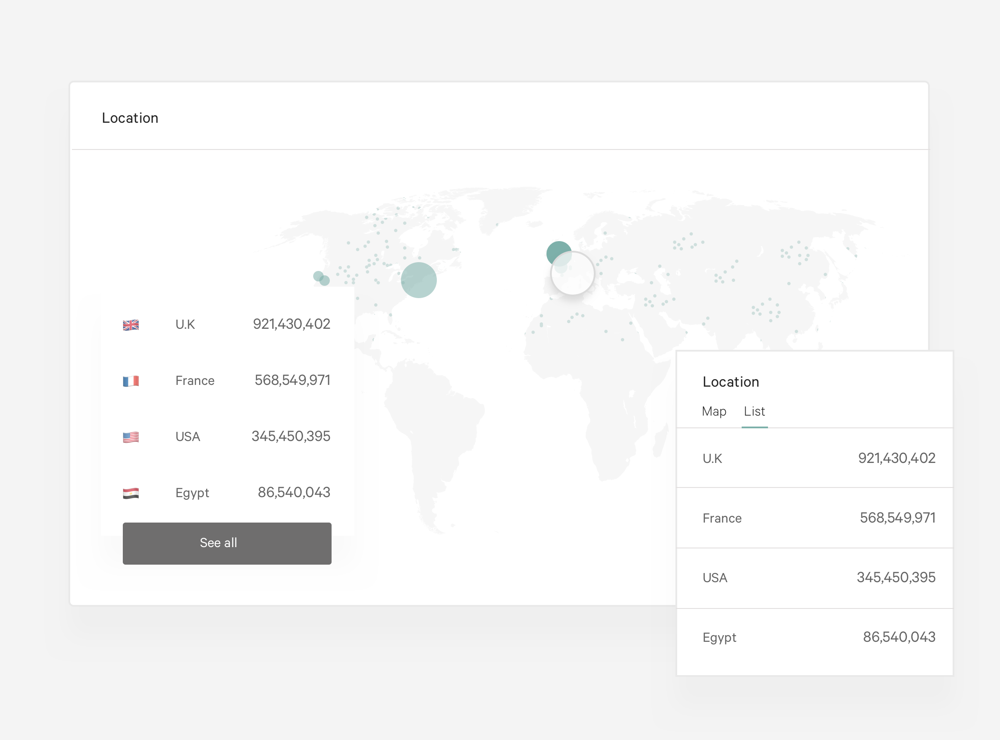
				

					Location of viewers
				
				 		
		 	
					
		
			
		

			<h3>Contrast helps, in context</h3>
			

				Wanting to reduce everything to conventions could lead to everything being a table of data.  
			

			

				Most important was connecting the spaces to our data.
			

		
				
	

	

		

			
Theme Three

			<h2>Educate</h2>
			

				This is probably the most important theme for retention of our users.  Retention is key to SaaS platforms.  The more we can educate our users on how to improve their interactive videos, the more ROI they'll get on the videos and ultimately, the more they'll use the platform.  Its not that we're expecting bad videos 
			

		
			
		

			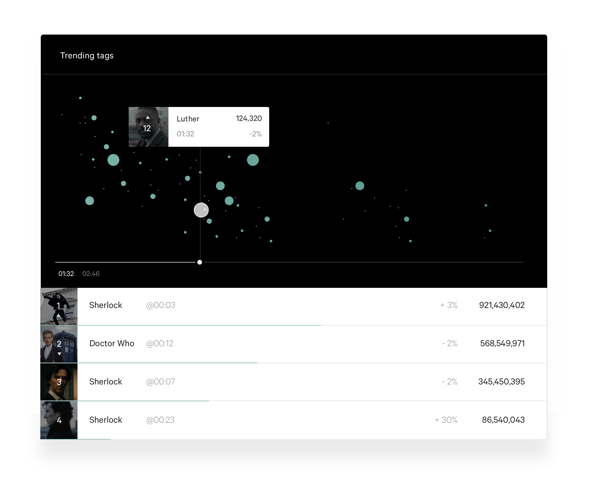
			
Letting people filter the data make its more powerful for them.
	
		

		

			

				We wanted users to visualise the success of their tags in the video timeline, so they could assertain where to put them.  Wirewax was a leading figure in interactive video, the founders speaking at several conferences a year around the world.  So the team had great insights into what a good interactive video looked like.  But it was important to let the data tell people the truth and that we got out of the way.
			

		

		

		 	

				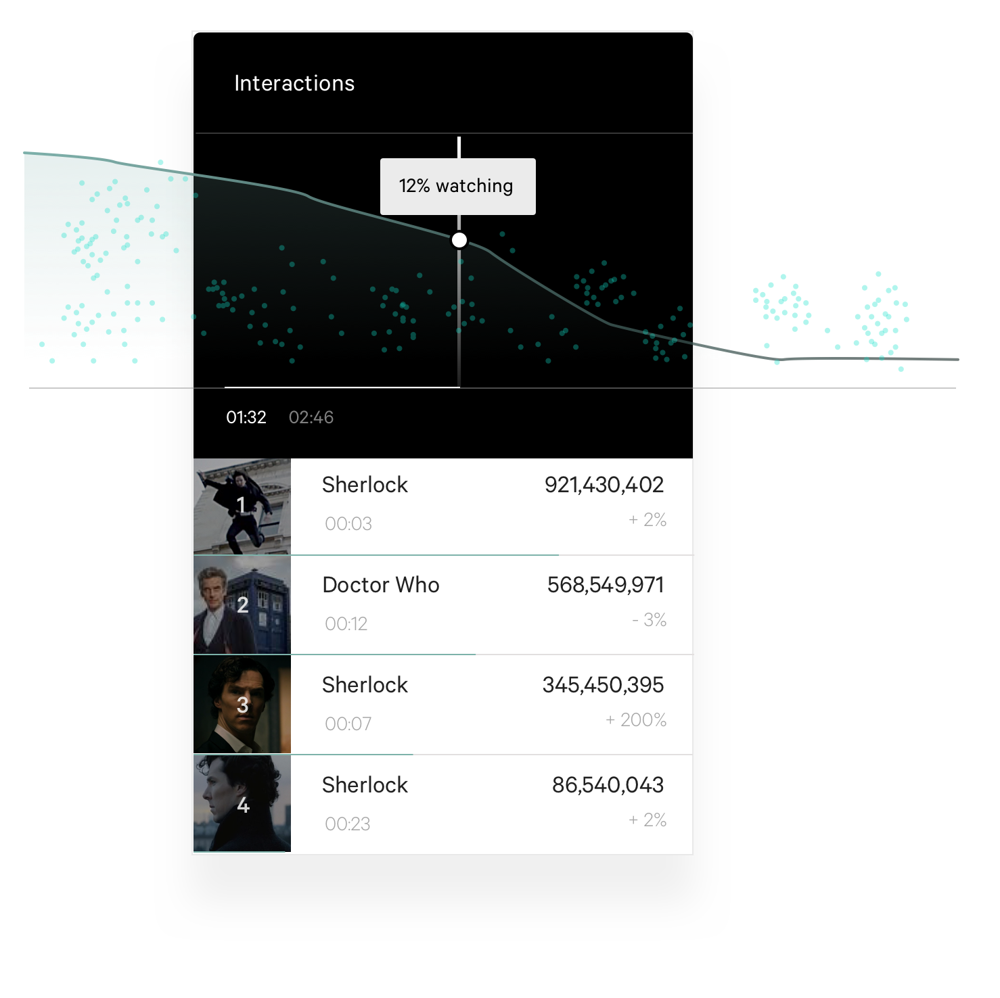
		 	
	
		 	

		 		

					

						People learn most effective by doing - rather than being told. Letting users scroll through data helps them draw their own conclusions. 
					

				
				 		
		 	
					
		

		

			

				With each data visualisation, I try to consider the spectrum of stories this visual might tell, and if those are helpful to the user.  With an engagement line graph over the course of the video, instead of a bar graph we can show the exact moment their audience leaves, and interacts.
			

			
The stories this tells are all powerful and important for the user to know. Its much easier on them if there is one data visualtsation that tells them all of this, rather than seperate chunks.

		

		

		 	

				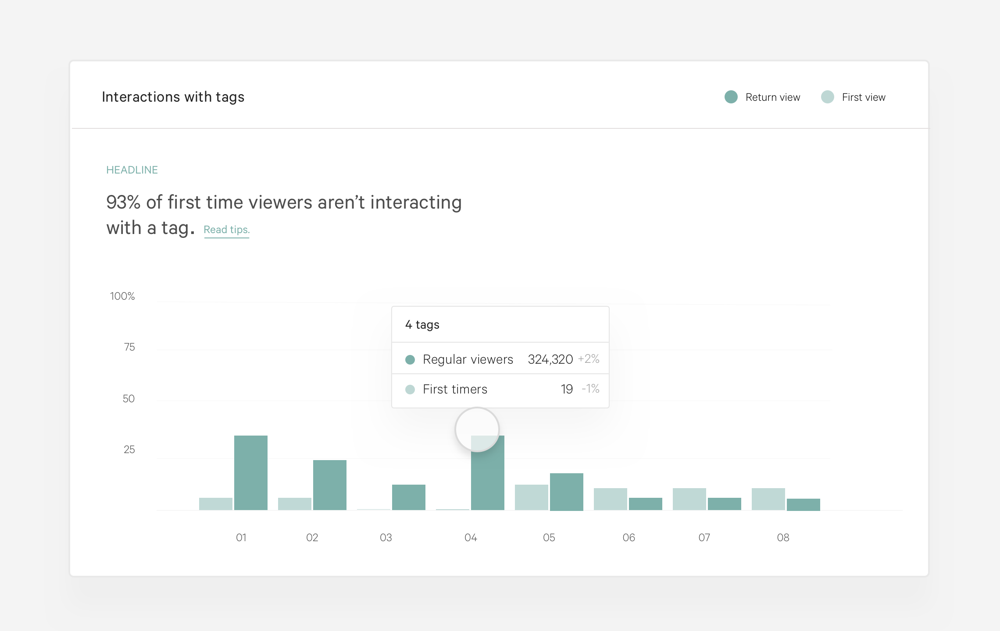
				

					Introducing a headline concept enhances the quick-glance power of the data.
				

		 	
	
		 	

		 		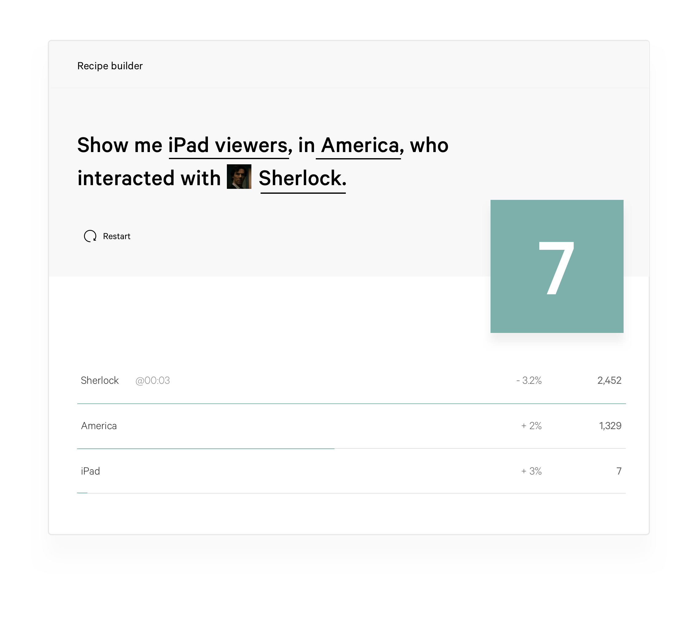
				

					Expanded on desktop design
				
				 		
		 	
					
		
						
	

	

		

			
Theme Four

			<h2>Get paid</h2>
			

				SaaS growth depends on both getting and retaining more users, and providing those users more tools for an additional fee.  As a small start up it was sometimes these bespoke ideas for metrics that helped win long term contracts with people like Amazon &amp; NBC Universal.  
			

			

				As ever, its a case of following that process of getting insights, ideating and testing.  We didn't end up building many of these ideas but they helped the team become stronger on the practice of taking real data and putting it into a visual story to empower users.  It came to the point where we could have a prototype of a concept within a day to help win the contract.
			

		
			
		

			<video autoplay loop class="m-auto chapter xs-m-b w100 autoplay">
				  <source src="../assets/work/wirewax-data/wirewax-intro-1.mp4" type="video/mp4">
				  <source src="../assets/work/wirewax-data/wirewax-intro-1.ogg" type="video/ogg">
				  Your browser does not support HTML5 video
			</video>
			
One idea was to show a heatmap on the video as it plays, to tell the story of what users are doing.
	
		

		

			

				As the only designer at a startup, especially one with offices in multuple countries, you have to learn strong time management, be aware of your weaknesses and work on them when you can.  I hadn't really worked with data before, to this level.  And certainly, it took a little time to realise the context of this data. 
			

			

				Wirewax's data became an important aspect of increasing its users by 300% over my two years there.
			

		
						
	

