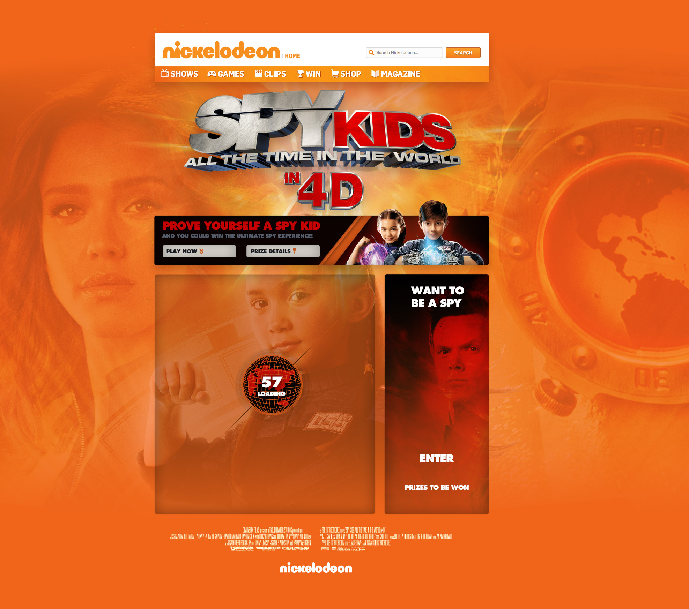
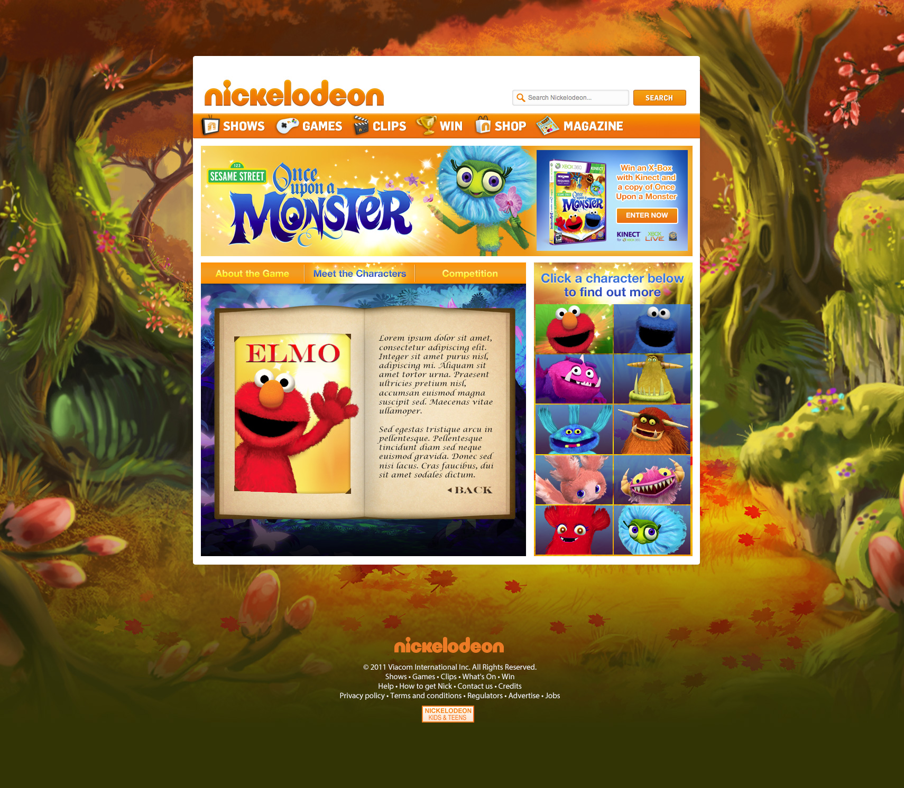

		

				

					
The problem to solve

					

						Consistency leads to expectation.  After so many years of digital experiences we all expect every new e-commerce experience to be essentially the same.  Even if its a totally new brand to us, if its not essentially the same as every brand's online shop we do know, we're not going to take the time to learn it, to adapt.  We'll just go somewhere else.
					

					

						Video players are the same.  We expect controls at the bottom; a scrubber so we can speed to the good bits or skip the boring ones; a time stamp.  Tens of tiny things we've been trained to anticipate that we don't even realise until something breaks those expectations.
					
	
					

						And it makes total sense for video players to be the same.  Not just because its easier for us all to then be entertained by the content.  Its because the content is all the same, really.  The material is different, sure, but the underlying concept is the same from Tellytubies to Terminator.  You press play, sit back and watch. 
					
	
					
	
						Wirewax videos aren't like that. 
					

				

		

			<video class="shadow screeniOSVideo" autoplay="" loop="">
			  <source src="../assets/work/wwxvideoplyr/tedbakerone_1.mp4" type="video/mp4">
			  <source src="mov_bbb.ogg" type="video/ogg">
			  Your browser does not support HTML5 video.
			</video>
		

		

					

					Its a product that lets people make anything in any video interactive.  So the watching experience stops being purely passive. With Wirewax videos, you can interact with potentially anything in the video.   
						We're designing an experience that doesn't exist yet.
					

					
Respect the constraints, recognise where to innovate 

					

						So I knew the design had to follow the basic rules of video players online.  
					
													

				
 	
		

<!--

	

		

			<h2 class="w50 mAuto">
				"Limitless posibilities"
			</h2>
			

				Buzzfeed.
			

		

	
	

-->

		

				

					
Customer insights &amp; experience strategy

					

						Of all the hundreds of videos Wirewax users had uploaded, were there common traits in what they are making interactive?  Looking at user generated content is a great way to connect with your users realities &amp; uncover the hidden insights that can connect to make a consistent product.
					

					

						What uploaders made interactive in their videos
					

					<ul class="shopping-list">
						<li>Permanent link 60%</li>
						<li>People 34%</li>
						<li>Objects 21%</li>
					</ul>
									
				
 	
		

	

		
						 	
	
						
{{page.title}}

						
{{page.subtitle}}

					
	
	

	

		
	

		

		 
 
		 	

		 		 
		 	

				

					<h2 class="w50 mAuto smallGapBott uppercase">
						Tags
					</h2>
					

						Tags are the objects viewers can interact with.  With a wide user base, I designed various tags to give our users more options to customise their interactive videos.
					

				
 			 	

		 

		 

		 	

		 		 
		 	
	
		 	

		 		 
		 	
	
		 
 

		 	

					

						USER EXPECTATIONS
					
		 		
		 		

		 			Knowing that users would interact with the scrubber to scroll through the video, I wanted to use that key functionality to indicate the interactive elements.
		 		

		 	
	
		 	

		 		 
		 	
		 	
		 	

		 		 
		 	
			 

		

				

					

						Designing games from scratch means defining logic and laws, algorythyms and animations.  
					

				
 	
				

						
				

				

					<video id="myVideo5b" class="mAuto" autoplay="" loop="">
							  <source src="../assets/work/nick/thomasCookGame1.mp4" type="video/mp4">
							  <source src="mov_bbb.ogg" type="video/ogg">
							  Your browser does not support HTML5 video.
					</video>		
				

		
		 

		 

		 	

		 		 
		 	
	
		 	

		 		 
		 	
	
		 
	
		 
	

